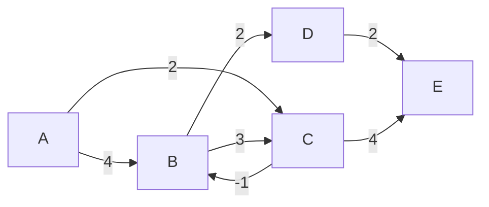
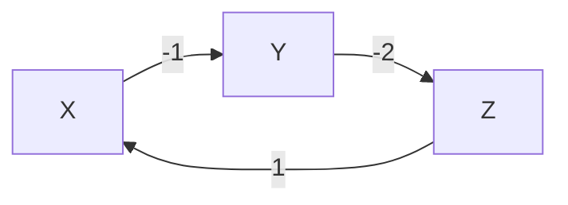

## Overview

The **Bellman-Ford Algorithm** finds the **shortest path from a single source vertex to all other vertices** in a weighted graph. Unlike Dijkstra's Algorithm, Bellman-Ford works correctly even when the graph contains **negative edge weights**, making it more versatile for real-world problems.

:::info Key Difference from Dijkstra
Dijkstra's Algorithm **fails** on graphs with negative edges. Bellman-Ford handles them correctly — and can even **detect negative weight cycles**.
:::

---

## How It Works

The algorithm is based on the principle of **edge relaxation**. It repeatedly relaxes all edges `V - 1` times (where `V` is the number of vertices).

### Relaxation Formula

For every edge `(u, v)` with weight `w`:

$$d[v] = \min(d[v],\ d[u] + w(u, v))$$

### Steps

1. Initialize distance of source to `0`, all others to `∞`
2. Repeat `V - 1` times:
   - For every edge `(u, v, w)`, apply the relaxation formula
3. Run one more pass to **detect negative weight cycles**:
   - If any distance can still be reduced, a negative cycle exists

---

## Dry Run Example

Consider this graph (5 nodes, directed, with a negative edge):



**Source: A**

| Pass | d[A] | d[B] | d[C] | d[D] | d[E] |
|------|------|------|------|------|------|
| Init | 0    | ∞    | ∞    | ∞    | ∞    |
| 1    | 0    | 4    | 2    | ∞    | ∞    |
| 2    | 0    | 1    | 2    | 3    | ∞    |
| 3    | 0    | 1    | 2    | 3    | 5    |
| 4    | 0    | 1    | 2    | 3    | 5    |

**Final shortest distances from A:** `A=0, B=1, C=2, D=3, E=5`

:::note
Notice how `d[B]` was reduced from `4 → 1` because the path `A → C → B` (weight `2 + (-1) = 1`) is shorter. This is only possible because Bellman-Ford handles negative edges.
:::

---

## Negative Cycle Detection

After `V - 1` passes, run **one more relaxation pass**. If any distance is still updated, the graph contains a **negative weight cycle**.



Here, `X → Y → Z → X` has total weight `-1 + -2 + 1 = -2`. Going around this cycle indefinitely keeps reducing the distance → **negative cycle detected**.

---

## Complexity Analysis

| Metric           | Value        |
|------------------|--------------|
| Time Complexity  | O(V × E)     |
| Space Complexity | O(V)         |

Where `V` = number of vertices, `E` = number of edges.

---

## Bellman-Ford vs Dijkstra

| Feature                    | Bellman-Ford       | Dijkstra            |
|----------------------------|--------------------|---------------------|
| Negative edge weights      | ✅ Supported        | ❌ Not supported     |
| Negative cycle detection   | ✅ Yes              | ❌ No                |
| Time Complexity            | O(V × E)           | O((V + E) log V)    |
| Best for                   | Dense/negative graphs | Non-negative graphs |
| Approach                   | Dynamic Programming | Greedy              |

**Rule of thumb:**
- Use **Dijkstra** when all edge weights are non-negative (faster)
- Use **Bellman-Ford** when negative weights are possible or you need cycle detection

---

## Implementations

### Python

```python
def bellman_ford(vertices, edges, source):
    # Step 1: Initialize distances
    dist = {v: float('inf') for v in range(vertices)}
    dist[source] = 0

    # Step 2: Relax all edges V-1 times
    for _ in range(vertices - 1):
        for u, v, w in edges:
            if dist[u] != float('inf') and dist[u] + w < dist[v]:
                dist[v] = dist[u] + w

    # Step 3: Check for negative weight cycles
    for u, v, w in edges:
        if dist[u] != float('inf') and dist[u] + w < dist[v]:
            print("Graph contains a negative weight cycle")
            return None

    return dist

# Example usage
V = 5
edges = [(0, 1, 4), (0, 2, 2), (1, 2, 3), (1, 3, 2), (2, 1, -1), (3, 4, 2), (2, 4, 4)]
result = bellman_ford(V, edges, 0)
print(result)  # {0: 0, 1: 1, 2: 2, 3: 3, 4: 5}
```

### Java

```java
import java.util.Arrays;

public class BellmanFord {

    static void bellmanFord(int V, int[][] edges, int source) {
        int[] dist = new int[V];
        Arrays.fill(dist, Integer.MAX_VALUE);
        dist[source] = 0;

        for (int i = 0; i < V - 1; i++) {
            for (int[] edge : edges) {
                int u = edge[0], v = edge[1], w = edge[2];
                if (dist[u] != Integer.MAX_VALUE && dist[u] + w < dist[v]) {
                    dist[v] = dist[u] + w;
                }
            }
        }

        for (int[] edge : edges) {
            int u = edge[0], v = edge[1], w = edge[2];
            if (dist[u] != Integer.MAX_VALUE && dist[u] + w < dist[v]) {
                System.out.println("Graph contains a negative weight cycle");
                return;
            }
        }

        System.out.println("Vertex\tDistance from Source");
        for (int i = 0; i < V; i++) {
            System.out.println(i + "\t" + dist[i]);
        }
    }

    public static void main(String[] args) {
        int V = 5;
        int[][] edges = {
            {0, 1, 4}, {0, 2, 2}, {1, 2, 3},
            {1, 3, 2}, {2, 1, -1}, {3, 4, 2}, {2, 4, 4}
        };
        bellmanFord(V, edges, 0);
    }
}
```

### C++

```cpp
#include <bits/stdc++.h>
using namespace std;

struct Edge {
    int u, v, w;
};

void bellmanFord(int V, vector<Edge>& edges, int source) {
    vector<int> dist(V, INT_MAX);
    dist[source] = 0;

    for (int i = 0; i < V - 1; i++) {
        for (auto& edge : edges) {
            if (dist[edge.u] != INT_MAX && dist[edge.u] + edge.w < dist[edge.v]) {
                dist[edge.v] = dist[edge.u] + edge.w;
            }
        }
    }

    for (auto& edge : edges) {
        if (dist[edge.u] != INT_MAX && dist[edge.u] + edge.w < dist[edge.v]) {
            cout << "Graph contains a negative weight cycle\n";
            return;
        }
    }

    cout << "Vertex\tDistance from Source\n";
    for (int i = 0; i < V; i++) {
        cout << i << "\t" << dist[i] << "\n";
    }
}

int main() {
    int V = 5;
    vector<Edge> edges = {
        {0, 1, 4}, {0, 2, 2}, {1, 2, 3},
        {1, 3, 2}, {2, 1, -1}, {3, 4, 2}, {2, 4, 4}
    };
    bellmanFord(V, edges, 0);
    return 0;
}
```

### JavaScript

```javascript
function bellmanFord(V, edges, source) {
    const dist = new Array(V).fill(Infinity);
    dist[source] = 0;

    for (let i = 0; i < V - 1; i++) {
        for (const [u, v, w] of edges) {
            if (dist[u] !== Infinity && dist[u] + w < dist[v]) {
                dist[v] = dist[u] + w;
            }
        }
    }

    for (const [u, v, w] of edges) {
        if (dist[u] !== Infinity && dist[u] + w < dist[v]) {
            console.log("Graph contains a negative weight cycle");
            return null;
        }
    }

    return dist;
}

// Example usage
const V = 5;
const edges = [
    [0, 1, 4], [0, 2, 2], [1, 2, 3],
    [1, 3, 2], [2, 1, -1], [3, 4, 2], [2, 4, 4]
];
console.log(bellmanFord(V, edges, 0)); // [0, 1, 2, 3, 5]
```

---

## Real-World Use Cases

- **Network Routing** — BGP (Border Gateway Protocol) uses Bellman-Ford for routing decisions across the internet
- **Currency Arbitrage Detection** — Negative cycles in a currency exchange graph indicate arbitrage opportunities
- **Traffic Navigation** — Road networks with toll discounts (negative weights) or penalties

---

## Related LeetCode Problems

| Problem | Difficulty | Link |
|---------|------------|------|
| #743 — Network Delay Time | Medium | [LeetCode](https://leetcode.com/problems/network-delay-time/) |
| #787 — Cheapest Flights Within K Stops | Medium | [LeetCode](https://leetcode.com/problems/cheapest-flights-within-k-stops/) |
| #1334 — Find the City With the Smallest Number of Neighbors | Medium | [LeetCode](https://leetcode.com/problems/find-the-city-with-the-smallest-number-of-neighbors-at-a-threshold-distance/) |

---

## Summary

- Bellman-Ford finds **single-source shortest paths** in `O(V × E)` time
- It handles **negative edge weights** — unlike Dijkstra
- It can **detect negative weight cycles** after `V - 1` relaxation passes
- Use it when graphs have negative weights; prefer Dijkstra for non-negative graphs
