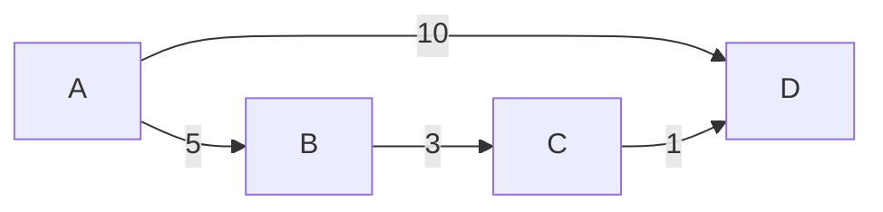

import FloydWarshallVisualizations from '@site/src/components/DSA/graphs/FloydWarshallVisualizations';

The **Floyd-Warshall Algorithm** is used to find the shortest paths between **all pairs of vertices** in a weighted graph.

Unlike Dijkstra or Bellman-Ford, which are *Single-Source Shortest Path* algorithms (finding distances from one node to all others), Floyd-Warshall computes the distances between every node `u` and every node `v`.

:::info Key Feature
Floyd-Warshall handles negative weights correctly. It can also be used to detect negative weight cycles (if the distance from a node to itself becomes negative).
:::

## Video Explanation

<LiteYouTubeEmbed
  id="oNI0rf2P9gE"
  params="autoplay=1&autohide=1&showinfo=0&rel=0"
  title="4.2 All Pairs Shortest Path (Floyd-Warshall) - Dynamic Programming"
  lazyLoad={true}
  webp
/>

---

## Interactive Visualization

Below is an interactive visualizer for the Floyd-Warshall algorithm. You can click **Start Floyd-Warshall** to step through the dynamic programming transitions, updating the distance matrix as each intermediate vertex `k` is considered.

<FloydWarshallVisualizations />

---

## How It Works

The algorithm uses **Dynamic Programming**. The core idea is to gradually allow more intermediate vertices to form paths between any two nodes.

### Steps

1. Initialize a 2D `dist` matrix. If there's an edge from `u` to `v`, `dist[u][v] = weight(u, v)`. Otherwise, `dist[u][v] = ∞`. The diagonal `dist[i][i] = 0`.
2. For each intermediate node `k` from `0` to `V-1`:
   - For every pair `(i, j)`:
     - Check if the path `i → k → j` is shorter than the currently known path `i → j`.
     - Update: `dist[i][j] = min(dist[i][j], dist[i][k] + dist[k][j])`

---

## Dry Run Example

Consider the following graph:



Initial Distance Matrix:

|   | A | B | C | D |
|---|---|---|---|---|
| A | 0 | 5 | ∞ | 10 |
| B | ∞ | 0 | 3 | ∞ |
| C | ∞ | ∞ | 0 | 1 |
| D | ∞ | ∞ | ∞ | 0 |

The algorithm now considers each vertex as an intermediate node and updates the matrix whenever a shorter path is found.

:::note
Unlike Dijkstra's Algorithm, Floyd-Warshall computes shortest paths between every pair of vertices simultaneously by gradually allowing more intermediate vertices.
:::

## Matrix Updates

### After considering B as intermediate vertex

Path A → B → C gives:

5 + 3 = 8

Updated matrix:

|   | A | B | C | D |
|---|---|---|---|---|
| A | 0 | 5 | 8 | 10 |
| B | ∞ | 0 | 3 | ∞ |
| C | ∞ | ∞ | 0 | 1 |
| D | ∞ | ∞ | ∞ | 0 |

### After considering C as intermediate vertex

Path A → C → D gives:

8 + 1 = 9

### Final Shortest Path Matrix

|   | A | B | C | D |
|---|---|---|---|---|
| A | 0 | 5 | 8 | 9 |
| B | ∞ | 0 | 3 | 4 |
| C | ∞ | ∞ | 0 | 1 |
| D | ∞ | ∞ | ∞ | 0 |

The matrix now contains the shortest distances between every pair of vertices after considering all intermediate vertices.

## Visualization

```mermaid
flowchart TD
    Start[Initialize Distance Matrix]
    K[Choose Intermediate Vertex K]
    Update[Update dist[i][j]]
    Next[Next Vertex]
    Check{More Vertices?}
    End[Shortest Paths Found]

    Start --> K
    K --> Update
    Update --> Check
    Check -->|Yes| Next
    Next --> K
    Check -->|No| End
```
## Negative Cycle Detection

One advantage of the Floyd-Warshall Algorithm is its ability to detect **negative weight cycles**.

A negative cycle is a cycle whose total edge weight is negative. If such a cycle exists, the shortest path is undefined because repeatedly traversing the cycle keeps reducing the path cost.

### How Detection Works

After all vertices have been considered as intermediate vertices, inspect the diagonal elements of the distance matrix.

For every vertex `i`:

```text
dist[i][i] < 0
```

indicates that a path exists from the vertex back to itself with a negative total cost.

Therefore, if any diagonal entry becomes negative, the graph contains a **negative weight cycle**.

### Example

Final distance matrix:

|   | A | B |
|---|---|---|
| A | -2 | 1 |
| B | 3 | 0 |

Here:

```text
dist[A][A] = -2
```

Since the distance from `A` back to itself is negative, a negative cycle exists in the graph.

:::warning
If a negative weight cycle is present, the shortest path values are not reliable because the path cost can be reduced indefinitely by repeatedly traversing the cycle.
:::

### Detection Check

Pseudo-code:

```text
for i = 0 to V-1:
    if dist[i][i] < 0:
        Negative Cycle Exists
```

This check takes only **O(V)** time after the Floyd-Warshall computation is complete.

---

## Complexity Analysis

| Metric           | Value        |
|------------------|--------------|
| Time Complexity  | O(V³)        |
| Space Complexity | O(V²)        |

Where `V` = number of vertices. Because of the `O(V³)` time complexity, it is best suited for small, dense graphs.

---

## Implementations

### Python

```python
def floyd_warshall(graph):
    V = len(graph)
    dist = list(map(lambda i: list(map(lambda j: j, i)), graph))
    
    # Adding vertices individually
    for k in range(V):
        for i in range(V):
            for j in range(V):
                dist[i][j] = min(dist[i][j], dist[i][k] + dist[k][j])
                
    return dist

# Example usage (INF represented as float('inf'))
INF = float('inf')
graph = [
    [0, 5, INF, 10],
    [INF, 0, 3, INF],
    [INF, INF, 0, 1],
    [INF, INF, INF, 0]
]
result = floyd_warshall(graph)
```

### Java

```java
public class FloydWarshall {
    final static int INF = 99999, V = 4;

    void floydWarshall(int graph[][]) {
        int dist[][] = new int[V][V];
        int i, j, k;

        for (i = 0; i < V; i++)
            for (j = 0; j < V; j++)
                dist[i][j] = graph[i][j];

        for (k = 0; k < V; k++) {
            for (i = 0; i < V; i++) {
                for (j = 0; j < V; j++) {
                    if (dist[i][k] + dist[k][j] < dist[i][j])
                        dist[i][j] = dist[i][k] + dist[k][j];
                }
            }
        }
    }
}
```

### C++

```cpp
#include <iostream>
#include <vector>

using namespace std;
#define INF 99999

void floydWarshall(int V, vector<vector<int>>& graph) {
    vector<vector<int>> dist = graph;
    
    for (int k = 0; k < V; k++) {
        for (int i = 0; i < V; i++) {
            for (int j = 0; j < V; j++) {
                if (dist[i][k] != INF && dist[k][j] != INF && dist[i][k] + dist[k][j] < dist[i][j]) {
                    dist[i][j] = dist[i][k] + dist[k][j];
                }
            }
        }
    }
}
```

### JavaScript

```javascript
function floydWarshall(graph) {
    const V = graph.length;
    const dist = Array.from(graph, row => [...row]);

    for (let k = 0; k < V; k++) {
        for (let i = 0; i < V; i++) {
            for (let j = 0; j < V; j++) {
                if (dist[i][k] + dist[k][j] < dist[i][j]) {
                    dist[i][j] = dist[i][k] + dist[k][j];
                }
            }
        }
    }
    return dist;
}
```

---

## Real-World Use Cases

- **Flight Routes** — Finding the cheapest connections between all possible city pairs.
- **Transitive Closure** — Checking if there exists a path between every pair of nodes in a directed graph.
- **Network Routing** — Used in decentralized networks to update routing tables.
