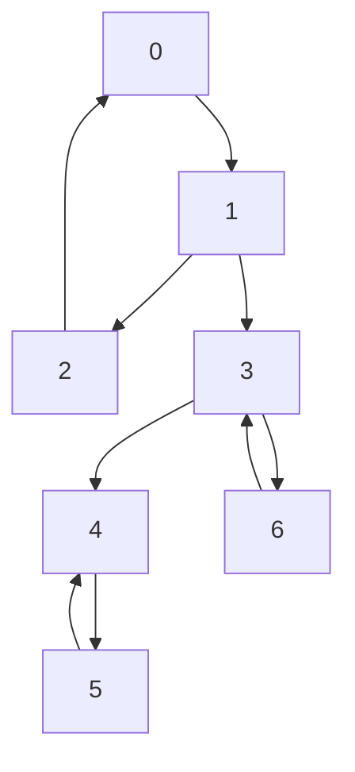

 
**Kosaraju's Algorithm** is a two-pass depth-first search based algorithm used to find all **Strongly Connected Components (SCCs)** in a directed graph.
 
A strongly connected component of a directed graph is a maximal subset of vertices where every vertex is reachable from every other vertex in the same subset.
 
:::info Key Feature
Kosaraju's Algorithm works in two DFS passes: first to compute a finishing order on the original graph, then to extract SCCs on the transpose (reversed) graph following that order.
:::
 
## Video Explanation
 
<LiteYouTubeEmbed
  id="6b1lLjq_bY8"
  params="autoplay=1&autohide=1&showinfo=0&rel=0"
  title="Kosaraju's Algorithm for Strongly Connected Components"
  poster="maxresdefault"
  lazyLoad={true}
  webp
/>
 
---
 
## How It Works
 
Kosaraju's algorithm works in two distinct phases:
 
### Phase 1: First DFS Pass (on Original Graph)
 
Perform a DFS traversal on the original directed graph. As each vertex finishes (backtracks from) its recursive exploration, push it onto a stack. This stack will hold vertices in order of their finishing times.
 
### Phase 2: Second DFS Pass (on Transpose Graph)
 
Reverse the direction of every edge in the graph to get the transpose graph. Then, repeatedly pop vertices from the stack (from top to bottom) and run DFS on the transpose graph starting from each unvisited vertex. Each DFS initiated from the stack produces exactly one strongly connected component.
 
### Steps
 
1. **First DFS**: Run DFS on the original graph. On finishing a vertex, push it onto a stack.
2. **Transpose**: Build the transpose graph by reversing all edges.
3. **Second DFS**: While the stack is not empty:
   - Pop a vertex from the stack.
   - If it is not visited, run DFS on the transpose graph.
   - All vertices visited during this DFS form one SCC.
4. Repeat until the stack is empty.
---
 
## Dry Run Example
 
Consider the following directed graph:
 

 
### Phase 1 Dry Run
 
1. Start DFS at node `0`. Visit order: `0 -> 1 -> 2`.
2. Node `2` has no unvisited neighbors. Push `2` to stack.
3. Backtrack to `1`. Visit `3` from `1`. Visit order: `0, 1, 2, 3`.
4. From `3`, visit `4`. From `4`, visit `5`.
5. Push `5` to stack. Backtrack: push `4`, push `3`, push `1`, push `0`.
6. Stack (top to bottom): `[2, 5, 4, 3, 1, 0]`.
### Phase 2 Dry Run
 
7. Pop `0`. Start DFS on transpose from `0`. No edges in transpose from `0`. SCC: `{0}`.
8. Pop `1`. Start DFS on transpose from `1`. Transpose edges: `1 <- 0`. No other paths. SCC: `{1}`.
9. Pop `3`. Transpose: `3 <- 1`, `3 <- 6`. Visit `3`. From `3`, visit `6`. SCC: `{3, 6}`.
10. Pop `4`. Transpose: `4 <- 3`, `4 <- 5`. Visit `4`. From `4`, visit `5`. SCC: `{4, 5}`.
**Result: 4 SCCs: {0}, {1}, {3,6}, {4,5}**
 
---
 
## Complexity Analysis
 
| Metric           | Value        |
|------------------|--------------|
| Time Complexity  | O(V + E)     |
| Space Complexity | O(V + E)     |
 
Both passes are O(V + E), and the transpose construction is also O(V + E).
 
---
 
## Implementation
 
### Python
 
```python
def kosaraju_scc(V, adj):
    visited = [False] * V
    stack = []
 
    # Phase 1: DFS to fill stack with finishing times
    def dfs1(u):
        visited[u] = True
        for v in adj[u]:
            if not visited[v]:
                dfs1(v)
        stack.append(u)
 
    for i in range(V):
        if not visited[i]:
            dfs1(i)
 
    # Build transpose graph
    transpose = [[] for _ in range(V)]
    for u in range(V):
        for v in adj[u]:
            transpose[v].append(u)
 
    # Phase 2: DFS on transpose in order of decreasing finish time
    visited = [False] * V
    sccs = []
 
    def dfs2(u, component):
        visited[u] = True
        component.append(u)
        for v in transpose[u]:
            if not visited[v]:
                dfs2(v, component)
 
    while stack:
        u = stack.pop()
        if not visited[u]:
            component = []
            dfs2(u, component)
            sccs.append(component)
 
    return sccs
 
# Example usage
V = 7
adj = [[1], [2, 3], [0], [4, 6], [5], [4], [3]]
sccs = kosaraju_scc(V, adj)
print("SCCs:", sccs)
# Output: [[0, 2, 1], [3, 6], [4, 5]]
```
 
### Java
 
```java
import java.util.*;
 
public class KosarajuSCC {
    private int V;
    private List<List<Integer>> adj;
    private List<List<Integer>> transpose;
    private boolean[] visited;
    private Stack<Integer> stack = new Stack<>();
 
    public KosarajuSCC(int V, List<List<Integer>> adj) {
        this.V = V;
        this.adj = adj;
        this.transpose = new ArrayList<>();
        for (int i = 0; i < V; i++) {
            transpose.add(new ArrayList<>());
        }
        visited = new boolean[V];
    }
 
    private void dfs1(int u) {
        visited[u] = true;
        for (int v : adj.get(u)) {
            if (!visited[v]) {
                dfs1(v);
            }
        }
        stack.push(u);
    }
 
    private void dfs2(int u, List<Integer> component) {
        visited[u] = true;
        component.add(u);
        for (int v : transpose.get(u)) {
            if (!visited[v]) {
                dfs2(v, component);
            }
        }
    }
 
    public List<List<Integer>> findSCCs() {
        // Phase 1
        for (int i = 0; i < V; i++) {
            if (!visited[i]) {
                dfs1(i);
            }
        }
 
        // Build transpose
        for (int u = 0; u < V; u++) {
            for (int v : adj.get(u)) {
                transpose.get(v).add(u);
            }
        }
 
        // Phase 2
        Arrays.fill(visited, false);
        List<List<Integer>> sccs = new ArrayList<>();
        while (!stack.isEmpty()) {
            int u = stack.pop();
            if (!visited[u]) {
                List<Integer> component = new ArrayList<>();
                dfs2(u, component);
                sccs.add(component);
            }
        }
        return sccs;
    }
}
```
 
### C++
 
```cpp
#include <bits/stdc++.h>
using namespace std;
 
class KosarajuSCC {
    int V;
    vector<vector<int>> adj, transpose;
    vector<bool> visited;
    stack<int> st;
 
public:
    KosarajuSCC(int V, vector<vector<int>> adj)
        : V(V), adj(adj), transpose(V), visited(V, false) {}
 
    void dfs1(int u) {
        visited[u] = true;
        for (int v : adj[u])
            if (!visited[v]) dfs1(v);
        st.push(u);
    }
 
    void dfs2(int u, vector<int>& component) {
        visited[u] = true;
        component.push_back(u);
        for (int v : transpose[u])
            if (!visited[v]) dfs2(v, component);
    }
 
    vector<vector<int>> findSCCs() {
        // Phase 1
        for (int i = 0; i < V; i++)
            if (!visited[i]) dfs1(i);
 
        // Build transpose
        for (int u = 0; u < V; u++)
            for (int v : adj[u])
                transpose[v].push_back(u);
 
        // Phase 2
        fill(visited.begin(), visited.end(), false);
        vector<vector<int>> sccs;
        while (!st.empty()) {
            int u = st.top(); st.pop();
            if (!visited[u]) {
                vector<int> component;
                dfs2(u, component);
                sccs.push_back(component);
            }
        }
        return sccs;
    }
};
```
 
### JavaScript
 
```javascript
function kosarajuSCC(V, adj) {
    const visited = new Array(V).fill(false);
    const stack = [];
 
    // Phase 1: DFS
    function dfs1(u) {
        visited[u] = true;
        for (const v of adj[u]) {
            if (!visited[v]) dfs1(v);
        }
        stack.push(u);
    }
 
    for (let i = 0; i < V; i++) {
        if (!visited[i]) dfs1(i);
    }
 
    // Build transpose
    const transpose = Array.from({ length: V }, () => []);
    for (let u = 0; u < V; u++) {
        for (const v of adj[u]) {
            transpose[v].push(u);
        }
    }
 
    // Phase 2: DFS on transpose
    fill(visited, false);
    const sccs = [];
 
    function dfs2(u, component) {
        visited[u] = true;
        component.push(u);
        for (const v of transpose[u]) {
            if (!visited[v]) dfs2(v, component);
        }
    }
 
    while (stack.length > 0) {
        const u = stack.pop();
        if (!visited[u]) {
            const component = [];
            dfs2(u, component);
            sccs.push(component);
        }
    }
 
    return sccs;
}
```
 
---
 
## Comparison: Kosaraju vs Tarjan
 
| Aspect                  | Kosaraju's Algorithm          | Tarjan's Algorithm          |
|-------------------------|------------------------------|-----------------------------|
| Number of Passes        | 2 DFS passes                 | 1 DFS pass                  |
| Extra Data Structure   | Stack + Transpose graph      | Stack only                  |
| Implementation          | Simpler to understand        | More compact                |
| Time Complexity         | O(V + E)                     | O(V + E)                    |
| Space Complexity        | O(V + E)                     | O(V)                        |
| Online/O Offline        | Needs transpose (offline)   | Single pass (online)        |
 
Both algorithms have the same time complexity, but Kosaraju's is often easier to understand conceptually, while Tarjan's is more space-efficient as it does not require storing the transpose graph.
 
---
 
## Applications
 
- **Social Networks**: Finding communities or groups of mutually connected users.
- ** compilers**: Parsing and dependency graphs in programming language compilers.
- **Web Page Ranking**: Used in algorithms like PageRank to find strongly connected clusters of web pages.
- **University Course Planning**: Identifying groups of courses with cyclic prerequisites.
- **Graph Partitioning**: Dividing large graphs into strongly connected subgraphs for parallel processing.
---
 
## Key Takeaways
 
- Kosaraju's algorithm finds SCCs in exactly two DFS passes.
- The first pass records finishing order; the second pass traverses the reversed graph.
- It achieves O(V + E) time complexity, making it highly efficient for large graphs.
- SCCs represent the maximal sets of mutually reachable vertices in a directed graph.