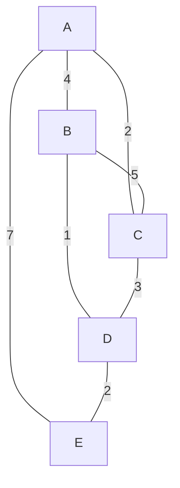

**Kruskal's Algorithm** is a greedy algorithm used to find the **Minimum Spanning Tree (MST)** of a connected, weighted, and undirected graph.

Kruskal's algorithm differs from Prim's in that it builds the MST by repeatedly adding the globally cheapest edge that does not create a cycle, rather than growing from a single vertex.

:::info Key Feature
Kruskal's algorithm sorts all edges by weight and adds them one by one, skipping any edge that would create a cycle. It uses a Disjoint Set Union (DSU) data structure to efficiently detect cycles.
:::

## Video Explanation

<LiteYouTubeEmbed
  id="Y4-BGCjPP6Y"
  params="autoplay=1&autohide=1&showinfo=0&rel=0"
  title="Kruskal's Algorithm - Minimum Spanning Tree"
  poster="maxresdefault"
  lazyLoad={true}
  webp
/>

---

## How It Works

Kruskal's algorithm processes edges in order of increasing weight. It maintains a forest of disjoint sets (one per vertex) and merges sets whenever an edge connects two different components.

### Steps

1. Sort all edges in non-decreasing order of their weight.
2. Initialize a Disjoint Set Union (DSU) where each vertex is its own parent.
3. Iterate over sorted edges:
   - For each edge (u, v, w), check if u and v belong to different sets (using DSU find).
   - If they are in different sets, add the edge to the MST and merge the two sets (using DSU union).
   - If they are in the same set, skip the edge (adding it would create a cycle).
4. Stop when the MST has exactly V - 1 edges (all vertices are connected).

---

## Dry Run Example

Consider the same weighted undirected graph as in Prim's:



### Step-by-Step Execution

| Step | Sorted Edges          | Sets Before Union       | Action     | Sets After Union     |
|------|----------------------|-------------------------|------------|----------------------|
| 1    | B-D (weight 1)       | {B},{D},{A},{C},{E}    | Add        | {B,D},{A},{C},{E}    |
| 2    | A-C (weight 2)       | {B,D},{A},{C},{E}       | Add        | {B,D},{A,C},{E}      |
| 3    | D-E (weight 2)       | {B,D},{A,C},{E}         | Add        | {B,D,E},{A,C}        |
| 4    | C-D (weight 3)       | {B,D,E},{A,C}           | Skip (cycle)| {B,D,E},{A,C}        |
| 5    | A-B (weight 4)       | {B,D,E},{A,C}           | Add        | {A,B,C,D,E} (all)    |

**MST Result: B-D, A-C, D-E, A-B with total weight = 1 + 2 + 2 + 4 = 8**

Note: A-B (weight 4) could alternatively be A-B (weight 4), giving total weight 8. Any valid MST has the same total weight.

---

## Complexity Analysis

| Step                  | Time Complexity      | Space Complexity |
|-----------------------|---------------------|------------------|
| Sorting edges         | O(E log E)          | O(E)             |
| DSU operations        | O(E alpha(V)) ~ O(E) | O(V)            |
| **Total**             | **O(E log E)**       | **O(V + E)**     |

Here, alpha(V) is the inverse Ackermann function, which is effectively constant for all practical values of V.

---

## Implementation

### Python

```python
# Disjoint Set Union (Union-Find) with path compression and union by rank
class DSU:
    def __init__(self, n):
        self.parent = list(range(n))
        self.rank = [0] * n

    def find(self, x):
        if self.parent[x] != x:
            self.parent[x] = self.find(self.parent[x])  # path compression
        return self.parent[x]

    def union(self, x, y):
        px, py = self.find(x), self.find(y)
        if px == py:
            return False  # already in same set
        if self.rank[px] < self.rank[py]:
            px, py = py, px
        self.parent[py] = px
        if self.rank[px] == self.rank[py]:
            self.rank[px] += 1
        return True

def kruskal_mst(V, edges):
    """
    edges: list of (u, v, weight)
    Returns MST edges and total weight
    """
    # Sort edges by weight
    edges.sort(key=lambda x: x[2])

    dsu = DSU(V)
    mst_edges = []
    total_weight = 0

    for u, v, w in edges:
        if dsu.union(u, v):
            mst_edges.append((u, v, w))
            total_weight += w
            if len(mst_edges) == V - 1:
                break

    return mst_edges, total_weight

# Example usage
V = 5
edges = [(0,1,4), (0,2,2), (1,2,5), (1,3,1), (2,3,3), (0,4,7), (3,4,2)]
mst, weight = kruskal_mst(V, edges)
print("MST edges:", mst)
print("Total weight:", weight)
```

### Java

```java
import java.util.*;

class DSU {
    int[] parent, rank;
    DSU(int n) {
        parent = new int[n];
        rank = new int[n];
        for (int i = 0; i < n; i++) parent[i] = i;
    }
    int find(int x) {
        return parent[x] == x ? x : (parent[x] = find(parent[x]));
    }
    boolean union(int x, int y) {
        int px = find(x), py = find(y);
        if (px == py) return false;
        if (rank[px] < rank[py]) parent[px] = py;
        else if (rank[px] > rank[py]) parent[py] = px;
        else { parent[py] = px; rank[px]++; }
        return true;
    }
}

public class KruskalMST {
    public static List<int[]> kruskalMST(int V, List<int[]> edges) {
        edges.sort(Comparator.comparingInt(e -> e[2]));
        DSU dsu = new DSU(V);
        List<int[]> mst = new ArrayList<>();
        int total = 0;

        for (int[] e : edges) {
            if (dsu.union(e[0], e[1])) {
                mst.add(e);
                total += e[2];
                if (mst.size() == V - 1) break;
            }
        }
        return mst;
    }
}
```

### C++

```cpp
#include <bits/stdc++.h>
using namespace std;

class DSU {
    vector<int> parent, rank;
public:
    DSU(int n) { parent.resize(n); rank.assign(n, 0); iota(parent.begin(), parent.end(), 0); }
    int find(int x) { return parent[x] == x ? x : parent[x] = find(parent[x]); }
    bool unite(int x, int y) {
        x = find(x); y = find(y);
        if (x == y) return false;
        if (rank[x] < rank[y]) swap(x, y);
        parent[y] = x;
        if (rank[x] == rank[y]) rank[x]++;
        return true;
    }
};

vector<tuple<int,int,int>> kruskalMST(int V, vector<tuple<int,int,int>> edges) {
    sort(edges.begin(), edges.end(),
         [](auto& a, auto& b) { return get<2>(a) < get<2>(b); });

    DSU dsu(V);
    vector<tuple<int,int,int>> mst;
    for (auto& e : edges) {
        int u, v, w;
        tie(u, v, w) = e;
        if (dsu.unite(u, v)) {
            mst.push_back(e);
            if ((int)mst.size() == V - 1) break;
        }
    }
    return mst;
}
```

### JavaScript

```javascript
class DSU {
    constructor(n) {
        this.parent = Array.from({ length: n }, (_, i) => i);
        this.rank = new Array(n).fill(0);
    }
    find(x) {
        if (this.parent[x] !== x)
            this.parent[x] = this.find(this.parent[x]);
        return this.parent[x];
    }
    union(x, y) {
        const px = this.find(x), py = this.find(y);
        if (px === py) return false;
        if (this.rank[px] < this.rank[py]) {
            this.parent[px] = py;
        } else if (this.rank[px] > this.rank[py]) {
            this.parent[py] = px;
        } else {
            this.parent[py] = px;
            this.rank[px]++;
        }
        return true;
    }
}

function kruskalMST(V, edges) {
    edges.sort((a, b) => a[2] - b[2]);
    const dsu = new DSU(V);
    const mst = [];
    let totalWeight = 0;

    for (const [u, v, w] of edges) {
        if (dsu.union(u, v)) {
            mst.push([u, v, w]);
            totalWeight += w;
            if (mst.length === V - 1) break;
        }
    }

    return { edges: mst, weight: totalWeight };
}
```

---

## Kruskal's vs Prim's: When to Use

| Scenario                      | Recommended Algorithm |
|-------------------------------|----------------------|
| Sparse graph (E << V^2)       | Kruskal's            |
| Dense graph (E ~ V^2)         | Prim's               |
| Need edges added incrementally | Kruskal's            |
| Need MST from arbitrary start | Prim's               |

---

## Applications

- **Network Cable Layout**: Laying cables for computer or telephone networks with minimum total length.
- **Road Construction**: Planning roads that connect all cities with minimum total cost.
- **Cluster Analysis**: Hierarchical clustering in data science.
- **Image Resizing**: Seam carving algorithms in computer graphics.
- **Circuit Design**: Minimizing wire length in VLSI chip design.

---

## Key Takeaways

- Kruskal's algorithm sorts all edges and greedily adds them if they do not create a cycle.
- The DSU (Union-Find) data structure enables near-constant time cycle detection.
- Total time complexity is O(E log E), equivalent to O(E log V) for connected graphs.
- The algorithm is correct due to the cut property and cycle property of MSTs.
- Both Kruskal's and Prim's produce MSTs of equal weight for the same graph.
