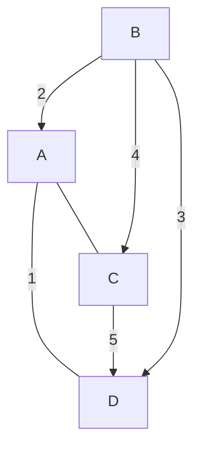

Prim's Algorithm is a greedy algorithm for finding the Minimum Spanning Tree (MST) of a connected, weighted graph. It connects all vertices with the minimum total edge weight, making it useful in network design, clustering, and various optimization tasks.

## Introduction

In graph theory, a Minimum Spanning Tree (MST) is a subset of the edges that connects all vertices in a graph with the minimum possible total edge weight and without any cycles. Prim's Algorithm builds the MST by growing a single tree and repeatedly selecting the smallest edge that connects a vertex in the tree to a vertex outside of it.

## Characteristics of Prim's Algorithm

1. **Greedy Nature**: Always selects the smallest available edge at every step.
2. **Optimal Substructure**: The MST problem has an optimal substructure, where an optimal solution can be built from optimal solutions of its subproblems.
3. **Dense Graphs**: Prim's works well with dense graphs with a large number of edges.


## How Prim's Algorithm Works
1. **Initialization:**
   - Start from an arbitrary vertex and mark it as part of the MST.
   - Use a priority queue (min-heap) to store the edges connected to the MST vertices.

2. **Edge Selection:**
   - While not all vertices are in the MST:
     - Extract the smallest edge from the priority queue.
     - Add the corresponding vertex to the MST.
     - Update the priority queue with edges connected to the new vertex.

3. **Termination:**
   - The algorithm terminates when all vertices have been included in the MST.

## Step-by-Step Execution
Here’s how Prim’s Algorithm can be executed on a simple graph:



- **Execution Steps:**
1. Start with vertex **A**.
2. Add edge **(A-D)**, weight **1** (smallest edge).
3. Add edge **(A-B)**, weight **2**.
4. Add edge **(B-E)**, weight **3**.
5. Add edge **(A-C)**, weight **4**.

The final MST includes edges **(A-D)**, **(A-B)**, **(B-E)**, and **(A-C)** with a total weight of **10**.

## Time Complexity
- The time complexity of Prim's Algorithm is **O(E log V)** when using a priority queue (min-heap), where **E** is the number of edges and **V** is the number of vertices. With an adjacency matrix, it can be reduced to **O(V^2)**.

## Applications
- **Network Design:** Used in designing computer and telecommunications networks for optimal connectivity.
- **Cabling and Wiring:** Efficiently plans the laying of cables between buildings or cities.
- **Cluster Analysis:** Forms the basis for hierarchical clustering in data analysis.
- **Urban Planning:** Helps design efficient transportation networks and utilities in urban environments.

## Pseudocode

```python
1. Initialize a key array to track the minimum weight edge for each vertex.
2. Initialize a boolean array to track the vertices included in the MST.
3. Set the key of the starting vertex to 0.
4. For each vertex not yet in the MST:
   a. Pick the vertex with the minimum key value.
   b. Add it to the MST.
   c. Update the key values of its adjacent vertices.
5. Repeat until all vertices are included in the MST.
```

## Advantages of Prim's Algorithm

- **Greedy and Simple**: Prim's algorithm follows a straightforward greedy approach, making it simple to understand and implement.
  
- **Efficient for Dense Graphs**: Prim's algorithm performs well for dense graphs, especially when used with advanced data structures like binary heaps to optimize edge selection.
  
- **Ensures Connectivity**: Prim's algorithm guarantees a connected graph, which is particularly useful when graph connectivity is crucial in the problem domain.

## Limitations

- **Graph Must Be Connected**: Prim's algorithm only works on connected graphs. If the graph is disconnected, Prim's cannot generate a minimum spanning tree (MST).
  
- **May Not Be Efficient for Sparse Graphs**: For graphs with few edges (sparse graphs), Kruskal's algorithm might be more efficient than Prim's algorithm due to the differences in how they explore the graph and manage edge processing.

## Prim's Algorithm vs. Kruskal's Algorithm

| Feature                | Prim's Algorithm                                       | Kruskal's Algorithm                                                      |
|------------------------|--------------------------------------------------------|--------------------------------------------------------------------------|
| **Approach**           | Greedy: Start from a vertex and grow the MST           | Greedy: Sort edges and add the smallest edge without forming cycles      |
| **Data Structure Used**| Adjacency list, priority queue (min-heap)              | Union-Find/Disjoint Set data structure                                   |
| **Graph Type**         | Dense graphs (many edges)                              | Sparse graphs (few edges)                                                |
| **Starting Point**     | Requires a starting vertex                             | No starting vertex, works directly with edges                            |
| **Time Complexity**    | $O(E log V)$ using binary heap and adjacency list        | $O(E log E)$ due to sorting edges                                          |

Both algorithms can effectively find the MST, but the choice between them depends on the graph's density and specific use cases.

## Conclusion

Prim's Algorithm is a powerful method for finding the Minimum Spanning Tree in a graph. Its greedy approach, efficiency, and wide range of applications make it a fundamental algorithm in computer science and network design. Understanding how Prim's Algorithm works enables developers and researchers to tackle various problems in optimization and connectivity.
