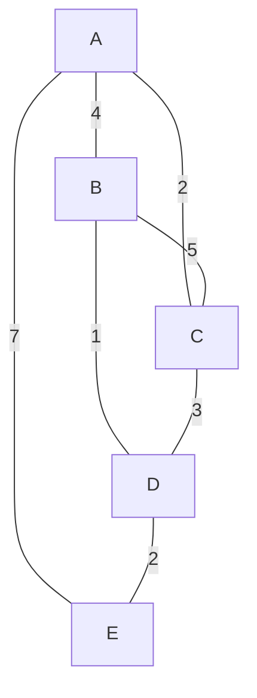

**Prim's Algorithm** is a greedy algorithm used to find the **Minimum Spanning Tree (MST)** of a weighted, undirected graph.

A Minimum Spanning Tree is a subset of the edges of a connected, weighted graph that connects all vertices with the minimum possible total edge weight, without forming any cycles.

:::info Key Feature
Prim's algorithm builds the MST by starting from an arbitrary vertex and greedily adding the cheapest edge that connects a visited vertex to an unvisited vertex at each step.
:::

## Video Explanation

<LiteYouTubeEmbed
  id="Y4-BGCjPP6Y"
  params="autoplay=1&autohide=1&showinfo=0&rel=0"
  title="Prim's Algorithm - Minimum Spanning Tree"
  poster="maxresdefault"
  lazyLoad={true}
  webp
/>

---

## How It Works

Prim's algorithm grows the MST one vertex at a time. It maintains two sets: vertices already included in the MST and vertices not yet included.

### Steps

1. Start with an arbitrary starting vertex. Mark it as part of the MST.
2. Initialize a min-heap (priority queue) with all edges from the starting vertex.
3. While the MST does not yet include all vertices:
   - Extract the minimum weight edge from the heap.
   - If the destination vertex is not already in the MST, add it along with the edge.
   - Add all edges from this new vertex to unvisited vertices to the heap.
4. The process terminates when all vertices are included in the MST.

### Intuition

The greedy choice of always picking the minimum weight edge that connects the MST to a new vertex is safe because any MST must include the cheapest edge crossing any cut of the graph (Cut Property).

---

## Dry Run Example

Consider the following weighted undirected graph:



### Step-by-Step Execution

| Step | MST Vertices | Edge Added    | Total Weight |
|------|--------------|---------------|--------------|
| 0    | {A}          | (start)       | 0            |
| 1    | {A, C}       | A-C (weight 2)| 2            |
| 2    | {A, C, D}    | C-D (weight 3)| 5            |
| 3    | {A, C, D, E} | D-E (weight 2)| 7            |
| 4    | {A, C, D, E, B}| B-D (weight 1)| 8            |

**MST Result: A-C, C-D, D-E, B-D with total weight = 8**

---

## Complexity Analysis

| Implementation    | Time Complexity        | Space Complexity |
|-------------------|------------------------|------------------|
| Adjacency List + Min-Heap | O(E log V)    | O(V + E)         |
| Adjacency Matrix (simple) | O(V^2)        | O(V^2)           |
| Binary Heap       | O(E log V)             | O(V)             |
| Fibonacci Heap    | O(E + V log V)         | O(V)             |

---

## Implementation

### Python

```python
import heapq

def prims_mst(V, adj, start=0):
    """
    adj: adjacency list where adj[u] = [(v, weight), ...]
    Returns list of edges in MST and total weight
    """
    visited = [False] * V
    min_heap = []  # (weight, u, v)
    mst_edges = []

    # Start from vertex 0
    visited[start] = True
    for v, w in adj[start]:
        heapq.heappush(min_heap, (w, start, v))

    total_weight = 0

    while min_heap and len(mst_edges) < V - 1:
        weight, u, v = heapq.heappop(min_heap)

        if visited[v]:
            continue

        visited[v] = True
        mst_edges.append((u, v, weight))
        total_weight += weight

        for next_v, w in adj[v]:
            if not visited[next_v]:
                heapq.heappush(min_heap, (w, v, next_v))

    return mst_edges, total_weight

# Example usage
V = 5
adj = [[] for _ in range(V)]
edges = [(0,1,4), (0,2,2), (1,2,5), (1,3,1), (2,3,3), (0,4,7), (3,4,2)]
for u, v, w in edges:
    adj[u].append((v, w))
    adj[v].append((u, w))

mst, weight = prims_mst(V, adj)
print("MST edges:", mst)
print("Total weight:", weight)
```

### Java

```java
import java.util.*;

public class PrimsMST {
    static class Edge {
        int to, weight;
        Edge(int to, int weight) {
            this.to = to;
            this.weight = weight;
        }
    }

    public static List<int[]> primsMST(int V, List<List<Edge>> adj, int start) {
        boolean[] visited = new boolean[V];
        PriorityQueue<int[]> pq = new PriorityQueue<>(Comparator.comparingInt(a -> a[2]));
        List<int[]> mstEdges = new ArrayList<>();
        int totalWeight = 0;

        visited[start] = true;
        for (Edge e : adj.get(start)) {
            pq.offer(new int[]{start, e.to, e.weight});
        }

        while (!pq.isEmpty() && mstEdges.size() < V - 1) {
            int[] edge = pq.poll();
            int u = edge[0], v = edge[1], w = edge[2];

            if (visited[v]) continue;

            visited[v] = true;
            mstEdges.add(new int[]{u, v, w});
            totalWeight += w;

            for (Edge e : adj.get(v)) {
                if (!visited[e.to]) {
                    pq.offer(new int[]{v, e.to, e.weight});
                }
            }
        }
        return mstEdges;
    }
}
```

### C++

```cpp
#include <bits/stdc++.h>
using namespace std;

class PrimsMST {
    int V;
    vector<vector<pair<int,int>>> adj;

public:
    PrimsMST(int V, vector<vector<pair<int,int>>> adj)
        : V(V), adj(adj) {}

    vector<tuple<int,int,int>> findMST(int start = 0) {
        vector<bool> visited(V, false);
        priority_queue<
            tuple<int,int,int>,
            vector<tuple<int,int,int>>,
            greater<tuple<int,int,int>>
        > pq;
        vector<tuple<int,int,int>> mstEdges;
        int totalWeight = 0;

        visited[start] = true;
        for (auto& [v, w] : adj[start])
            pq.emplace(w, start, v);

        while (!pq.empty() && (int)mstEdges.size() < V - 1) {
            auto [w, u, v] = pq.top(); pq.pop();
            if (visited[v]) continue;

            visited[v] = true;
            mstEdges.emplace_back(u, v, w);
            totalWeight += w;

            for (auto& [nv, nw] : adj[v])
                if (!visited[nv])
                    pq.emplace(nw, v, nv);
        }
        return mstEdges;
    }
};
```

### JavaScript

```javascript
function primsMST(V, adj, start = 0) {
    const visited = new Array(V).fill(false);
    const minHeap = []; // [weight, u, v]
    const mstEdges = [];
    let totalWeight = 0;

    visited[start] = true;
    for (const [v, w] of adj[start]) {
        minHeap.push([w, start, v]);
    }
    minHeap.sort((a, b) => a[0] - b[0]);

    while (minHeap.length > 0 && mstEdges.length < V - 1) {
        const [w, u, v] = minHeap.shift();
        if (visited[v]) continue;

        visited[v] = true;
        mstEdges.push([u, v, w]);
        totalWeight += w;

        for (const [nv, nw] of adj[v]) {
            if (!visited[nv]) {
                minHeap.push([nw, v, nv]);
                minHeap.sort((a, b) => a[0] - b[0]);
            }
        }
    }

    return { edges: mstEdges, weight: totalWeight };
}
```

---

## Comparison: Prim's vs Kruskal's

| Aspect             | Prim's Algorithm              | Kruskal's Algorithm         |
|--------------------|------------------------------|-----------------------------|
| Growth Pattern     | Grows MST from a starting vertex | Grows MST edge by edge    |
| Data Structure     | Min-Heap / Priority Queue     | Disjoint Set Union (DSU)    |
| Best For           | Dense graphs (E ~ V^2)        | Sparse graphs (E ~ V)       |
| Time (dense)       | O(V^2)                       | O(E log E)                  |
| Time (sparse)      | O(E log V)                   | O(E log E)                  |
| Edge Selection     | Always connects to MST       | Always selects minimum edge |

---

## Applications

- **Network Design**: Designing minimum cost telephone networks, electrical grids, and road networks.
- **Clustering**: Grouping data points based on proximity in hierarchical clustering.
- **Image Segmentation**: Finding edges and regions in computer vision.
- **Approximation Algorithms**: Used as a building block in approximation algorithms for NP-hard problems like the Traveling Salesman Problem.

---

## Key Takeaways

- Prim's algorithm is a greedy algorithm that builds the MST incrementally from a starting vertex.
- It uses a min-heap to efficiently select the minimum weight edge crossing the cut.
- Time complexity with binary heap is O(E log V), making it efficient for sparse graphs.
- The algorithm is correct due to the cut property of MSTs.
