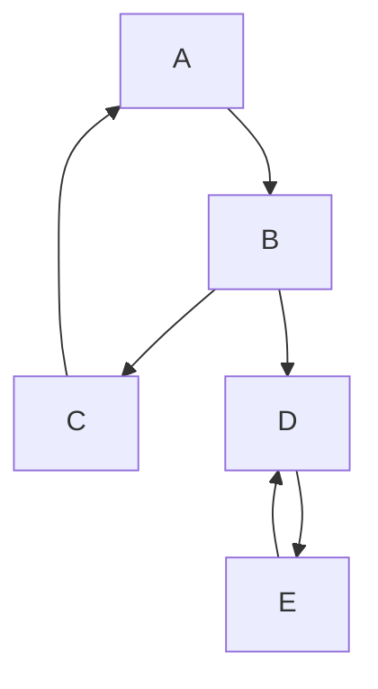

## Tarjan's Algorithm:
Tarjan's Algorithm is a graph traversal technique used to find all strongly connected components (SCCs) in a directed graph. It employs depth-first search (DFS) and uses a low-link value to keep track of the smallest reachable vertex.

## Introduction

In graph theory, a strongly connected component (SCC) of a directed graph is a maximal subgraph where every vertex is reachable from every other vertex. Tarjan's Algorithm efficiently identifies all SCCs using a single DFS traversal, making it suitable for various applications in network analysis, compiler design, and more.

## Characteristics of Tarjan's Algorithm

1. **Single DFS Traversal**: The algorithm performs a single depth-first search traversal of the graph.
2. **Low-Link Values**: It uses low-link values to determine the smallest reachable vertex in the DFS tree.
3. **Stack-Based**: The algorithm utilizes a stack to track vertices and identify components.

## How Tarjan's Algorithm Works

1. **Initialization**:
   - Maintain an index to assign unique identifiers to vertices during DFS traversal.
   - Use a low-link array to track the lowest index reachable from each vertex.
   - Use a stack to keep track of vertices in the current DFS path.

2. **DFS Traversal**:
   - For each unvisited vertex, assign it an index and initialize its low-link value.
   - Perform DFS on its neighbors:
     - If a neighbor is unvisited, recursively apply Tarjan’s algorithm.
     - Update the low-link value based on the neighbor's low-link value.
     - If the neighbor is in the stack, update the low-link value to reflect its index.
  
3. **Component Identification**:
   - After visiting all neighbors, check if the vertex is a root of an SCC:
     - If it is, pop vertices from the stack until the vertex itself is reached, marking them as part of the same component.

4. **Termination**:
   - The algorithm terminates when all vertices have been visited, and all SCCs have been identified.

## Step-by-Step Execution

Consider a simple directed graph:




### Code Implementation:

```java
    import java.util.ArrayList;
import java.util.List;
import java.util.Stack;

public class TarjanAlgorithm {
    private int index = 0;
    private int[] indices;
    private int[] lowLink;
    private boolean[] onStack;
    private Stack<Integer> stack;
    private List<List<Integer>> sccs;

    public List<List<Integer>> tarjansAlgorithm(List<List<Integer>> graph) {
        int n = graph.size();
        indices = new int[n];
        lowLink = new int[n];
        onStack = new boolean[n];
        stack = new Stack<>();
        sccs = new ArrayList<>();

        for (int v = 0; v < n; v++) {
            if (indices[v] == 0) {
                strongconnect(v, graph);
            }
        }

        return sccs;
    }

    private void strongconnect(int v, List<List<Integer>> graph) {
        indices[v] = lowLink[v] = ++index;
        stack.push(v);
        onStack[v] = true;

        for (int w : graph.get(v)) {
            if (indices[w] == 0) {
                // Successor w has not yet been visited; recurse on it
                strongconnect(w, graph);
                lowLink[v] = Math.min(lowLink[v], lowLink[w]);
            } else if (onStack[w]) {
                // Successor w is in stack and hence in the current SCC
                lowLink[v] = Math.min(lowLink[v], indices[w]);
            }
        }

        // If v is a root node, pop the stack and generate an SCC
        if (lowLink[v] == indices[v]) {
            List<Integer> scc = new ArrayList<>();
            int w;
            do {
                w = stack.pop();
                onStack[w] = false;
                scc.add(w);
            } while (w != v);
            sccs.add(scc);
        }
    }

    public static void main(String[] args) {
        // Create a sample directed graph
        List<List<Integer>> graph = new ArrayList<>();
        for (int i = 0; i < 5; i++) {
            graph.add(new ArrayList<>());
        }

        // Add edges (directed)
        graph.get(0).add(1);
        graph.get(1).add(2);
        graph.get(2).add(0);
        graph.get(1).add(3);
        graph.get(3).add(4);
        graph.get(4).add(3);

        TarjanAlgorithm tarjan = new TarjanAlgorithm();
        List<List<Integer>> sccs = tarjan.tarjansAlgorithm(graph);

        System.out.println("Strongly Connected Components:");
        for (List<Integer> scc : sccs) {
            System.out.println(scc);
        }
    }
}

```
## Time Complexity
The time complexity of Tarjan's Algorithm is O(V + E), where V is the number of vertices and E is the number of edges, as it performs a single DFS traversal of the graph.


## Applications
Compiler Optimization: Used to identify strongly connected components in control flow graphs.
Social Network Analysis: Helps to identify communities within networks where every member is reachable from every other member.
Web Page Ranking: Analyzes link structures of web pages for search engine optimization.

## Advantages of Tarjan's Algorithm

Efficiency: The algorithm efficiently finds all SCCs in linear time with respect to the number of vertices and edges.
Simplicity: The algorithm is straightforward and can be easily implemented with basic graph traversal techniques.
Memory Usage: Tarjan's algorithm uses minimal additional memory since it operates with a stack and a few arrays.

## Limitations
Directed Graphs Only: Tarjan's Algorithm is designed specifically for directed graphs and cannot be applied to undirected graphs.
Complex Implementation for Beginners: Understanding the algorithm's use of low-link values and stack management may be challenging for those new to graph theory.

## Conclusion
Tarjan's Algorithm is a powerful and efficient method for identifying strongly connected components in directed graphs. Its linear time complexity and elegant design make it a fundamental algorithm in computer science, particularly in areas like network analysis, compiler design, and graph theory. Understanding and implementing Tarjan's Algorithm enables developers and researchers to effectively solve problems related to connectivity and component analysis in graphs.