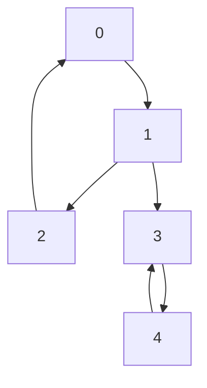

The **Tarjan's Algorithm** is an efficient depth-first search (DFS) based algorithm used to find all **Strongly Connected Components (SCCs)** in a directed graph.

A strongly connected component of a directed graph is a maximal subset of vertices such that every vertex in the subset is reachable from any other vertex in the same subset.

:::info Key Feature
Tarjan's Algorithm finds all SCCs in a single DFS traversal of the graph. It achieves this by tracking the traversal order of nodes and the lowest-indexed nodes reachable from them.
:::

## Video Explanation

<LiteYouTubeEmbed
  id="TyWtx7q2D7s"
  params="autoplay=1&autohide=1&showinfo=0&rel=0"
  title="Tarjan's Strongly Connected Component (SCC) Algorithm"
  lazyLoad={true}
  webp
/>

---

## How It Works

Tarjan's algorithm uses two main tracking values for each vertex `u`:
1. **`index[u]`**: The discovery time / traversal step number of vertex `u`.
2. **`low[u]`**: The smallest discovery index reachable from `u` through at most one back-edge.

We also maintain a **stack** to keep track of the path of DFS traversal and vertices currently member of the active DFS branch.

### Steps

1. Start DFS traversal. For each unvisited vertex `u`:
   - Set `index[u] = low[u] = current_time`. Increment `current_time`.
   - Push `u` onto the stack and mark it as present in the stack.
2. For each directed edge `u → v` (neighbor `v` of `u`):
   - If `v` is not visited, recursively run DFS on `v`. After return, update:
     `low[u] = min(low[u], low[v])`.
   - If `v` is already visited and is currently in the stack (indicating a back-edge / cycle):
     `low[u] = min(low[u], index[v])`.
3. If after visiting all neighbors of `u`, `low[u] === index[u]`, then `u` is the root of an SCC:
   - Pop nodes from the stack until we pop `u`.
   - All popped nodes, including `u`, form a strongly connected component (SCC).

---

## Dry Run Example

Consider the following directed graph:



### Dry Run Table & Steps

1. Start DFS at node `0`: `index[0] = low[0] = 1`. Stack: `[0]`
2. Move to neighbor `1`: `index[1] = low[1] = 2`. Stack: `[0, 1]`
3. Move to neighbor `2`: `index[2] = low[2] = 3`. Stack: `[0, 1, 2]`
4. Neighbor of `2` is `0` (already visited & on stack). Update `low[2] = min(low[2], index[0]) = min(3, 1) = 1`.
5. Backtrack to `1`. Update `low[1] = min(low[1], low[2]) = min(2, 1) = 1`.
6. From `1`, visit neighbor `3`: `index[3] = low[3] = 4`. Stack: `[0, 1, 2, 3]`
7. From `3`, visit neighbor `4`: `index[4] = low[4] = 5`. Stack: `[0, 1, 2, 3, 4]`
8. Neighbor of `4` is `3` (visited & on stack). Update `low[4] = min(low[4], index[3]) = min(5, 4) = 4`.
9. Backtrack to `3`. Update `low[3] = min(low[3], low[4]) = min(4, 4) = 4`.
10. For node `4`, `low[4]` (4) is not equal to `index[4]` (5), so it is not an SCC root. Backtrack to `3`.
11. For node `3`, `low[3] === index[3] === 4`. Pop stack until `3`. **SCC found: {4, 3}**. Stack becomes `[0, 1, 2]`.
12. Backtrack to `1`. Neighbors done. `low[1] === 1` but `index[1] === 2`. (No SCC root yet).
13. Backtrack to `0`. Neighbors done. `low[0] === index[0] === 1`. Pop stack until `0`. **SCC found: {2, 1, 0}**. Stack: `[]`.

---

## Complexity Analysis

| Metric | Value |
| :--- | :--- |
| **Time Complexity** | $O(V + E)$ |
| **Space Complexity** | $O(V)$ |

Where:
- `V` = Number of Vertices
- `E` = Number of Edges

---

## Implementations

### Python

```python
class TarjanSCC:
    def __init__(self, vertices):
        self.V = vertices
        self.graph = {}
        self.time = 0

    def add_edge(self, u, v):
        if u not in self.graph:
            self.graph[u] = []
        self.graph[u].append(v)

    def scc_util(self, u, low, disc, stack_member, st, result):
        disc[u] = self.time
        low[u] = self.time
        self.time += 1
        st.append(u)
        stack_member[u] = True

        for v in self.graph.get(u, []):
            if disc[v] == -1:
                self.scc_util(v, low, disc, stack_member, st, result)
                low[u] = min(low[u], low[v])
            elif stack_member[v]:
                low[u] = min(low[u], disc[v])

        w = -1
        if low[u] == disc[u]:
            scc = []
            while w != u:
                w = st.pop()
                scc.append(w)
                stack_member[w] = False
            result.append(scc)

    def find_sccs(self):
        self.time = 0
        disc = [-1] * self.V
        low = [-1] * self.V
        stack_member = [False] * self.V
        st = []
        result = []

        for i in range(self.V):
            if disc[i] == -1:
                self.scc_util(i, low, disc, stack_member, st, result)
        return result

# Example usage
g = TarjanSCC(5)
g.add_edge(0, 1)
g.add_edge(1, 2)
g.add_edge(2, 0)
g.add_edge(1, 3)
g.add_edge(3, 4)
g.add_edge(4, 3)
print(g.find_sccs())
```

### Java

```java
import java.util.*;

public class TarjanSCC {
    private int V;
    private List<List<Integer>> adj;
    private int time;
    
    public TarjanSCC(int vertices) {
        this.V = vertices;
        adj = new ArrayList<>(vertices);
        for (int i = 0; i < vertices; i++) {
            adj.add(new ArrayList<>());
        }
    }

    public void addEdge(int u, int v) {
        adj.get(u).add(v);
    }

    private void sccUtil(int u, int[] low, int[] disc, boolean[] stackMember, Deque<Integer> st, List<List<Integer>> result) {
        disc[u] = low[u] = ++time;
        st.push(u);
        stackMember[u] = true;

        for (int v : adj.get(u)) {
            if (disc[v] == -1) {
                sccUtil(v, low, disc, stackMember, st, result);
                low[u] = Math.min(low[u], low[v]);
            } else if (stackMember[v]) {
                low[u] = Math.min(low[u], disc[v]);
            }
        }

        if (low[u] == disc[u]) {
            List<Integer> scc = new ArrayList<>();
            while (true) {
                int w = st.pop();
                stackMember[w] = false;
                scc.add(w);
                if (w == u) break;
            }
            result.add(scc);
        }
    }

    public List<List<Integer>> findSCCs() {
        this.time = 0;
        int[] disc = new int[V];
        int[] low = new int[V];
        Arrays.fill(disc, -1);
        Arrays.fill(low, -1);
        boolean[] stackMember = new boolean[V];
        Deque<Integer> st = new ArrayDeque<>();
        List<List<Integer>> result = new ArrayList<>();

        for (int i = 0; i < V; i++) {
            if (disc[i] == -1) {
                sccUtil(i, low, disc, stackMember, st, result);
            }
        }
        return result;
    }
}
```

### C++

```cpp
#include <iostream>
#include <vector>
#include <stack>
#include <algorithm>

using namespace std;

class TarjanSCC {
    int V;
    vector<vector<int>> adj;
    int time;

    void sccUtil(int u, vector<int>& low, vector<int>& disc, vector<bool>& stackMember, stack<int>& st, vector<vector<int>>& result) {
        disc[u] = low[u] = ++time;
        st.push(u);
        stackMember[u] = true;

        for (int v : adj[u]) {
            if (disc[v] == -1) {
                sccUtil(v, low, disc, stackMember, st, result);
                low[u] = min(low[u], low[v]);
            } else if (stackMember[v]) {
                low[u] = min(low[u], disc[v]);
            }
        }

        if (low[u] == disc[u]) {
            vector<int> scc;
            while (true) {
                int w = st.top();
                st.pop();
                stackMember[w] = false;
                scc.push_back(w);
                if (w == u) break;
            }
            result.push_back(scc);
        }
    }

public:
    TarjanSCC(int vertices) : V(vertices), adj(vertices), time(0) {}

    void addEdge(int u, int v) {
        adj[u].push_back(v);
    }

    vector<vector<int>> findSCCs() {
        time = 0;
        vector<int> disc(V, -1);
        vector<int> low(V, -1);
        vector<bool> stackMember(V, false);
        stack<int> st;
        vector<vector<int>> result;

        for (int i = 0; i < V; i++) {
            if (disc[i] == -1) {
                sccUtil(i, low, disc, stackMember, st, result);
            }
        }
        return result;
    }
};
```

### JavaScript

```javascript
class TarjanSCC {
    constructor(vertices) {
        this.V = vertices;
        this.adj = Array.from({ length: vertices }, () => []);
        this.time = 0;
    }

    addEdge(u, v) {
        this.adj[u].push(v);
    }

    sccUtil(u, low, disc, stackMember, st, result) {
        disc[u] = low[u] = ++this.time;
        st.push(u);
        stackMember[u] = true;

        for (const v of this.adj[u]) {
            if (disc[v] === -1) {
                this.sccUtil(v, low, disc, stackMember, st, result);
                low[u] = Math.min(low[u], low[v]);
            } else if (stackMember[v]) {
                low[u] = Math.min(low[u], disc[v]);
            }
        }

        if (low[u] === disc[u]) {
            const scc = [];
            while (true) {
                const w = st.pop();
                stackMember[w] = false;
                scc.push(w);
                if (w === u) break;
            }
            result.push(scc);
        }
    }

    findSCCs() {
        this.time = 0;
        const disc = new Array(this.V).fill(-1);
        const low = new Array(this.V).fill(-1);
        const stackMember = new Array(this.V).fill(false);
        const st = [];
        const result = [];

        for (let i = 0; i < this.V; i++) {
            if (disc[i] === -1) {
                this.sccUtil(i, low, disc, stackMember, st, result);
            }
        }
        return result;
    }
}
```

---

## Real-World Use Cases

- **Circular Dependency Detection** — In build tools (e.g. Maven, Webpack) or module loaders to find cycles in import chains.
- **Social Network Analysis** — Discovering strongly connected groups where users interact mutually.
- **Compiler Optimization** — Identifying components of mutually recursive functions.
- **Web Crawlers** — Partitioning websites into clusters of mutual reachability.
