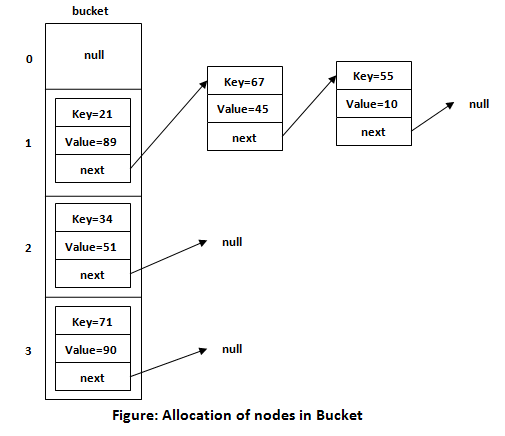

# HashMap Data Structure

## Introduction to HashMap

A HashMap is a data structure that implements the Map interface, storing data in key-value pairs. It uses a technique called hashing to store the keys. In a HashMap, the key is run through a hash function to generate a hash code, which is then used as the index at which the corresponding value is stored.



## HashMap Operations

- **Put**: Add a key-value pair to the HashMap.
- **Get**: Retrieve the value associated with a given key.
- **Remove**: Delete a key-value pair from the HashMap.
- **ContainsKey**: Check if a key exists in the HashMap.
- **Size**: Get the number of key-value pairs in the HashMap.

## Implementation

### Python Implementation

```python
class HashMap:
    def __init__(self, size=100):
        self.size = size
        self.map = [[] for _ in range(self.size)]
    
    def _hash(self, key):
        return hash(key) % self.size
    
    def put(self, key, value):
        index = self._hash(key)
        for pair in self.map[index]:
            if pair[0] == key:
                pair[1] = value
                return
        self.map[index].append([key, value])
    
    def get(self, key):
        index = self._hash(key)
        for pair in self.map[index]:
            if pair[0] == key:
                return pair[1]
        raise KeyError(key)
    
    def remove(self, key):
        index = self._hash(key)
        for i, pair in enumerate(self.map[index]):
            if pair[0] == key:
                return self.map[index].pop(i)[1]
        raise KeyError(key)
    
    def contains_key(self, key):
        index = self._hash(key)
        return any(pair[0] == key for pair in self.map[index])
    
    def size(self):
        return sum(len(bucket) for bucket in self.map)

# Example usage
hash_map = HashMap()
hash_map.put("key1", "value1")
hash_map.put("key2", "value2")
print(hash_map.get("key1"))  # Output: value1
print(hash_map.contains_key("key2"))  # Output: True
print(hash_map.size())  # Output: 2
hash_map.remove("key1")
print(hash_map.size())  # Output: 1
```

### C++ Implementation
```cpp
#include <iostream>
#include <vector>
#include <list>
#include <stdexcept>
#include <functional>

template<typename K, typename V>
class HashMap {
private:
    std::vector<std::list<std::pair<K, V>>> map;
    size_t numItems;

    size_t hash(const K& key) const {
        return std::hash<K>{}(key) % map.size();
    }

public:
    HashMap(size_t size = 100) : map(size), numItems(0) {}

    void put(const K& key, const V& value) {
        size_t index = hash(key);
        for (auto& pair : map[index]) {
            if (pair.first == key) {
                pair.second = value;
                return;
            }
        }
        map[index].push_back({key, value});
        ++numItems;
    }

    V get(const K& key) const {
        size_t index = hash(key);
        for (const auto& pair : map[index]) {
            if (pair.first == key) {
                return pair.second;
            }
        }
        throw std::out_of_range("Key not found");
    }

    void remove(const K& key) {
        size_t index = hash(key);
        auto& bucket = map[index];
        for (auto it = bucket.begin(); it != bucket.end(); ++it) {
            if (it->first == key) {
                bucket.erase(it);
                --numItems;
                return;
            }
        }
        throw std::out_of_range("Key not found");
    }

    bool containsKey(const K& key) const {
        size_t index = hash(key);
        for (const auto& pair : map[index]) {
            if (pair.first == key) {
                return true;
            }
        }
        return false;
    }

    size_t size() const {
        return numItems;
    }
};

// Example usage
int main() {
    HashMap<std::string, int> hashMap;
    hashMap.put("key1", 10);
    hashMap.put("key2", 20);
    std::cout << hashMap.get("key1") << std::endl;  // Output: 10
    std::cout << hashMap.containsKey("key2") << std::endl;  // Output: 1 (true)
    std::cout << hashMap.size() << std::endl;  // Output: 2
    hashMap.remove("key1");
    std::cout << hashMap.size() << std::endl;  // Output: 1
    return 0;
}
```
### Java Implementation
```java
import java.util.LinkedList;
import java.util.List;

public class HashMap<K, V> {
    private static final int DEFAULT_SIZE = 100;
    private List<Entry<K, V>>[] map;
    private int size;

    @SuppressWarnings("unchecked")
    public HashMap() {
        map = new LinkedList[DEFAULT_SIZE];
        size = 0;
    }

    private int hash(K key) {
        return Math.abs(key.hashCode() % map.length);
    }

    public void put(K key, V value) {
        int index = hash(key);
        if (map[index] == null) {
            map[index] = new LinkedList<>();
        }
        for (Entry<K, V> entry : map[index]) {
            if (entry.key.equals(key)) {
                entry.value = value;
                return;
            }
        }
        map[index].add(new Entry<>(key, value));
        size++;
    }

    public V get(K key) {
        int index = hash(key);
        if (map[index] != null) {
            for (Entry<K, V> entry : map[index]) {
                if (entry.key.equals(key)) {
                    return entry.value;
                }
            }
        }
        return null;
    }

    public V remove(K key) {
        int index = hash(key);
        if (map[index] != null) {
            for (Entry<K, V> entry : map[index]) {
                if (entry.key.equals(key)) {
                    map[index].remove(entry);
                    size--;
                    return entry.value;
                }
            }
        }
        return null;
    }

    public boolean containsKey(K key) {
        int index = hash(key);
        if (map[index] != null) {
            for (Entry<K, V> entry : map[index]) {
                if (entry.key.equals(key)) {
                    return true;
                }
            }
        }
        return false;
    }

    public int size() {
        return size;
    }

    private static class Entry<K, V> {
        K key;
        V value;

        Entry(K key, V value) {
            this.key = key;
            this.value = value;
        }
    }

    // Example usage
    public static void main(String[] args) {
        HashMap<String, Integer> hashMap = new HashMap<>();
        hashMap.put("key1", 10);
        hashMap.put("key2", 20);
        System.out.println(hashMap.get("key1"));  // Output: 10
        System.out.println(hashMap.containsKey("key2"));  // Output: true
        System.out.println(hashMap.size());  // Output: 2
        hashMap.remove("key1");
        System.out.println(hashMap.size());  // Output: 1
    }
}
```