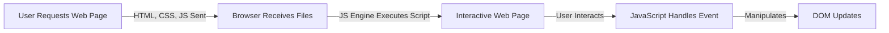

# Introduction to JavaScript

Hey, everyone! In this guide, we'll take a journey into **JavaScript**, one of the most popular programming languages used for web development. JavaScript allows you to create interactive, dynamic, and feature-rich web applications. Let's dive into the basics!

<AdsComponent />

## 1. What is JavaScript?

JavaScript, often abbreviated as **JS**, is a high-level, dynamic, and versatile programming language used primarily for web development. It allows developers to create interactive web pages, handle user events, and manipulate the Document Object Model (DOM).

### Key Features of JavaScript:

- **Client-side scripting**: Runs directly in the browser, enabling dynamic content.
- **Interactivity**: Handles user interactions, such as clicks, form submissions, and animations.
- **Cross-platform**: Compatible with all major web browsers.
- **Event-driven**: Reacts to user inputs and events like clicks, hovers, or keypresses.

:::tip Fun Fact
JavaScript was created in just **10 days** by Brendan Eich in 1995, and despite its rushed creation, it has grown to become the most widely-used language on the web!
:::

<Ads />

## 2. How Does JavaScript Work?

JavaScript runs in the web browser. When a web page loads, the browser's JavaScript engine interprets and executes the script to make the page interactive.

### JavaScript Workflow




## 3. JavaScript in Action: Example
Here’s an example of how JavaScript can enhance a web page by responding to user input and dynamically updating the content.


```html
<!DOCTYPE html>
<html>
  <head>
    <title>Simple JS Example</title>
  </head>
  <body>
    <h1 id="greeting">Welcome!</h1>
    <button onclick="changeGreeting()">Click Me</button>

    <script>
      function changeGreeting() {
        document.getElementById("greeting").innerText = "Hello, JavaScript!";
      }
    </script>
  </body>
</html>
```
What happens here?
HTML: Provides the structure (a heading and a button).
JavaScript: Adds interactivity. When the button is clicked, the heading's text is changed to "Hello, JavaScript!".
```html
<AdsComponent />
```
## 4. Where is JavaScript Used?
JavaScript is everywhere! From simple web pages to complex applications, here are some areas where it's commonly used:

4.1. Front-End Web Development
JavaScript brings static HTML pages to life by enabling interaction. Popular JavaScript frameworks like React, Vue, and Angular have revolutionized the way we build modern web applications.

4.2. Back-End Web Development
JavaScript is not limited to the browser. With Node.js, you can run JavaScript on servers, enabling you to build full-stack web applications using a single language!

4.3. Mobile and Desktop Apps
Frameworks like React Native (for mobile) and Electron (for desktop) allow developers to build apps for multiple platforms using JavaScript.

4.4. Game Development
Using libraries like Phaser and Three.js, JavaScript can even be used to create 2D and 3D games that run directly in the browser.

## 5. Adding JavaScript to Your Web Page
To include JavaScript in a web page, you can embed it directly within the HTML using the  tag.

5.1. Inline JavaScript
You can add JavaScript code directly inside your HTML:

```html
<script>
  console.log("Hello, world!");
</script>
```

5.2. External JavaScript
For larger projects, it's better to keep your JavaScript in a separate file:
```html
<script src="main.js"></script>
```