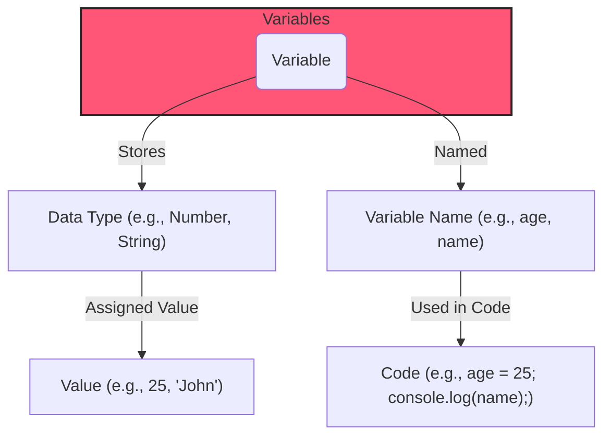
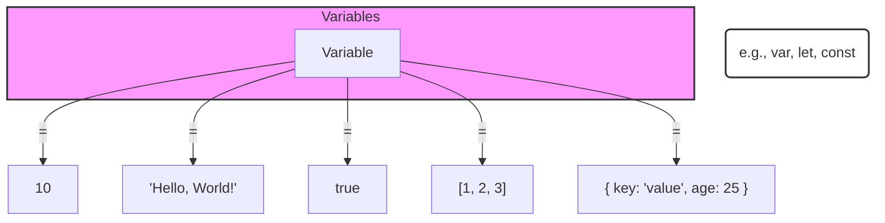
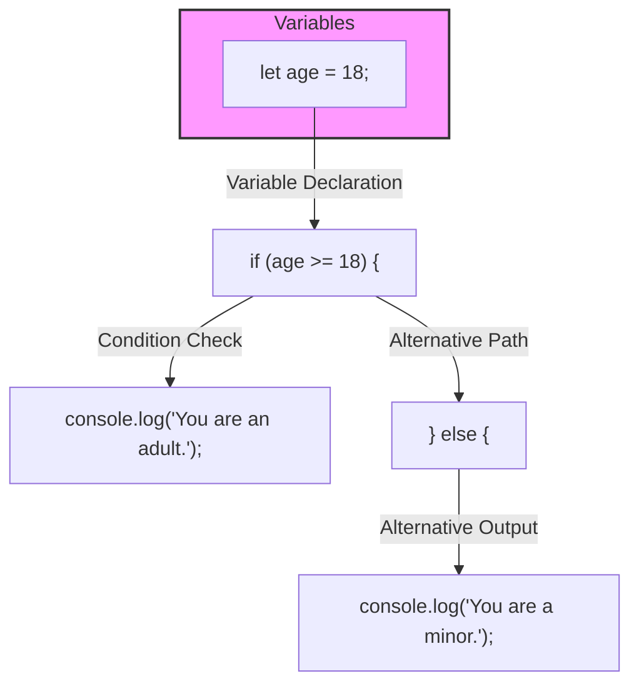

Hey, everyone! In this guide, we'll explore the concept of variables in JavaScript. Variables are essential in programming, allowing you to store and manipulate data dynamically. Let's dive in!

<AdsComponent />

## 1. What are Variables?

In the world of programming, variables act as containers. Think of them like labeled boxes that hold various types of information in your program. These containers allow you to store, retrieve, and manipulate data, providing the foundation for dynamic and interactive code.

### Visualizing Variables



In JavaScript, we use variables to store and manage data, representing numbers, text, or more complex structures.



:::tip Definition 
In JavaScript, variables are containers that hold information, allowing you to reference and manipulate values within your code. Variables are fundamental to programming, enabling you to work with data dynamically.

In programming, variables are used to store and manage data. They act as symbolic names for values. In JavaScript, you can declare variables using the `var`, `let`, or `const` keywords.

1. `var`:

   - Historically used for variable declaration, but it has some scoping issues.
   - Variables declared with `var` are function-scoped, meaning they are only accessible within the function where they are declared.

2. `let`:

   - Introduced in ECMAScript 6 (ES6) to address the scoping issues of `var`.
   - `let` allows block-scoping, meaning the variable is limited to the block (enclosed by curly braces) where it is defined.

3. `const`:

   - Also introduced in ES6, `const` is used to declare constants.
   - Constants cannot be reassigned after declaration.
   - They are block-scoped like variables declared with let.
:::

<Ads />

## 2. Variable Declaration and Types

Now, let's explore how to declare variables and the different types available in JavaScript.

### Variable Declaration



In JavaScript, you can declare variables using 'var,' 'let,' or 'const.' While 'var' has been around for a while, ES6 introduced 'let' and 'const.'

**Comparison of 'var,' 'let,' and 'const':**

```javascript
// Using var (function-scoped)
var x = 10;

// Using let (block-scoped, reassignable)
let y = 'Hello';

// Using const (block-scoped, not reassignable)
const pi = 3.14;
```

### Variable Assignment and Dynamic Typing

Once a variable is declared, you can assign values to it. JavaScript's dynamic typing allows the type of a variable to change during runtime.

**Example of Variable Assignment and Dynamic Typing:**

<!-- Visual Aid: Code example demonstrating variable assignment and dynamic typing -->

This flexibility is powerful, but it's crucial to be aware of the data types your variables hold to avoid unexpected behavior.

<AdsComponent />

## 3. Scope and Hoisting

Understanding the scope of variables is crucial for writing robust and error-free code. JavaScript has function-scoped variables with 'var' and block-scoped variables with 'let' and 'const.'

### Scope

Scope defines the context in which variables are accessible. Let's explore function and block scope.

```javascript
function exampleScope() {
  if (true) {
    var localVar = "I'm accessible inside the function";
    let blockVar = "I'm accessible only in this block";
  }
  console.log(localVar); // Accessible
  console.log(blockVar); // Error: blockVar is not defined
}
```

### Hoisting

Variable and function declarations are hoisted to the top of their containing scope during compilation.

```javascript
console.log(hoistedVar); // Outputs undefined
var hoistedVar = "I am hoisted!";
```

## 4. Save Code

To organize and reuse code effectively, consider saving reusable portions as functions or modules. This approach promotes maintainability and helps avoid redundancy.

```javascript
// Example function
function greet(name) {
  return `Hello, ${name}!`;
}

// Using the function
let message = greet("Algo");
console.log(message); // Outputs: Hello, Algo!
```

<Ads />

## 5. Best Practices

Before we wrap up, let's discuss some best practices for working with variables in JavaScript.

### Use `const` by Default

In modern JavaScript, it's recommended to use `const` by default. If you know the value will change, then use `let`.

```js
const maxAttempts = 3;
let currentAttempts = 0;
```

### Avoid `var`

The `var` keyword is outdated and can lead to unexpected issues. Prefer `let` and `const` for better-scoped variables.

```js
var oldWay = "I'm using var.";

let modernWay = "I'm using let.";
```

***Congratulations! You've now gained a comprehensive understanding of variables in JavaScript.***