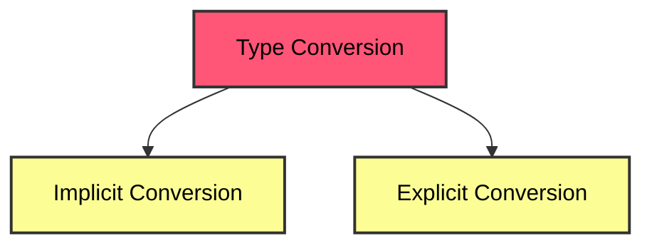

---  
id: type-casting-in-javascript  
sidebar_position: 6
title: Type Casting in JavaScript  
sidebar_label: Type Casting in JavaScript
---

Hey everyone! Today, we will explore Type Casting in JavaScript, an essential concept for converting data types and ensuring smooth operations in your code. Whether you're a beginner or just need a quick refresher, this guide will help you understand how to effectively change between different types in JavaScript. Let's dive in!
# Type Casting

#### Q. Why do we need Type Casting? 
* **JavaScript** is a loosely-typed language, meaning variables aren't tied to any specific data type. 
* However, there are scenarios where you'll need to change the type of a variable to perform certain operations. 
* Hence, type casting is essential for accurate, efficient, and error-free handling of data in JavaScript applications.

## Types of Type Casting -

JavaScript supports two types of type casting:
   1. Implicit Type Casting (Type Coercion)
   2. Explicit Type Casting



## 1. Implicit Type Casting : 

- Also known as **Type Coercion**
- In implicit type casting, JavaScript automatically converts one data type to another.
- This happens when you perform operations between values of different types, and JavaScript tries to make them compatible.
- Example:

```javascript
let result = '5' + 3;  // "53" (number 3 is converted to string)
let difference = '10' - 2;  // 8 (string "10" is converted to number)
let truthy = '5' == 5;  // true (type coercion between string and number)
```

- Explanation:
    - In the first example, JavaScript converts the `number` `3` to a `string` before concatenating it with `"5"`.
    - In the second example, `"10"` (`string`) is automatically converted to a `number` to perform subtraction.
    - In the third example, JavaScript compares a `string` and a `number` by converting the `string` to a `number`.

## 2. Explicit Type Casting : 

Unlike implicit type casting, explicit type casting requires you to manually convert a value from one type to another. JavaScript provides built-in methods to facilitate this process.

**Common Methods for Explicit Type Casting with Examples:**

1. `Number()` – Converts a value to a number.

```javascript
// Converting string to number
let strNum = '42';
let num = Number(strNum);  // 42
```

2. `Boolean()` – Converts a value to a boolean ( true or false ).

```javascript
// Converting string to boolean
let strBool = '';
let boolValue = Boolean(strBool);  // false (empty string is falsy)
```

3. `ParseInt()` – Parse a string and return an integer.

```javascript
// Converting string to integer
let decimalString = '3.14';
let intValue = parseInt(decimalString);  // 3 (truncates decimal part)
```

4. `ParseFloat()` – Parse a string and return a float

```javascript
// Converting string to integer
let decimalString = '4.48';
let floatValue = parseFloat(decimalString); // 4.48 
```

5. `String()` – Converts a value to a string.

```javascript
// Converting number to string
let numberValue = 100;
let str = String(numberValue);  // "100"
```


