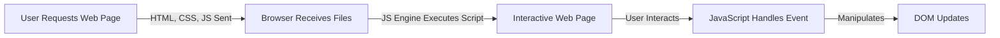

Hey, everyone! In this guide, we'll take a journey into **JavaScript**, one of the most popular programming languages used for web development. JavaScript allows you to create interactive, dynamic, and feature-rich web applications. Let's dive into the basics!

<AdsComponent />

## 1. What is JavaScript?

JavaScript is a programming language that makes web pages interactive and functional. It allows websites to respond to user actions like button clicks, form submissions, animations, and dynamic content updates. In simple words, JavaScript helps turn static web pages into dynamic applications that users can interact with.


### Key Features of JavaScript:

- **Client-side scripting**: Runs directly in the browser, enabling dynamic content.
- **Interactivity**: Handles user interactions, such as clicks, form submissions, and animations.
- **Cross-platform**: Compatible with all major web browsers.
- **Event-driven**: Reacts to user inputs and events like clicks, hovers, or keypresses.

:::tip Fun Fact
JavaScript was created in just **10 days** by Brendan Eich in 1995, and despite its rushed creation, it has grown to become the most widely-used language on the web!
:::

<AdsComponent />

## 2. How Does JavaScript Work?

When a website loads in your browser, the browser first reads the HTML and CSS to display the structure and design of the page. Then JavaScript runs and adds functionality such as button clicks, form validation, animations, and dynamic updates without reloading the page.

### JavaScript Workflow




## 3. JavaScript in Action: Example
Let’s see how JavaScript makes a webpage interactive. In this example, clicking a button changes the text displayed on the screen dynamically.


```html
<!DOCTYPE html>
<html>
  <head>
    <title>Simple JS Example</title>
  </head>
  <body>
    <h1 id="greeting">Welcome!</h1>
    <button onclick="changeGreeting()">Click Me</button>

    <script>
      function changeGreeting() {
        document.getElementById("greeting").innerText = "Hello, JavaScript!";
      }
    </script>
  </body>
</html>
```
In this example:

- The `<h1>` tag displays the text `Welcome!` on the webpage.
- The button listens for a click using the `onclick` event.
- When the user clicks the button, the `changeGreeting()` function runs.
- JavaScript then finds the heading using `getElementById()` and changes its text to `Hello, JavaScript!`.

<AdsComponent />

## 4. Where is JavaScript Used?
JavaScript is everywhere! From simple web pages to complex applications, here are some areas where it's commonly used:

4.1. Front-End Web Development :
JavaScript is used in front-end development to make websites interactive and responsive. Popular frameworks like React, Vue, and Angular help developers build modern web applications.

4.2. Back-End Web Development :
JavaScript is not limited to web browsers. With Node.js, developers can use JavaScript on servers to handle user requests, manage databases, and build full-stack web applications using a single language!.

4.3. Mobile and Desktop Apps :
Frameworks like React Native (for mobile) and Electron (for desktop) allow developers to build apps for multiple platforms using JavaScript.

4.4. Game Development :
JavaScript is used in game development to create interactive 2D and 3D games that run directly in the browser. Libraries like Phaser and Three.js help developers build games with animations, graphics, and real-time interactions.

## 5. Adding JavaScript to Your Web Page

To include JavaScript in a web page, you can embed it directly within the HTML using the tag.

### 5.1. Inline JavaScript
You can add JavaScript code directly inside your HTML:

```html
<script>
  console.log("Hello, world!");
</script>
```

### 5.2. External JavaScript
For larger projects, it's better to keep your JavaScript in a separate file:
```html
<script src="main.js"></script>
```
The `<script>` tag is usually placed before the closing `</body>` tag so the webpage content loads first before the JavaScript runs.

### 5.3. Best Practice

- **Separation of Concerns**: Keep your HTML, CSS, and JavaScript separate for better organization.
- **Asynchronous Loading**: Use the `defer` attribute to load JavaScript files without slowing down the webpage rendering. This helps the page load faster while ensuring the script runs after the HTML is fully loaded.

```html
<script src="main.js" defer></script>
```

## 6. Conclusion

JavaScript is a powerful language that drives the interactivity of the web. By learning JavaScript, you can create dynamic web applications, interactive games, and much more. Stay tuned for more JavaScript guides and tutorials!
