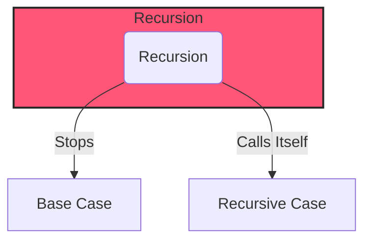

---  
id: recursion-in-javascript  
sidebar_position: 9
title: Recursion in JavaScript  
sidebar_label: Recursion in JavaScript
---

Recursion is a powerful concept in programming where a function calls itself to solve smaller instances of the same problem. This approach is especially useful for tasks that can be broken down into similar sub-tasks, such as traversing trees, calculating factorials, or working with recursive data structures like nested arrays.

<AdsComponent />

## What is Recursion?

In JavaScript, recursion occurs when a function calls itself until it reaches a base condition, at which point it stops calling itself and returns a value.

## Key Concepts:
1. **Base Case**: The condition under which the recursion stops.
2. **Recursive Case**: The function calls itself with a modified argument, moving toward the base case.

## Example: Factorial Function

```javascript
function factorial(n) {
  if (n === 0) { // Base case
    return 1;
  }
  return n * factorial(n - 1); // Recursive case
}

console.log(factorial(5)); // Output: 120
```

<Ads />

## Visualizing Recursion

Recursion can be visualized as a series of function calls, each building on the previous one until the base case is reached.



In the example above, the `factorial` function calculates the factorial of a number by calling itself with a modified argument until it reaches the base case (`n === 0`).

## Benefits of Recursion:

1. **Simplicity**: Recursion can simplify complex problems by breaking them down into smaller, more manageable sub-problems.
2. **Readability**: Recursive solutions often mirror the problem's description, making the code easier to understand.
3. **Versatility**: Recursion can be applied to a wide range of problems, from mathematical calculations to tree traversal.
4. **Efficiency**: In some cases, recursive solutions can be more efficient than iterative ones.

## Considerations:

1. **Base Case**: Ensure that the base case is well-defined and reachable to prevent infinite recursion.
2. **Stack Usage**: Recursion consumes stack space for each function call, which can lead to stack overflow errors for deeply nested calls.
3. **Performance**: Recursive solutions may not always be the most performant due to the overhead of function calls.

By understanding recursion and its applications, you can leverage this powerful technique to solve a variety of problems in JavaScript and other programming languages.  

```javascript
function factorial(n) {
  if (n === 0) { // Base case
    return 1;
  }
  return n * factorial(n - 1); // Recursive case
}

console.log(factorial(5)); // Output: 120
```

## Conclusion

Recursion is a fundamental concept in programming that enables elegant solutions to complex problems. By mastering recursion, you can write concise, efficient code that leverages the power of self-referential functions to solve a wide range of tasks. Practice implementing recursive solutions to enhance your problem-solving skills and deepen your understanding of JavaScript.