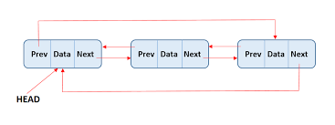

### Introduction to Circular Doubly Linked List

A **Circular Doubly Linked List** is a variation of a doubly linked list in which the last node points back to the first node, and the first node points to the last node. Each node contains three parts:
- Value: The data value stored in the node.
- Next Pointer: A pointer/reference to the next node in the list.
- Previous Pointer: A pointer/reference to the previous node in the list.
 




### Circular Doubly Linked List Operations

A Circular Doubly Linked List typically supports the following operations:

1. **Insertion Operations** : Insertion at the beginning or end involves adjusting the next pointers, previous pointer and potentially updating the head pointer.
- **At the Beginning**
- **At the End**
- **After a Given Node**

2. **Deletion Operations** : Deletion of nodes, whether from the beginning, end, or a specific node, requires properly updating the references of adjacent nodes.
- **Delete from the Beginning**
- **Delete from the End**
- **Delete by Key**

3. **Search Operation** : The search operation traverses the list until it either finds the required node or returns to the head.

4. **Traversal Operation** : Traversal begins from the head and continues until the node just before the head is encountered again.

### Pseudocode

#### Basic Operations

1. **Insert at the Beginning**:

   ```text
    function insertAtBeginning(list : CircularDoublyLinkedList, value : DataType) {
        newNode = new Node(value)
        if list.head is null {
            newNode.next = newNode
            newNode.prev = newNode
            list.head = newNode
        } else {
            newNode.next = list.head
            newNode.prev = list.tail
            list.tail.next = newNode
            list.head.prev = newNode
            list.head = newNode
        }
    }
   ```

2. **Insert at the End**:

   ```text
   function insertAtEnd(list : CircularDoublyLinkedList, value : DataType) {
        newNode = new Node(value)
        if list.head is null {
            newNode.next = newNode
            newNode.prev = newNode
            list.head = newNode
        } else {
            newNode.next = list.head
            newNode.prev = list.tail
            list.tail.next = newNode
            list.head.prev = newNode
        }
        list.tail = newNode
    }
   ```

3. **Insert After a Given Node**:

   ```text
   function insertAfter(list : CircularDoublyLinkedList, node : Node, value : DataType) {
        if node is null {
            return // Invalid node
        }
        newNode = new Node(value)
        newNode.next = node.next
        newNode.prev = node

        node.next.prev = newNode
        node.next = newNode

        if node is list.tail {
            list.tail = newNode // Update tail if necessary
        }
    }

   ```

4. **Delete a Node**:

   ```text
   function deleteNode(list : CircularDoublyLinkedList, node : Node) {
        if node is null {
            return // Invalid node
        }
        if node.next is node { // Only node in the list
            list.head = null
        } else {
            node.prev.next = node.next
            node.next.prev = node.prev

            if node is list.head {
                list.head = node.next // Update head if necessary
            }
            if node is list.tail {
                list.tail = node.prev // Update tail if necessary
            }
        }
    }

   ```

5. **Traverse Forward**:

   ```text
   function traverseForward(list : CircularDoublyLinkedList) {
        if list.head is null {
            return // List is empty
        }
        current = list.head
        do {
            print(current.value)
            current = current.next
        } while current is not list.head
    }

   ```

6. **Traverse Backward**

   ```text
   function traverseBackward(list : CircularDoublyLinkedList) {
        if list.tail is null {
            return // List is empty
        }
        current = list.tail
        do {
            print(current.value)
            current = current.prev
        } while current is not list.tail
    }
    ```


### Implementation in Python, C++, and Java

#### Python Implementation

```python
class Node:
    def __init__(self, value):
        self.value = value
        self.next = None
        self.prev = None

class CircularDoublyLinkedList:
    def __init__(self):
        self.head = None
        self.tail = None

    def insert_at_beginning(self, value):
        new_node = Node(value)
        if not self.head:
            new_node.next = new_node
            new_node.prev = new_node
            self.head = new_node
            self.tail = new_node
        else:
            new_node.next = self.head
            new_node.prev = self.tail
            self.tail.next = new_node
            self.head.prev = new_node
            self.head = new_node

    def insert_at_end(self, value):
        new_node = Node(value)
        if not self.head:
            new_node.next = new_node
            new_node.prev = new_node
            self.head = new_node
            self.tail = new_node
        else:
            new_node.next = self.head
            new_node.prev = self.tail
            self.tail.next = new_node
            self.head.prev = new_node
            self.tail = new_node

    def insert_after(self, prev_node, value):
        if prev_node is None:
            return
        new_node = Node(value)
        new_node.next = prev_node.next
        new_node.prev = prev_node
        prev_node.next.prev = new_node
        prev_node.next = new_node
        if prev_node is self.tail:
            self.tail = new_node

    def delete_node(self, node):
        if node is None:
            return
        if node.next == node:  # Only one node
            self.head = None
            self.tail = None
        else:
            node.prev.next = node.next
            node.next.prev = node.prev
            if node is self.head:
                self.head = node.next
            if node is self.tail:
                self.tail = node.prev

    def traverse_forward(self):
        if not self.head:
            return
        current = self.head
        while True:
            print(current.value, end=' ')
            current = current.next
            if current == self.head:
                break
        print()

    def traverse_backward(self):
        if not self.tail:
            return
        current = self.tail
        while True:
            print(current.value, end=' ')
            current = current.prev
            if current == self.tail:
                break
        print()

# Example Usage
if __name__ == "__main__":
    circular_dll = CircularDoublyLinkedList()
    circular_dll.insert_at_beginning(10)
    circular_dll.insert_at_end(20)
    circular_dll.insert_at_end(30)
    circular_dll.insert_at_beginning(5)
    circular_dll.traverse_forward()  # Output: 5 10 20 30
    circular_dll.traverse_backward()  # Output: 30 20 10 5

```

#### C++ Implementation

```cpp
#include <iostream>
using namespace std;

class Node {
public:
    int value;
    Node* next;
    Node* prev;

    Node(int value) {
        this->value = value;
        this->next = nullptr;
        this->prev = nullptr;
    }
};

class CircularDoublyLinkedList {
public:
    Node* head;
    Node* tail;

    CircularDoublyLinkedList() {
        head = nullptr;
        tail = nullptr;
    }

    void insertAtBeginning(int value) {
        Node* newNode = new Node(value);
        if (!head) {  // If the list is empty
            newNode->next = newNode;
            newNode->prev = newNode;
            head = newNode;
            tail = newNode;
        } else {
            newNode->next = head;
            newNode->prev = tail;
            tail->next = newNode;
            head->prev = newNode;
            head = newNode;
        }
    }

    void insertAtEnd(int value) {
        Node* newNode = new Node(value);
        if (!head) {  // If the list is empty
            newNode->next = newNode;
            newNode->prev = newNode;
            head = newNode;
            tail = newNode;
        } else {
            newNode->next = head;
            newNode->prev = tail;
            tail->next = newNode;
            head->prev = newNode;
            tail = newNode;
        }
    }

    void insertAfter(Node* prevNode, int value) {
        if (prevNode == nullptr) return;
        Node* newNode = new Node(value);
        newNode->next = prevNode->next;
        newNode->prev = prevNode;
        prevNode->next->prev = newNode;
        prevNode->next = newNode;
        if (prevNode == tail) {
            tail = newNode;
        }
    }

    void deleteNode(Node* node) {
        if (node == nullptr) return;
        if (node->next == node) {  // Only one node
            head = nullptr;
            tail = nullptr;
        } else {
            node->prev->next = node->next;
            node->next->prev = node->prev;
            if (node == head) {
                head = node->next;
            }
            if (node == tail) {
                tail = node->prev;
            }
        }
    }

    void traverseForward() {
        if (!head) return;
        Node* current = head;
        do {
            cout << current->value << " ";
            current = current->next;
        } while (current != head);
        cout << endl;
    }

    void traverseBackward() {
        if (!tail) return;
        Node* current = tail;
        do {
            cout << current->value << " ";
            current = current->prev;
        } while (current != tail);
        cout << endl;
    }
};

// Example Usage
int main() {
    CircularDoublyLinkedList circularDLL;
    circularDLL.insertAtBeginning(10);
    circularDLL.insertAtEnd(20);
    circularDLL.insertAtEnd(30);
    circularDLL.insertAtBeginning(5);
    circularDLL.traverseForward();  // Output: 5 10 20 30
    circularDLL.traverseBackward();  // Output: 30 20 10 5
    return 0;
}
```

#### Java Implementation

```java
class Node {
    int value;
    Node next;
    Node prev;

    Node(int value) {
        this.value = value;
        this.next = null;
        this.prev = null;
    }
}

class CircularDoublyLinkedList {
    Node head;
    Node tail;

    CircularDoublyLinkedList() {
        head = null;
        tail = null;
    }

    void insertAtBeginning(int value) {
        Node newNode = new Node(value);
        if (head == null) {
            newNode.next = newNode;
            newNode.prev = newNode;
            head = newNode;
            tail = newNode;
        } else {
            newNode.next = head;
            newNode.prev = tail;
            tail.next = newNode;
            head.prev = newNode;
            head = newNode;
        }
    }

    void insertAtEnd(int value) {
        Node newNode = new Node(value);
        if (head == null) {
            newNode.next = newNode;
            newNode.prev = newNode;
            head = newNode;
            tail = newNode;
        } else {
            newNode.next = head;
            newNode.prev = tail;
            tail.next = newNode;
            head.prev = newNode;
            tail = newNode;
        }
    }

    void insertAfter(Node prevNode, int value) {
        if (prevNode == null) return;
        Node newNode = new Node(value);
        newNode.next = prevNode.next;
        newNode.prev = prevNode;
        prevNode.next.prev = newNode;
        prevNode.next = newNode;
        if (prevNode == tail) {
            tail = newNode;
        }
    }

    void deleteNode(Node node) {
        if (node == null) return;
        if (node.next == node) {  // Only one node
            head = null;
            tail = null;
        } else {
            node.prev.next = node.next;
            node.next.prev = node.prev;
            if (node == head) {
                head = node.next;
            }
            if (node == tail) {
                tail = node.prev;
            }
        }
    }

    void traverseForward() {
        if (head == null) return;
        Node current = head;
        do {
            System.out.print(current.value + " ");
            current = current.next;
        } while (current != head);
        System.out.println();
    }

    void traverseBackward() {
        if (tail == null) return;
        Node current = tail;
        do {
            System.out.print(current.value + " ");
            current = current.prev;
        } while (current != tail);
        System.out.println();
    }

    // Example Usage
    public static void main(String[] args) {
        CircularDoublyLinkedList circularDLL = new CircularDoublyLinkedList();
        circularDLL.insertAtBeginning(10);
        circularDLL.insertAtEnd(20);
        circularDLL.insertAtEnd(30);
        circularDLL.insertAtBeginning(5);
        circularDLL.traverseForward();  // Output: 5 10 20 30
        circularDLL.traverseBackward();  // Output: 30 20 10 5
    }
}
```

### Complexity

- **Time Complexity**:

  - Insertion : $O(1)$
  - Deletion: $O(1)$
  - Traversal: $O(n)$

- **Space Complexity**: $O(1)$


### Conclusion

The Circular Doubly Linked List (CDLL) is a versatile data structure that combines the advantages of both doubly linked lists and circular linked lists. By allowing traversal in both forward and backward directions, CDLLs facilitate efficient data manipulation and navigation.