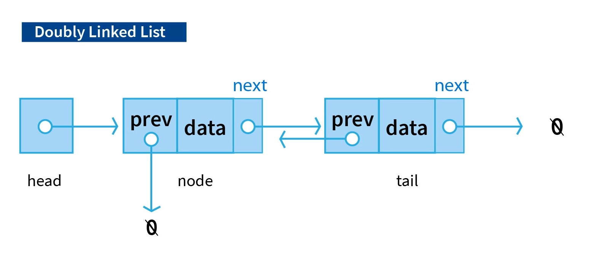

### Introduction to Doubly Linked List

A **Doubly LinkedList** is a variation of a linked list where the last node points back to the first node instead of null (or None in Python). This structure allows for a Doubly traversal where one can start from any node and eventually return to the same node. Doubly linked lists can be either singly or doubly linked. 




### Doubly LinkedList Operations

A Doubly LinkedList typically supports the following operations:

1. **Insertion Operations** : Insertion at the beginning or end involves adjusting the next pointers to maintain the Doubly nature, and potentially updating the head pointer.
- **At the Beginning**
- **At the End**
- **After a Given Node**

2. **Deletion Operations** : Deletion of nodes, whether from the beginning, end, or a specific node, requires properly updating the references of adjacent nodes so that the Doubly structure is maintained.
- **Delete from the Beginning**
- **Delete from the End**
- **Delete by Key**

3. **Search Operation** : The search operation traverses the list until it either finds the required node or returns to the head.

4. **Traversal Operation** : Traversal begins from the head and continues until the node just before the head is encountered again.

### Pseudocode

#### Basic Operations

1. **Insert at the Beginning**:

   ```text
    function insertAtBeginning(list : DoublyLinkedList, value : DataType) {
        newNode = new Node(value)
        if list.head is null {
            list.head = newNode
            list.tail = newNode
        } else {
            newNode.next = list.head
            list.head.prev = newNode
            list.head = newNode
        }
    }
   ```

2. **Insert at the End**:

   ```text
   function insertAtEnd(list : DoublyLinkedList, value : DataType) {
        newNode = new Node(value)
        if list.tail is null {
            list.head = newNode
            list.tail = newNode
        } else {
            list.tail.next = newNode
            newNode.prev = list.tail
            list.tail = newNode
        }
    }
   ```

3. **Insert after a given node**:

   ```text
   function insertAfter(list : DoublyLinkedList, node : Node, value : DataType) {
        if node is null {
            return // Invalid node
        }
        newNode = new Node(value)
        newNode.next = node.next
        newNode.prev = node

        if node.next is not null {
            node.next.prev = newNode
        }
        node.next = newNode

        if node is list.tail {
            list.tail = newNode // Update tail if necessary
        }
    }
   ```

4. **Delete a Node**:

   ```text
   function deleteNode(list : DoublyLinkedList, node : Node) {
        if node is null {
            return // Invalid node
        }
        if node.prev is not null {
            node.prev.next = node.next
        } else {
            list.head = node.next // Update head if it's the first node
        }
        
        if node.next is not null {
            node.next.prev = node.prev
        } else {
            list.tail = node.prev // Update tail if it's the last node
        }
        
        // Optional: Clear the node to help with garbage collection
        node = null
    }
   ```

5. **Traverse Forward**:

   ```text
   function traverseForward(list : DoublyLinkedList) {
        current = list.head
        while current is not null {
            print(current.value)
            current = current.next
        }
    }
   ```

6. **Traverse Backward**

   ```text
   function traverseBackward(list : DoublyLinkedList) {
        current = list.tail
        while current is not null {
            print(current.value)
            current = current.prev
        }
    }
    ```


### Implementation in Python, C++, and Java

#### Python Implementation

```python
class Node:
    def __init__(self, data):
        self.data = data  
        self.next = None  
        self.prev = None 


class DoublyLinkedList:
    def __init__(self):
        self.head = None  

    def insert_at_beginning(self, data):
        new_node = Node(data)
        new_node.next = self.head  
        if self.head is not None:
            self.head.prev = new_node  
        self.head = new_node 

    def insert_at_end(self, data):
        new_node = Node(data)
        if self.head is None: 
            self.head = new_node
            return
        last = self.head
        while last.next:  
            last = last.next
        last.next = new_node  
        new_node.prev = last  

    def delete_node(self, key):
        current = self.head
        while current:
            if current.data == key:  
                if current.prev: 
                    current.prev.next = current.next
                if current.next: 
                    current.next.prev = current.prev
                if current == self.head:
                    self.head = current.next
                del current 
                return
            current = current.next
        print(f"Node with value {key} not found.")

    def display(self):
        current = self.head
        while current:
            print(current.data, end=" <=> ") 
            current = current.next
        print("None") 


# Example usage
if __name__ == "__main__":
    dll = DoublyLinkedList()
    dll.insert_at_end(10)
    dll.insert_at_end(20)
    dll.insert_at_beginning(5)
    dll.display()  # Output: 5 <=> 10 <=> 20 <=> None
    dll.delete_node(10)
    dll.display()  # Output: 5 <=> 20 <=> None

```

#### C++ Implementation

```cpp
#include <iostream>
using namespace std;

class Node {
public:
    int data;          
    Node* next;       
    Node* prev;    

    Node(int data) {
        this->data = data; 
        this->next = nullptr; 
        this->prev = nullptr;
    }
};

class DoublyLinkedList {
public:
    Node* head; 

    DoublyLinkedList() {
        head = nullptr; 
    }

    void insertAtBeginning(int data) {
        Node* newNode = new Node(data); 
        newNode->next = head; 
        if (head != nullptr) {
            head->prev = newNode;
        }
        head = newNode; 
    }

    void insertAtEnd(int data) {
        Node* newNode = new Node(data); 
        if (head == nullptr) { 
            head = newNode;
            return;
        }
        Node* last = head;
        while (last->next != nullptr) { 
            last = last->next;
        }
        last->next = newNode; 
        newNode->prev = last; e
    }

    void deleteNode(int key) {
        Node* current = head; 
        while (current != nullptr) { 
            if (current->data == key) { 
                if (current->prev != nullptr) { 
                    current->prev->next = current->next;
                }
                if (current->next != nullptr) { 
                    current->next->prev = current->prev;
                }
                if (current == head) { 
                    head = current->next;
                }
                delete current; 
                return; 
            }
            current = current->next; 
        }
        cout << "Node with value " << key << " not found." << endl;
    }

    void display() {
        Node* current = head; 
        while (current != nullptr) {
            cout << current->data << " <=> "; 
            current = current->next;
        }
        cout << "None" << endl; 
    }
};

// Example usage
int main() {
    DoublyLinkedList dll;
    dll.insertAtEnd(10);
    dll.insertAtEnd(20);
    dll.insertAtBeginning(5);
    dll.display(); // Output: 5 <=> 10 <=> 20 <=> None
    dll.deleteNode(10);
    dll.display(); // Output: 5 <=> 20 <=> None
    return 0;
}

```

#### Java Implementation

```java
class Node {
    int data;          
    Node next;        
    Node prev;        

    public Node(int data) {
        this.data = data; 
        this.next = null; 
        this.prev = null; 
    }
}

class DoublyLinkedList {
    Node head; 

    public DoublyLinkedList() {
        head = null; 
    }

    public void insertAtBeginning(int data) {
        Node newNode = new Node(data); 
        newNode.next = head;
        if (head != null) {
            head.prev = newNode; 
        }
        head = newNode; 
    }

    public void insertAtEnd(int data) {
        Node newNode = new Node(data); 
        if (head == null) { 
            head = newNode;
            return;
        }
        Node last = head;
        while (last.next != null) { 
            last = last.next;
        }
        last.next = newNode; 
        newNode.prev = last; 
    }

    public void deleteNode(int key) {
        Node current = head; 
        while (current != null) { 
            if (current.data == key) { 
                if (current.prev != null) { 
                    current.prev.next = current.next;
                }
                if (current.next != null) { 
                    current.next.prev = current.prev;
                }
                if (current == head) {
                    head = current.next;
                }
                return;
            }
            current = current.next; 
        }
        System.out.println("Node with value " + key + " not found.");
    }

    public void display() {
        Node current = head; 
        while (current != null) {
            System.out.print(current.data + " <=> "); 
            current = current.next; 
        }
        System.out.println("None"); 
    }
}

// Example usage
public class Main {
    public static void main(String[] args) {
        DoublyLinkedList dll = new DoublyLinkedList();
        dll.insertAtEnd(10);
        dll.insertAtEnd(20);
        dll.insertAtBeginning(5);
        dll.display(); // Output: 5 <=> 10 <=> 20 <=> None
        dll.deleteNode(10);
        dll.display(); // Output: 5 <=> 20 <=> None
    }
}

```

### Complexity

- **Time Complexity**:

  - Insertion : $O(1)$
  - Deletion: $O(1)$
  - Search: $O(n)$	
  - Traversal: $O(n)$

- **Space Complexity**: $O(1)$


### Conclusion

Doubly Linked Lists are powerful and versatile data structures that allow for efficient insertion and deletion from both ends and provides flexibility in traversing the list.