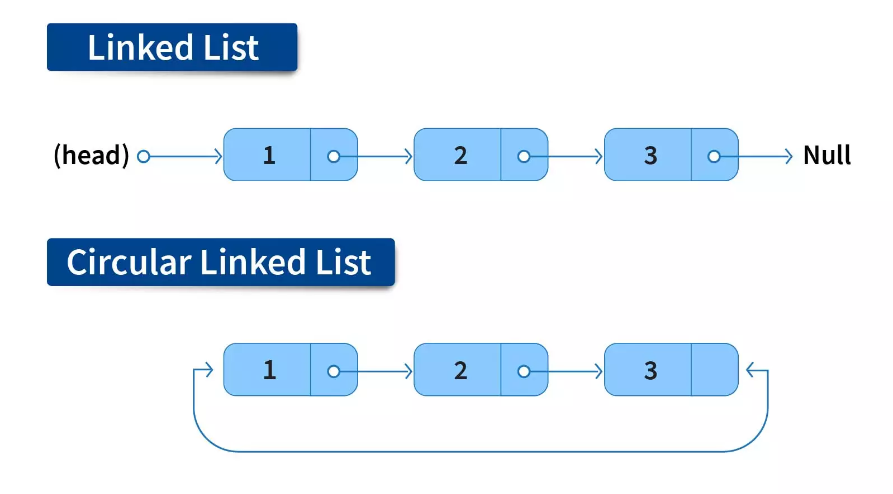

### Introduction to Circular Linked List

A **Circular LinkedList** is a variation of a linked list where the last node points back to the first node instead of null (or None in Python). This structure allows for a circular traversal where one can start from any node and eventually return to the same node. Circular linked lists can be either singly or doubly linked. 




### Circular LinkedList Operations

A Circular LinkedList typically supports the following operations:

1. **Insertion Operations** : Insertion at the beginning or end involves adjusting the next pointers to maintain the circular nature, and potentially updating the head pointer.
- **At the Beginning**
- **At the End**
- **After a Given Node**

2. **Deletion Operations** : Deletion of nodes, whether from the beginning, end, or a specific node, requires properly updating the references of adjacent nodes so that the circular structure is maintained.
- **Delete from the Beginning**
- **Delete from the End**
- **Delete by Key**

3. **Search Operation** : The search operation traverses the list until it either finds the required node or returns to the head.

4. **Traversal Operation** : Traversal begins from the head and continues until the node just before the head is encountered again.

### Pseudocode

#### Basic Operations

1. **Insert at the Beginning**:

   ```text
   Function insert_at_beginning(data):
    Create new_node with data
    If head is NULL:
        head = new_node
        new_node.next = head   # Points to itself
    Else:
        Set temp = head
        While temp.next != head:
            Move temp to temp.next  # Traverse to last node
        Set new_node.next = head
        Set temp.next = new_node   # Last node points to new_node
        Set head = new_node  # Update the head to the new node
    End Function
   ```

2. **Insert at the End**:

   ```text
   Function insert_at_end(data):
    Create new_node with data
    If head is NULL:
        head = new_node
        new_node.next = head   # Points to itself
    Else:
        Set temp = head
        While temp.next != head:
            Move temp to temp.next  # Traverse to last node
        Set temp.next = new_node
        Set new_node.next = head  # New node points to head
    End Function
   ```

3. **Delete Node by Value**:

   ```text
   Function insert_after(prev_data, data):
    Create new_node with data
    If head is NULL:
        Exit Function  # List is empty
    Else:
        Set temp = head
        While temp.data != prev_data:
            Move temp to temp.next
            If temp == head:
                Print "Node not found"
                Exit Function
        Set new_node.next = temp.next  # Link new_node to temp's next node
        Set temp.next = new_node  # Link temp to new_node
    End Function
   ```

4. **Search for a Node**:

   ```text
   Function delete_beginning():
    If head is NULL:
        Exit Function  # List is empty
    If head.next == head:  # Only one node
        head = NULL
    Else:
        Set temp = head
        While temp.next != head:
            Move temp to temp.next  # Traverse to last node
        Set temp.next = head.next  # Last node points to second node
        Set head = head.next  # Update head to the second node
    End Function
   ```

5. **Traverse and Print the List**:

   ```text
   Function delete_end():
    If head is NULL:
        Exit Function  # List is empty
    If head.next == head:  # Only one node
        head = NULL
    Else:
        Set temp = head
        Set prev = NULL
        While temp.next != head:
            Set prev = temp  # Keep track of second last node
            Move temp to temp.next
        Set prev.next = head  # Second last node points to head
    End Function
   ```

6. **Deletion of a Specific Node**

   ```text
   Function delete_node(key):
    If head is NULL:
        Exit Function  # List is empty
    If head.data == key AND head.next == head:  # Only one node
        head = NULL
    Else If head.data == key:
        Set temp = head
        While temp.next != head:
            Move temp to temp.next  # Traverse to last node
        Set temp.next = head.next  # Last node points to second node
        Set head = head.next  # Update head to the second node
    Else:
        Set temp = head
        Set prev = NULL
        While temp.data != key:
            Set prev = temp  # Keep track of previous node
            Move temp to temp.next
            If temp == head:
                Print "Node not found"
                Exit Function
        Set prev.next = temp.next  # Remove the node by linking prev to temp.next
    End Function
    ```

7. **Traversal (Displaying the List)**

    ```text
    Function display():
    If head is NULL:
        Print "List is empty"
    Else:
        Set temp = head
        Do:
            Print temp.data
            Move temp to temp.next
        While temp != head
    End Function
    ```

8. **Search for a Node**

    ```text
    Function search(key):
    If head is NULL:
        Return False  # List is empty
    Set temp = head
    Do:
        If temp.data == key:
            Return True  # Node found
        Move temp to temp.next
    While temp != head
    Return False  # Node not found
    End Function
    ```


### Implementation in Python, C++, and Java

#### Python Implementation

```python
class Node:
    def __init__(self, data):
        self.data = data
        self.next = None

class CircularLinkedList:
    def __init__(self):
        self.head = None

    def insert_beginning(self, data):
        new_node = Node(data)
        if not self.head:
            self.head = new_node
            new_node.next = self.head
        else:
            temp = self.head
            while temp.next != self.head:
                temp = temp.next
            new_node.next = self.head
            temp.next = new_node
            self.head = new_node

    def insert_end(self, data):
        new_node = Node(data)
        if not self.head:
            self.head = new_node
            new_node.next = self.head
        else:
            temp = self.head
            while temp.next != self.head:
                temp = temp.next
            temp.next = new_node
            new_node.next = self.head

    def insert_after_node(self, target, data):
        if not self.head:
            print("List is empty")
            return
        new_node = Node(data)
        temp = self.head
        while True:
            if temp.data == target:
                new_node.next = temp.next
                temp.next = new_node
                return
            temp = temp.next
            if temp == self.head:
                break
        print(f"Node with data {target} not found.")

    def delete_by_key(self, key):
        if not self.head:
            print("List is empty")
            return
        current = self.head
        prev = None
        while True:
            if current.data == key:
                if prev:
                    prev.next = current.next
                else:
                    # Deleting head
                    if current.next == self.head:
                        self.head = None
                    else:
                        temp = self.head
                        while temp.next != self.head:
                            temp = temp.next
                        self.head = current.next
                        temp.next = self.head
                return
            prev = current
            current = current.next
            if current == self.head:
                break
        print(f"Key {key} not found.")

    def search(self, key):
        if not self.head:
            return False
        temp = self.head
        while True:
            if temp.data == key:
                return True
            temp = temp.next
            if temp == self.head:
                break
        return False

    def display(self):
        nodes = []
        if self.head:
            temp = self.head
            while True:
                nodes.append(temp.data)
                temp = temp.next
                if temp == self.head:
                    break
        print(" -> ".join(map(str, nodes)))

# Example Usage
cll = CircularLinkedList()
cll.insert_end(1)
    cll.insert_end(2)
    cll.insert_end(3)
    cll.display()  # Output: 1 -> 2 -> 3

    cll.insert_beginning(0)
    cll.display()  # Output: 0 -> 1 -> 2 -> 3

    cll.insert_after_node(2, 2.5)
    cll.display()  # Output: 0 -> 1 -> 2 -> 2.5 -> 3

    cll.delete_by_key(2)
    cll.display()  # Output: 0 -> 1 -> 2.5 -> 3

    print("Search for 2:", cll.search(2))    # Output: False
    print("Search for 2.5:", cll.search(2.5))  # Output: True

```

#### C++ Implementation

```cpp
#include <iostream>
using namespace std;

class Node {
public:
    int data;
    Node* next;

    Node(int data) {
        this->data = data;
        this->next = nullptr;
    }
};

class CircularLinkedList {
public:
    Node* head;

    CircularLinkedList() {
        head = nullptr;
    }

    void append(int data) {
        Node* newNode = new Node(data);
        if (head == nullptr) {
            head = newNode;
            newNode->next = head;
        } else {
            Node* temp = head;
            while (temp->next != head) {
                temp = temp->next;
            }
            temp->next = newNode;
            newNode->next = head;
        }
    }

    void insertBeginning(int data) {
        Node* newNode = new Node(data);
        if (head == nullptr) {
            head = newNode;
            newNode->next = head;
        } else {
            Node* temp = head;
            while (temp->next != head)
                temp = temp->next;
            newNode->next = head;
            temp->next = newNode;
            head = newNode;
        }
    }

    void insertEnd(int data) {
        Node* newNode = new Node(data);
        if (head == nullptr) {
            head = newNode;
            newNode->next = head;
        } else {
            Node* temp = head;
            while (temp->next != head)
                temp = temp->next;
            temp->next = newNode;
            newNode->next = head;
        }
    }

    void insertAfterNode(int target, int data) {
        if (head == nullptr) {
            cout << "List is empty" << endl;
            return;
        }
        Node* temp = head;
        do {
            if (temp->data == target) {
                Node* newNode = new Node(data);
                newNode->next = temp->next;
                temp->next = newNode;
                return;
            }
            temp = temp->next;
        } while (temp != head);
        cout << "Node with data " << target << " not found." << endl;
    }

    void deleteByKey(int key) {
        if (head == nullptr) {
            cout << "List is empty" << endl;
            return;
        }
        Node* current = head;
        Node* prev = nullptr;
        do {
            if (current->data == key) {
                if (prev != nullptr) {
                    prev->next = current->next;
                } else {
                    // Deleting head
                    if (current->next == head) {
                        head = nullptr;
                    } else {
                        Node* temp = head;
                        while (temp->next != head)
                            temp = temp->next;
                        head = current->next;
                        temp->next = head;
                    }
                }
                delete current;
                return;
            }
            prev = current;
            current = current->next;
        } while (current != head);
        cout << "Key " << key << " not found." << endl;
    }

    bool search(int key) {
        if (head == nullptr)
            return false;
        Node* temp = head;
        do {
            if (temp->data == key)
                return true;
            temp = temp->next;
        } while (temp != head);
        return false;
    }

    void display() {
        if (head != nullptr) {
            Node* temp = head;
            do {
                cout << temp->data << " -> ";
                temp = temp->next;
            } while (temp != head);
            cout << endl;
        }
    }
};

// Example Usage
int main() {
    CircularLinkedList cll;
    cll.insertEnd(1);
    cll.insertEnd(2);
    cll.insertEnd(3);
    cll.display(); // Output: 1 -> 2 -> 3 ->

    cll.insertBeginning(0);
    cll.display(); // Output: 0 -> 1 -> 2 -> 3 ->

    cll.insertAfterNode(2, 2.5);
    cll.display(); // Output: 0 -> 1 -> 2 -> 2.5 -> 3 ->

    cll.deleteByKey(2);
    cll.display(); // Output: 0 -> 1 -> 2.5 -> 3 ->

    cout << "Search for 2: " << (cll.search(2) ? "Found" : "Not Found") << endl;    // Output: Not Found
    cout << "Search for 2.5: " << (cll.search(2.5) ? "Found" : "Not Found") << endl; // Output: Found

    return 0;
}

```

#### Java Implementation

```java
class Node {
    int data;
    Node next;

    public Node(int data) {
        this.data = data;
        this.next = null;
    }
}

class CircularLinkedList {
    Node head;

    public CircularLinkedList() {
        head = null;
    }

     public void insertAtBeginning(int data) {
        Node newNode = new Node(data);
        if (head == null) {
            head = newNode;
            newNode.next = head;
        } else {
            Node temp = head;
            while (temp.next != head) {
                temp = temp.next;
            }
            newNode.next = head;
            temp.next = newNode;
            head = newNode;
        }
    }

    public void insertAtEnd(int data) {
        Node newNode = new Node(data);
        if (head == null) {
            head = newNode;
            newNode.next = head;
        } else {
            Node temp = head;
            while (temp.next != head) {
                temp = temp.next;
            }
            temp.next = newNode;
            newNode.next = head;
        }
    }

    public void insertAfter(int prevData, int data) {
        Node temp = head;
        Node newNode = new Node(data);
        if (head == null) {
            return;
        }
        do {
            if (temp.data == prevData) {
                newNode.next = temp.next;
                temp.next = newNode;
                return;
            }
            temp = temp.next;
        } while (temp != head);
    }

    public void deleteNode(int key) {
        if (head == null) {
            return;
        }
        if (head.data == key && head.next == head) {
            head = null;
        } else if (head.data == key) {
            Node temp = head;
            while (temp.next != head) {
                temp = temp.next;
            }
            temp.next = head.next;
            head = head.next;
        } else {
            Node temp = head;
            Node prev = null;
            do {
                if (temp.data == key) {
                    prev.next = temp.next;
                    return;
                }
                prev = temp;
                temp = temp.next;
            } while (temp != head);
        }
    }

    public void display() {
        if (head != null) {
            Node temp = head;
            do {
                System.out.print(temp.data + " -> ");
                temp = temp.next;
            } while (temp != head);
            System.out.println();
        }
    }

    public boolean search(int key) {
        Node temp = head;
        do {
            if (temp.data == key) {
                return true;
            }
            temp = temp.next;
        } while (temp != head);
        return false;
    }

// Example usage
    public static void main(String[] args) {
        CircularLinkedList cll = new cll.insertEnd(1);
        cll.insertEnd(2);
        cll.insertEnd(3);
        cll.display(); // Output: 1 -> 2 -> 3 ->

        cll.insertBeginning(0);
        cll.display(); // Output: 0 -> 1 -> 2 -> 3 ->

        cll.insertAfter(2, 2.5);
        cll.display(); // Output: 0 -> 1 -> 2 -> 2.5 -> 3 ->

        cll.deleteByKey(2);
        cll.display(); // Output: 0 -> 1 -> 2.5 -> 3 ->

        System.out.println("Search for 2: " + cll.search(2));    // Output: false
        System.out.println("Search for 2.5: " + cll.search(2.5)); // Output: true
    }
}
```

### Complexity

- **Time Complexity**:

  - Insertion at the Beginning: $O(n)$
  - Insertion at the End: $O(n)$
  - Insert After Node: $O(n)$
  - Delete from Beginning: $O(n)$	
  - Delete from End: $O(n)$	
  - Delete by Key: $O(n)$	
  - Search: $O(n)$	
  - Traversal: $O(n)$

- **Space Complexity**: 

- Operations typically use $O(1) $ extra space as they only involve manipulating existing nodes.
- In Python's display method, storing node data in a list requires O(n) space.


### Conclusion

Circular Linked Lists are versatile data structures that allow for efficient cyclic traversals. While most operations have a time complexity of O(n) due to the need to traverse the list, they offer the advantage of not having a null reference at the end, which can be beneficial in certain applications like implementing round-robin schedulers or circular queues.