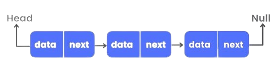

### Introduction to Linked List

A **LinkedList** is a linear data structure in which elements are stored in nodes, and each node points to the next node, forming a chain. Imagine a train where each car is connected to the next car, but you can only move forward through the train. Each car contains passengers (data) and has a coupling (pointer) that connects it to the next car.

### Definition and Structure
A linked list consists of nodes, where each node contains:
- **Data:** The value stored in the node.
- **Next:** A reference to the next node in the sequence (or `null` if there is no next node).

The sequence starts from a node called the **head** and continues until it reaches a node that points to `null`, which marks the end of the list.

### Properties
Key characteristics of linked lists include:
- **Dynamic Size:** Unlike arrays, linked lists can grow and shrink dynamically as nodes are added or removed.
- **Sequential Access:** Accessing elements in a linked list requires traversal from the head, as elements are not indexed like in an array.
  
    ```
    Head -> A -> B -> C -> D -> null
    ```

### Types of Linked Lists
1. **Singly Linked Lists:** Each node has a reference to the next node in the sequence.

    Example:
    ```plaintext
    Head -> 10 -> 20 -> 30 -> null
    ```

2. **Doubly Linked Lists:** Each node has two references—one to the next node and one to the previous node.
   
    Example:
    ```plaintext
    Head <-> 10 <-> 20 <-> 30 <-> null
    ```

3. **Circular Linked Lists:** The last node points back to the head, forming a circular structure.

    Example:
    ```plaintext
    Head -> 10 -> 20 -> 30 --|
           |-----------------|
    ```

4. **Doubly Circular Linked Lists:** Similar to a circular linked list but with both next and previous references.

    Example:
    ```plaintext
    Head <-> 10 <-> 20 <-> 30 <-> Head
    ```


### LinkedList Operations

A LinkedList typically supports the following operations:

1. **Insert at the Beginning**: 
- A new node is created with the given data. 
- The new node's next pointer is set to the current head. - The head pointer is updated to point to the new node.
2. **Insert at the End**: 
- If the list is empty, the new node becomes the head.
- Otherwise, traverse the list until the last node is found, and set its next to the new node.
3. **Delete Node by Value**: 
- If the head contains the key, adjust the head to point to the next node.
-Otherwise, traverse the list to find the node before the target node and adjust its next pointer to skip the target node.
4. **Search for a Node**: 
- Traverse the list while comparing each node’s data with the key.
- If a match is found, return True; otherwise, after reaching the end of the list, return False.

5. **Traverse and Print the List**: 
-Traverse the list, printing the data in each node until the end of the list (NULL) is reached.

### Advantages and Disadvantages
#### Advantages:

- **Efficient Insertion/Deletion**: Can insert and delete nodes at any position in constant time if the node reference is known.
- **Dynamic Size**: Can easily grow and shrink in size without the need for resizing or memory reallocation like arrays.

#### Disadvantages:

- **No Random Access**: Unlike arrays, linked lists do not provide direct access to elements via index, requiring traversal from the head.
- **Memory Overhead**: Each node requires extra memory for storing a pointer to the next node.
- **Slow Lookups**: Finding an element requires linear time (O(n)) as the list must be traversed.

### Applications of Linked Lists

- **Dynamic Memory Allocation**: Linked lists provide an efficient way to manage memory when the number of elements is not known in advance. They are widely used in memory management systems to keep track of free and used memory blocks.

- **Implementation of Other Data Structures**: Linked lists serve as the foundation for more complex data structures such as:
  - **Stacks**: Dynamic stacks can be efficiently implemented using linked lists, allowing for dynamic memory usage.
  - **Queues**: Linked lists are ideal for building dynamic queues, ensuring efficient insertion and deletion operations.
  - **Graphs**: Linked lists are used to represent adjacency lists in graph data structures, allowing efficient traversal and manipulation of nodes.

- **Efficient Insertions/Deletions**: For applications where elements are frequently inserted or removed, such as task scheduling or buffer management, linked lists are ideal due to their dynamic nature and minimal overhead for these operations.

- **Polynomial Representation**: Linked lists are used to represent polynomials, where each term is stored in a node. This structure allows efficient addition and manipulation of polynomial terms.
  
  Example:
  ```plaintext
  (5x^2 + 3x + 2) -> 5 -> 3 -> 2 -> null


### Pseudocode

#### Basic Operations

1. **Insert at the Beginning**:

   ```text
   Function insertAtBeginning(head, data):
    Create newNode with data
    Set newNode.next = head
    Set head = newNode
    Return head
   ```

2. **Insert at the End**:

   ```text
   Function insertAtEnd(head, data):
    Create newNode with data
    If head is NULL:
        Set head = newNode
        Return head
    Set temp = head
    While temp.next is not NULL:
        Move temp to temp.next
    Set temp.next = newNode
    Return head
   ```

3. **Delete Node by Value**:

   ```text
   Function deleteNode(head, key):
    If head.data equals key:
        Set head = head.next
        Return head
    Set temp = head
    While temp is not NULL and temp.next.data is not key:
        Move temp to temp.next
    If temp is NULL:
        Return head (Key not found)
    Set temp.next = temp.next.next
    Return head
   ```

4. **Search for a Node**:

   ```Function searchNode(head, key):
    Set temp = head
    While temp is not NULL:
        If temp.data equals key:
            Return True
        Move temp to temp.next
    Return False
   ```

5. **Traverse and Print the List**:

   ```text
   Function traverseList(head):
    Set temp = head
    While temp is not NULL:
        Print temp.data
        Move temp to temp.next
   ```

### Implementation in Python, C++, and Java

#### Python Implementation

```python
class Node:
    def __init__(self, data):
        self.data = data
        self.next = None

class LinkedList:
    def __init__(self):
        self.head = None

    def insert_at_beginning(self, data):
        new_node = Node(data)
        new_node.next = self.head
        self.head = new_node

    def insert_at_end(self, data):
        new_node = Node(data)
        if self.head is None:
            self.head = new_node
            return
        last = self.head
        while last.next:
            last = last.next
        last.next = new_node

    def delete_node(self, key):
        temp = self.head
        if temp is not None:
            if temp.data == key:
                self.head = temp.next
                temp = None
                return
        while temp is not None:
            if temp.data == key:
                break
            prev = temp
            temp = temp.next
        if temp is None:
            return
        prev.next = temp.next
        temp = None

    def search(self, key):
        current = self.head
        while current:
            if current.data == key:
                return True
            current = current.next
        return False

    def print_list(self):
        temp = self.head
        while temp:
            print(temp.data, end=" -> ")
            temp = temp.next
        print("None")

# Example usage
ll = LinkedList()
ll.insert_at_end(1)
ll.insert_at_end(2)
ll.insert_at_beginning(0)
ll.print_list()  # Outputs: 0 -> 1 -> 2 -> None
ll.delete_node(2)
ll.print_list()  # Outputs: 0 -> 1 -> None
print(ll.search(1))  # Outputs: true
```

#### C++ Implementation

```cpp
#include <iostream>
using namespace std;

class Node {
public:
    int data;
    Node* next;
    Node(int val) : data(val), next(nullptr) {}
};

class LinkedList {
public:
    Node* head;

    LinkedList() { head = nullptr; }

    void insertAtBeginning(int data) {
        Node* newNode = new Node(data);
        newNode->next = head;
        head = newNode;
    }

    void insertAtEnd(int data) {
        Node* newNode = new Node(data);
        if (head == nullptr) {
            head = newNode;
            return;
        }
        Node* last = head;
        while (last->next != nullptr) {
            last = last->next;
        }
        last->next = newNode;
    }

    void deleteNode(int key) {
        Node* temp = head;
        if (temp != nullptr && temp->data == key) {
            head = temp->next;
            delete temp;
            return;
        }
        Node* prev = nullptr;
        while (temp != nullptr && temp->data != key) {
            prev = temp;
            temp = temp->next;
        }
        if (temp == nullptr) return;
        prev->next = temp->next;
        delete temp;
    }

    bool search(int key) {
        Node* current = head;
        while (current != nullptr) {
            if (current->data == key)
                return true;
            current = current->next;
        }
        return false;
    }

    void printList() {
        Node* temp = head;
        while (temp != nullptr) {
            cout << temp->data << " -> ";
            temp = temp->next;
        }
        cout << "None" << endl;
    }
};

// Example usage
int main() {
    LinkedList ll;
    ll.insertAtEnd(1);
    ll.insertAtEnd(2);
    ll.insertAtBeginning(0);
    ll.printList();  //Outputs: 0 -> 1 -> 2 -> None
    ll.deleteNode(2);
    ll.printList();  // Outputs: 0 -> 1 -> None
    cout << ll.search(1) << endl; // Outputs: true
    return 0;
}
```

#### Java Implementation

```java
class LinkedList {
    Node head;

    class Node {
        int data;
        Node next;

        Node(int d) {
            data = d;
            next = null;
        }
    }

    public void insertAtBeginning(int data) {
        Node newNode = new Node(data);
        newNode.next = head;
        head = newNode;
    }

    public void insertAtEnd(int data) {
        Node newNode = new Node(data);
        if (head == null) {
            head = newNode;
            return;
        }
        Node last = head;
        while (last.next != null) {
            last = last.next;
        }
        last.next = newNode;
    }

    public void deleteNode(int key) {
        Node temp = head, prev = null;
        if (temp != null && temp.data == key) {
            head = temp.next;
            return;
        }
        while (temp != null && temp.data != key) {
            prev = temp;
            temp = temp.next;
        }
        if (temp == null) return;
        prev.next = temp.next;
    }

    public boolean search(int key) {
        Node current = head;
        while (current != null) {
            if (current.data == key) {
                return true;
            }
            current = current.next;
        }
        return false;
    }

    public void printList() {
        Node temp = head;
        while (temp != null) {
            System.out.print(temp.data + " -> ");
            temp = temp.next;
        }
        System.out.println("None");
    }

// Example usage
    public static void main(String[] args) {
        LinkedList ll = new LinkedList();
        ll.insertAtEnd(1);
        ll.insertAtEnd(2);
        ll.insertAtBeginning(0);
        ll.printList();  // Outputs: 0 -> 1 -> 2 -> None
        ll.deleteNode(2);
        ll.printList();  //Outputs: 0 -> 1 -> None
        System.out.println(ll.search(1)); //Outputs: True
    }
}
```

### Complexity

- **Time Complexity**:

  - Insertion at the Beginning: $O(1)$
  - Insertion at the End: $O(n)$
  - Deletion by Value: $O(n)$
  - Search for a Node by Value: $O(n)$
  - Traversal (Print the List): $O(n)$

- **Space Complexity**: $O(n)$, where $n$ is the number of nodes.

### Example

Consider that you start with an empty list of student IDs and perform the following operations:

1. Insert 101 
2. Insert 102 at the beginning
3. Insert 103 at the end
4. Insert 100 at the beginning
5. Search for a student with ID 102
6. Delete the student with ID 103
7. Print the final list of students

**Operations**:

- **Insert 101**: List: 101
- **Insert 102 at the beginning**: List: 102 -> 101
- **Insert 103 at the end**: List: 102 -> 101 -> 103
- **Insert 100 at the beginning**: List: 100 -> 102 -> 101 -> 103
- **Search for a student with ID 102**: Found: 1 (true)
- **Delete ID 103 and print final list of students**: Output: 100 -> 102 -> 101 -> None

### Conclusion

Singly Linked Lists (SLLs) offer dynamic memory management. They grow or shrink in size as needed, avoiding the limitations of static data structures like arrays. SLLs are excellent for applications that involve frequent insertions and deletions (especially at the beginning or middle), such as in stacks, queues, or other dynamic datasets. A singly linked list can be slower in terms of searching compared to arrays, since every search requires linear time.