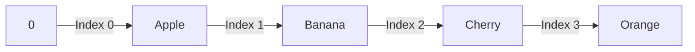

Arrays are one of the most fundamental data structures in programming. They are used to store multiple values in a single variable, allowing for efficient data manipulation and access. This guide will cover how to declare, initialize, and work with arrays in JavaScript, Java, Python, and C++.

<Ads />

## What is an Array?

An array is a collection of items stored at contiguous memory locations. The idea is to store multiple items of the same type together to make it easier to manage them. Arrays can be indexed, modified, and iterated over to perform various operations.

## Arrays in Different Languages

<Tabs>
  <TabItem value="javascript" label="JavaScript" default>

### JavaScript Arrays Overview

In JavaScript, arrays are dynamic, which means they can change size and hold mixed data types.

#### Declaration and Initialization

```js title="JavaScript Array Example"
// Declaration
let fruits = ["Apple", "Banana", "Cherry"];

// Accessing elements
console.log(fruits[0]); // Output: Apple

// Modifying an array
fruits[1] = "Mango";
console.log(fruits); // Output: ["Apple", "Mango", "Cherry"]
```

#### Common Array Methods

- **`push()`**: Adds an element to the end.
- **`pop()`**: Removes the last element.
- **`shift()`**: Removes the first element.
- **`unshift()`**: Adds an element to the beginning.

```js title="JavaScript Array Methods Example"
fruits.push("Orange");
console.log(fruits); // Output: ["Apple", "Mango", "Cherry", "Orange"]

fruits.pop();
console.log(fruits); // Output: ["Apple", "Mango", "Cherry"]
```

  </TabItem>

  <TabItem value="java" label="Java">

### Java Arrays Overview

Java arrays have a fixed size and must be declared with a type.

#### Declaration and Initialization

```java title="Java Array Example"
// Declaration
int[] numbers = new int[5]; // Array of size 5

// Initialization
int[] primes = {2, 3, 5, 7, 11};

// Accessing elements
System.out.println(primes[2]); // Output: 5

// Modifying an array
primes[2] = 13;
System.out.println(primes[2]); // Output: 13
```

#### Looping Through Arrays

```java title="Java Looping Through Array Example"
for (int num : primes) {
    System.out.println(num);
}
```

  </TabItem>

  <TabItem value="python" label="Python">

### Python Arrays (Lists) Overview

In Python, lists are dynamic and can hold different data types.

#### Declaration and Initialization

```python title="Python List Example"
# Declaration
fruits = ["Apple", "Banana", "Cherry"]

# Accessing elements
print(fruits[0])  # Output: Apple

# Modifying an array
fruits[1] = "Mango"
print(fruits)  # Output: ["Apple", "Mango", "Cherry"]
```

#### Common List Methods

- **`append()`**: Adds an element to the end.
- **`remove()`**: Removes a specific element.
- **`pop()`**: Removes the last element.

```python title="Python List Methods Example"
fruits.append("Orange")
print(fruits)  # Output: ["Apple", "Mango", "Cherry", "Orange"]

fruits.pop()
print(fruits)  # Output: ["Apple", "Mango", "Cherry"]
```

  </TabItem>

  <TabItem value="cpp" label="C++">

### C++ Arrays Overview

C++ arrays are static and have a fixed size.

#### Declaration and Initialization

```cpp title="C++ Array Example"
// Declaration
int numbers[5]; // Array of size 5

// Initialization
int primes[] = {2, 3, 5, 7, 11};

// Accessing elements
std::cout << primes[2] << std::endl; // Output: 5

// Modifying an array
primes[2] = 13;
std::cout << primes[2] << std::endl; // Output: 13
```

#### Looping Through Arrays

```cpp title="C++ Looping Through Array Example"
for (int i = 0; i < 5; i++) {
    std::cout << primes[i] << " ";
}
```

  </TabItem>
</Tabs>

<AdsComponent />

## Visualizing Arrays with Mermaid

Below is a simple Mermaid diagram to visualize how an array is structured in memory.



<br />

This representation shows how each element in an array can be accessed by its index.

<AdsComponent />

---

<h2 className="text-center">Feedback and Support</h2>

<GiscusComponent />