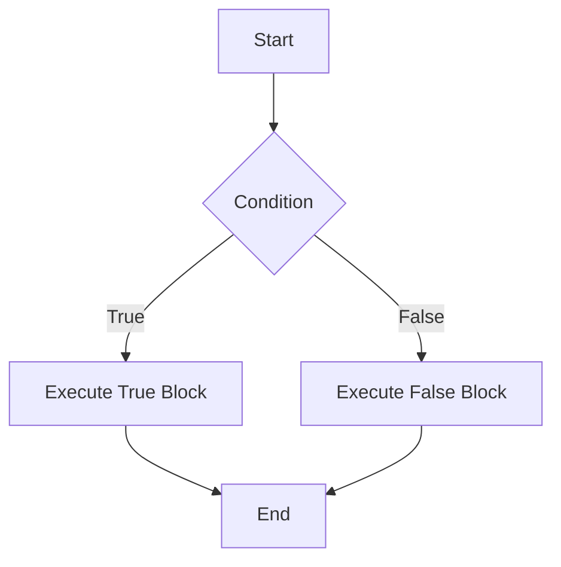

Conditionals allow you to execute different blocks of code based on certain conditions. They are essential for decision-making in programming. This guide will cover the common types of conditional statements and provide detailed examples across multiple languages.

<Ads />

## Types of Conditional Statements

1. **If-Else**: Executes a block of code if a condition is true; otherwise, it executes another block.
2. **Else-If Ladder**: Used when there are multiple conditions to check.
3. **Switch Case**: A more efficient way to handle multiple conditions based on the value of a single variable.
4. **Ternary Operator**: A shorthand way to write simple `if-else` statements.

## Conditional Statements in Different Languages

<Tabs>
  <TabItem value="javascript" label="JavaScript" default>

### JavaScript Conditionals Overview

In JavaScript, you can use `if-else`, `else-if` ladder, `switch` case, and the ternary operator for conditional statements.

#### 1. If-Else Statement

`if-else` statements are used to execute a block of code based on a condition. If the condition is true, the code inside the `if` block is executed; otherwise, the code inside the `else` block is executed.

```js title="If-Else Statement in JavaScript"
let number = 10;

if (number > 5) {
  console.log("Number is greater than 5");
} else {
  console.log("Number is 5 or less");
}
```

#### 2. Else-If Ladder

An `else-if` ladder is used when you have multiple conditions to check. The code block associated with the first true condition is executed.

```js title="Else-If Ladder in JavaScript"
let grade = 85;

if (grade >= 90) {
  console.log("A");
} else if (grade >= 80) {
  console.log("B");
} else if (grade >= 70) {
  console.log("C");
} else {
  console.log("Fail");
}
```

#### 3. Switch Case

`switch` statements are used to select one of many code blocks to be executed. It is more efficient than multiple `else-if` statements when you have multiple conditions based on the value of a single variable.

```js title="Switch Case in JavaScript"
let day = "Monday";

switch (day) {
  case "Monday":
    console.log("Start of the work week");
    break;
  case "Friday":
    console.log("End of the work week");
    break;
  default:
    console.log("Midweek days");
}
```

#### 4. Ternary Operator

The ternary operator is a shorthand way to write simple `if-else` statements. It consists of a condition followed by a `?` and two expressions separated by `:`. If the condition is true, the first expression is executed; otherwise, the second expression is executed.

```js title="Ternary Operator in JavaScript"
let age = 18;
let canVote = age >= 18 ? "Yes" : "No";
console.log(`Can vote: ${canVote}`); // Output: Can vote: Yes
```

  </TabItem>

  <TabItem value="java" label="Java">

### Java Conditionals Overview

Java supports `if-else`, `else-if` ladder, `switch` case, and the ternary operator for conditional statements.

#### 1. If-Else Statement

`if-else` statements in Java are used to execute a block of code based on a condition. If the condition is true, the code inside the `if` block is executed; otherwise, the code inside the `else` block is executed.

```java title="If-Else Statement in Java"
int number = 10;

if (number > 5) {
  System.out.println("Number is greater than 5");
} else {
  System.out.println("Number is 5 or less");
}
```

#### 2. Else-If Ladder

An `else-if` ladder is used when you have multiple conditions to check. The code block associated with the first true condition is executed.

```java title="Else-If Ladder in Java"
int grade = 85;

if (grade >= 90) {
  System.out.println("A");
} else if (grade >= 80) {
  System.out.println("B");
} else if (grade >= 70) {
  System.out.println("C");
} else {
  System.out.println("Fail");
}
```

#### 3. Switch Case

`switch` statements in Java are used to select one of many code blocks to be executed based on the value of a variable.

```java title="Switch Case in Java"
String day = "Monday";

switch (day) {
  case "Monday":
    System.out.println("Start of the work week");
    break;
  case "Friday":
    System.out.println("End of the work week");
    break;
  default:
    System.out.println("Midweek days");
    break;
}
```

#### 4. Ternary Operator

The ternary operator is a shorthand way to write simple `if-else` statements in Java. It consists of a condition followed by a `?` and two expressions separated by `:`. If the condition is true, the first expression is executed; otherwise, the second expression is executed.

```java title="Ternary Operator in Java"
int age = 18;
String canVote = (age >= 18) ? "Yes" : "No";
System.out.println("Can vote: " + canVote); // Output: Can vote: Yes
```

  </TabItem>

  <TabItem value="python" label="Python">

### Python Conditionals Overview

Python supports `if-else`, `else-if` ladder, and the ternary operator for conditional statements. Python does not have a native `switch` statement, but you can use dictionaries for similar behavior.

#### 1. If-Else Statement

`if-else` statements in Python are used to execute a block of code based on a condition. If the condition is true, the code inside the `if` block is executed; otherwise, the code inside the `else` block is executed.

```python title="If-Else Statement in Python"
number = 10

if number > 5:
    print("Number is greater than 5")
else:
    print("Number is 5 or less")
```

#### 2. Else-If Ladder (Elif)

An `elif` ladder is used when you have multiple conditions to check. The code block associated with the first true condition is executed.

```python title="Else-If Ladder in Python"
grade = 85

if grade >= 90:
    print("A")
elif grade >= 80:
    print("B")
elif grade >= 70:
    print("C")
else:
    print("Fail")
```

#### 3. Ternary Operator

The ternary operator is a shorthand way to write simple `if-else` statements in Python. It consists of a condition followed by a `if` and `else` expressions separated by `else`. If the condition is true, the `if` expression is executed; otherwise, the `else` expression is executed.

```python title="Ternary Operator in Python"
age = 18
can_vote = "Yes" if age >= 18 else "No"
print(f"Can vote: {can_vote}")  # Output: Can vote: Yes
```

:::note
Python does not have a native `switch` statement, but you can use dictionaries for similar behavior.
:::

```python title="Switch Case in Python"
day = "Monday"

days = {
    "Monday": "Start of the work week",
    "Friday": "End of the work week"
}

print(days.get(day, "Midweek days"))  # Output: Start of the work week
```

  </TabItem>

  <TabItem value="cpp" label="C++">

### C++ Conditionals Overview

In C++, you can use `if-else`, `else-if` ladder, `switch` case, and the ternary operator for conditional statements.

#### 1. If-Else Statement

`if-else` statements in C++ are used to execute a block of code based on a condition. If the condition is true, the code inside the `if` block is executed; otherwise, the code inside the `else` block is executed.

```cpp title="If-Else Statement in C++"
int number = 10;

if (number > 5) {
    std::cout << "Number is greater than 5" << std::endl;
} else {
    std::cout << "Number is 5 or less" << std::endl;
}
```

#### 2. Else-If Ladder

An `else-if` ladder is used when you have multiple conditions to check. The code block associated with the first true condition is executed.

```cpp title="Else-If Ladder in C++"
int grade = 85;

if (grade >= 90) {
    std::cout << "A" << std::endl;
} else if (grade >= 80) {
    std::cout << "B" << std::endl;
} else if (grade >= 70) {
    std::cout << "C" << std::endl;
} else {
    std::cout << "Fail" << std::endl;
}
```

#### 3. Switch Case

`switch` statements in C++ are used to select one of many code blocks to be executed based on the value of a variable.

```cpp title="Switch Case in C++"
std::string day = "Monday";

if (day == "Monday") {
    std::cout << "Start of the work week" << std::endl;
} else if (day == "Friday") {
    std::cout << "End of the work week" << std::endl;
} else {
    std::cout << "Midweek days" << std::endl;
}
```

#### 4. Ternary Operator

The ternary operator is a shorthand way to write simple `if-else` statements in C++. It consists of a condition followed by a `?` and two expressions separated by `:`. If the condition is true, the first expression is executed; otherwise, the second expression is executed.

```cpp title="Ternary Operator in C++"
int age = 18;
std::string canVote = (age >= 18) ? "Yes" : "No";
std::cout << "Can vote: " << canVote << std::endl; // Output: Can vote: Yes
```

  </TabItem>
</Tabs>

<AdsComponent />

## Visualizing Conditional Flow

To better understand the logic of `if-else` statements, consider the following Mermaid diagram that illustrates how a basic conditional check works:



## Conclusion

Conditional statements are fundamental to programming and allow you to control the flow of your code based on specific conditions. By mastering `if-else`, `switch`, and ternary operators, you can write more efficient and readable code across different programming languages.


<AdsComponent />

---

<h2 className="text-center">Feedback and Support</h2>

<GiscusComponent />