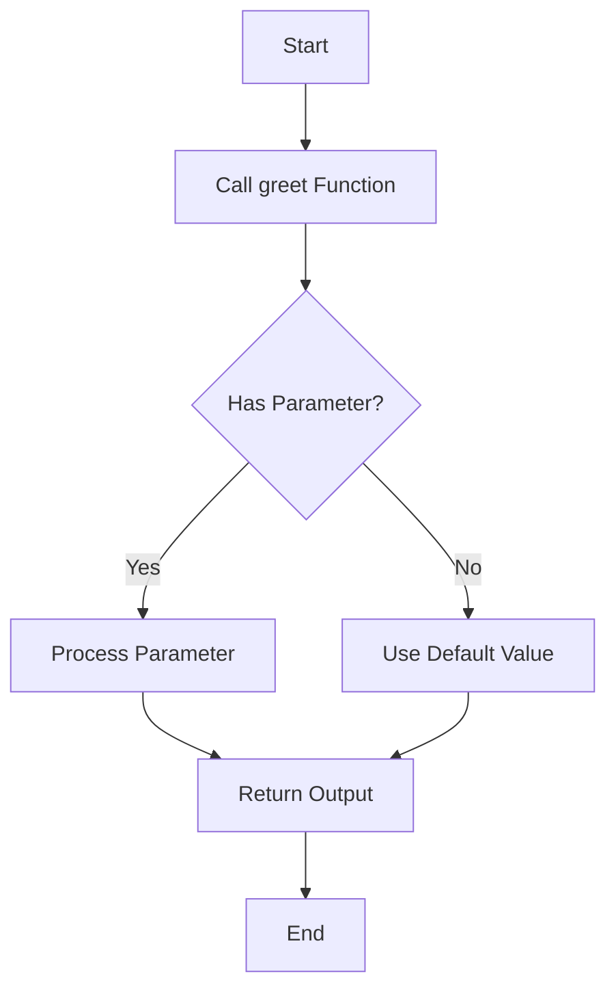

Functions are blocks of code that perform specific tasks and can be reused throughout a program. They help in organizing code, making it modular, and reducing redundancy.

<Ads />

## What is a Function?

A function is a reusable block of code that performs a specific task. Functions typically take input, process it, and return an output. The general structure of a function includes:

1. **Function name**: Identifies the function.
2. **Parameters**: Input values the function uses (optional).
3. **Return type**: The value the function sends back as output (optional).
4. **Function body**: The code that runs when the function is called.

## Functions in Different Languages

<Tabs>
  <TabItem value="javascript" label="JavaScript" default>

### JavaScript Functions Overview

JavaScript supports both function declarations and expressions.

#### Function Declaration

```js title="Declaring a function in JavaScript"
function greet(name) {
  return `Hello, ${name}!`;
}

console.log(greet("Alice")); // Output: Hello, Alice!
```

#### Function Expression

```js title="Function expression in JavaScript"
const greet = function(name) {
  return `Hello, ${name}!`;
};

console.log(greet("Bob")); // Output: Hello, Bob!
```

#### Arrow Functions

Introduced in ES6, arrow functions provide a concise way to write functions.

```js title="Arrow function in JavaScript"
const greet = (name) => `Hello, ${name}!`;

console.log(greet("Charlie")); // Output: Hello, Charlie!
```

### Function Scope and Closures

Functions in JavaScript can create closures, capturing variables from their surrounding scope.

```js title="Function scope and closures in JavaScript"
function outerFunction() {
  let outerVar = "I'm outer";

  function innerFunction() {
    console.log(outerVar); // Can access outerVar
  }

  return innerFunction;
}

const inner = outerFunction();
inner(); // Output: I'm outer
```

  </TabItem>

  <TabItem value="java" label="Java">

### Java Functions (Methods) Overview

In Java, functions are defined within classes and are called methods. They have a return type, a name, and can have parameters.

#### Method Declaration

```java title="Declaring a method in Java"
public class Main {
  public static void main(String[] args) {
    greet("Alice");
  }

  public static void greet(String name) {
    System.out.println("Hello, " + name + "!");
  }
}
```

### Return Values and Parameters

Methods can return values using the `return` keyword.

```java title="Returning a value from a method in Java"
public static int add(int a, int b) {
  return a + b;
}
```

  </TabItem>

  <TabItem value="python" label="Python">

### Python Functions Overview

Python functions are simple to define and use. The `def` keyword is used for defining functions.

#### Function Declaration

```python title="Defining a function in Python"
def greet(name):
    return f"Hello, {name}!"

print(greet("Alice"))  # Output: Hello, Alice!
```

### Default Parameters

Functions can have default parameter values.

```python title="Default parameters in Python"
def greet(name="World"):
    return f"Hello, {name}!"

print(greet())  # Output: Hello, World!
```

### Lambda Functions

Python also supports lambda (anonymous) functions for simple, one-line functions.

```python title="Lambda function in Python"
add = lambda x, y: x + y
print(add(2, 3))  # Output: 5
```

  </TabItem>

  <TabItem value="cpp" label="C++">

### C++ Functions Overview

In C++, functions can be declared outside or inside a class. They need to specify a return type, name, and optionally, parameters.

#### Function Declaration

```cpp title="Declaring a function in C++"
#include <iostream>
using namespace std;

void greet(string name) {
    cout << "Hello, " << name << "!" << endl;
}

int main() {
    greet("Alice"); // Output: Hello, Alice!
    return 0;
}
```

### Return Values and Parameters

Functions can return values and take multiple parameters.

```cpp title="Returning a value from a function in C++"
int add(int a, int b) {
    return a + b;
}

int main() {
    cout << add(5, 3); // Output: 8
    return 0;
}
```

  </TabItem>
</Tabs>

## Function Visualization with Mermaid

Here's a simple Mermaid diagram to illustrate the flow of a function:



In this flowchart:

- **Start**: The beginning of the function.
- **Call greet Function**: Invoking the function.
- **Has Parameter?**: Checking if a parameter is passed.
- **Process Parameter**: Handling the parameter.
- **Use Default Value**: Using a default value if no parameter is passed.
- **Return Output**: Returning the output.
- **End**: The end of the function.

## Conclusion

Functions are essential building blocks in programming, allowing you to write reusable code and improve the structure of your programs. Understanding how to create and use functions in different programming languages is a fundamental skill for any developer. Practice writing functions to enhance your programming skills and make your code more efficient and maintainable.

<AdsComponent />

---

<h2 className="text-center">Feedback and Support</h2>

<GiscusComponent />