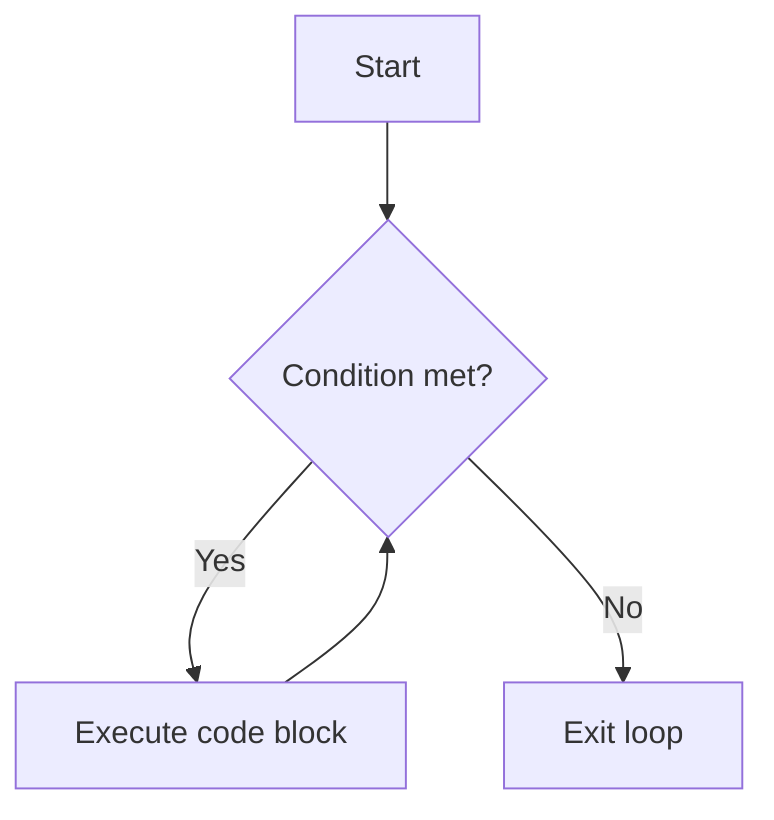

Loops are used in programming to repeat a block of code until a certain condition is met. This can simplify complex tasks that require repetitive actions, making code more efficient and easier to maintain.

<Ads />

## Types of Loops

1. **For Loop**: Repeats a block of code a specific number of times.
2. **While Loop**: Repeats a block of code as long as a condition is true.
3. **Do-While Loop**: Similar to a while loop, but guarantees at least one iteration.
4. **Enhanced For Loop (for-each)**: Used to iterate over collections or arrays (in Java, Python, and C++).

## Loops in Different Languages

<Tabs>
  <TabItem value="javascript" label="JavaScript" default>

### JavaScript Loops Overview

In JavaScript, you can use different types of loops to iterate over arrays, objects, or perform repetitive tasks. Here are examples of common loops in JavaScript:

#### 1. For Loop

```js title="JavaScript For Loop Example"
for (let i = 0; i < 5; i++) {
  console.log(i); // Output: 0, 1, 2, 3, 4
}
```

#### 2. While Loop

```js title="JavaScript While Loop Example"
let i = 0;
while (i < 5) {
  console.log(i); // Output: 0, 1, 2, 3, 4
  i++;
}
```

#### 3. Do-While Loop

```js title="JavaScript Do-While Loop Example"
let i = 0;
do {
  console.log(i); // Output: 0, 1, 2, 3, 4
  i++;
} while (i < 5);
```

  </TabItem>

  <TabItem value="java" label="Java">

### Java Loops Overview

In Java, loops are used to iterate over arrays, collections, or perform repetitive tasks. Here are examples of common loops in Java:

#### 1. For Loop

```java title="Java For Loop Example"
for (int i = 0; i < 5; i++) {
  System.out.println(i); // Output: 0, 1, 2, 3, 4
}
```

#### 2. While Loop

```java title="Java While Loop Example"
int i = 0;
while (i < 5) {
  System.out.println(i); // Output: 0, 1, 2, 3, 4
  i++;
}
```

#### 3. Do-While Loop

```java title="Java Do-While Loop Example"
int i = 0;
do {
  System.out.println(i); // Output: 0, 1, 2, 3, 4
  i++;
} while (i < 5);
```

#### 4. Enhanced For Loop (for-each)

```java title="Java Enhanced For Loop Example"
int[] numbers = {1, 2, 3, 4, 5};
for (int num : numbers) {
  System.out.println(num); // Output: 1, 2, 3, 4, 5
}
```

  </TabItem>

  <TabItem value="python" label="Python">

### Python Loops Overview

In Python, loops are used to iterate over sequences, collections, or perform repetitive tasks. Here are examples of common loops in Python:

#### 1. For Loop

```python title="Python For Loop Example"
for i in range(5):
  print(i) # Output: 0, 1, 2, 3, 4
```

#### 2. While Loop

```python title="Python While Loop Example"
i = 0
while i < 5:
  print(i) # Output: 0, 1, 2, 3, 4
  i += 1
```

  </TabItem>

  <TabItem value="cpp" label="C++">

### C++ Loops Overview

In C++, loops are used to iterate over arrays, collections, or perform repetitive tasks. Here are examples of common loops in C++:

#### 1. For Loop

```cpp title="C++ For Loop Example"
for (int i = 0; i < 5; i++) {
  std::cout << i << std::endl; // Output: 0, 1, 2, 3, 4
}
```

#### 2. While Loop

```cpp title="C++ While Loop Example"
int i = 0;
while (i < 5) {
  std::cout << i << std::endl; // Output: 0, 1, 2, 3, 4
  i++;
}
```

#### 3. Do-While Loop

```cpp title="C++ Do-While Loop Example"
int i = 0;
do {
  std::cout << i << std::endl; // Output: 0, 1, 2, 3, 4
  i++;
} while (i < 5);
```

#### 4. Range-Based For Loop (C++11 and above)

```cpp title="C++ Range-Based For Loop Example"
std::vector<int> numbers = {1, 2, 3, 4, 5};
for (int num : numbers) {
  std::cout << num << std::endl; // Output: 1, 2, 3, 4, 5
}
```

  </TabItem>
</Tabs>

<AdsComponent />

## Understanding Loop Flow with a Diagram

To better understand how loops work, let's use a Mermaid diagram to visualize the flow of a `while` loop.



In this flowchart:
- The loop starts and checks the condition.
- If the condition is true, the code block is executed, and the condition is checked again.
- If the condition is false, the loop ends.

This visualization helps illustrate the iterative nature of loops and how they repeat until a specific condition is no longer met.

## Conclusion

Loops are essential in programming to automate repetitive tasks and iterate over data structures. By using loops effectively, you can write more efficient code and solve complex problems with ease.

<AdsComponent />

---

<h2 className="text-center">Feedback and Support</h2>

<GiscusComponent />