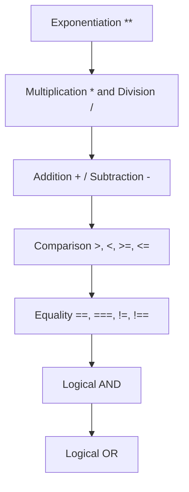

Operators are symbols or keywords used to perform operations on variables and values. Understanding the different types of operators and their precedence is crucial for writing efficient code.

<Ads />

## Types of Operators

Most programming languages support the following types of operators:

1. **Arithmetic Operators**
2. **Comparison Operators**
3. **Logical Operators**
4. **Assignment Operators**
5. **Bitwise Operators**
6. **Unary Operators**
7. **Ternary (Conditional) Operators**

<Tabs>
  <TabItem value="js" label="JavaScript" default>

### JavaScript Operators Overview

JavaScript supports a wide range of operators that help you perform various tasks:

#### 1. Arithmetic Operators
These operators are used to perform mathematical operations.

```js title="Arithmetic Operators in JavaScript"
let a = 10;
let b = 5;

console.log(a + b); // Addition: 15
console.log(a - b); // Subtraction: 5
console.log(a * b); // Multiplication: 50
console.log(a / b); // Division: 2
console.log(a % b); // Modulus: 0
console.log(a ** 2); // Exponentiation: 100
```

#### 2. Comparison Operators
These operators compare two values and return a Boolean (`true` or `false`).

```js title="Comparison Operators in JavaScript"
console.log(a > b); // true
console.log(a < b); // false
console.log(a == 10); // true (loose equality)
console.log(a === "10"); // false (strict equality)
```

### Operator Precedence

Understanding operator precedence is important to ensure expressions evaluate as intended. JavaScript evaluates operators from **highest to lowest precedence**.

**Mermaid Diagram of Operator Precedence:**



  </TabItem>

  <TabItem value="java" label="Java">

### Java Operators Overview

In Java, operators work similarly but come with strict typing:

#### 1. Arithmetic Operators
```java
int a = 15;
int b = 4;

System.out.println(a + b); // Addition: 19
System.out.println(a - b); // Subtraction: 11
System.out.println(a * b); // Multiplication: 60
System.out.println(a / b); // Division: 3 (integer division)
System.out.println(a % b); // Modulus: 3
```

#### 2. Comparison Operators
```java
System.out.println(a > b); // true
System.out.println(a == 15); // true
System.out.println(a != b); // true
```

#### 3. Logical Operators
```java
boolean x = true;
boolean y = false;

System.out.println(x && y); // Logical AND: false
System.out.println(x || y); // Logical OR: true
System.out.println(!x);     // Logical NOT: false
```

### Operator Precedence Chart

Operator precedence in Java follows a strict hierarchy:

<!-- **Mermaid Diagram for Operator Precedence in Java:** -->


  </TabItem>

  <TabItem value="python" label="Python">

### Python Operators Overview

Python operators are straightforward and easy to use:

#### 1. Arithmetic Operators
```python
a = 20
b = 7

print(a + b)  # Addition: 27
print(a - b)  # Subtraction: 13
print(a * b)  # Multiplication: 140
print(a / b)  # Division: 2.857142857142857
print(a % b)  # Modulus: 6
print(a ** 2) # Exponentiation: 400
```

#### 2. Comparison Operators
```python
print(a > b)   # True
print(a == 20) # True
print(a != b)  # True
```

#### 3. Logical Operators
```python
x = True
y = False

print(x and y) # False
print(x or y)  # True
print(not x)   # False
```

### Operator Precedence in Python

<!-- **Mermaid Diagram for Python Operator Precedence:** -->

  </TabItem>

  <TabItem value="cpp" label="C++">

### C++ Operators Overview

C++ operators are powerful and similar to those in Java:

#### 1. Arithmetic Operators
```cpp
int a = 25;
int b = 8;

std::cout << a + b << std::endl; // Addition: 33
std::cout << a - b << std::endl; // Subtraction: 17
std::cout << a * b << std::endl; // Multiplication: 200
std::cout << a / b << std::endl; // Division: 3 (integer division)
std::cout << a % b << std::endl; // Modulus: 1
```

#### 2. Comparison Operators
```cpp
std::cout << (a > b) << std::endl;   // true
std::cout << (a == 25) << std::endl; // true
std::cout << (a != b) << std::endl;  // true
```

#### 3. Logical Operators
```cpp
bool x = true;
bool y = false;

std::cout << (x && y) << std::endl; // false
std::cout << (x || y) << std::endl; // true
std::cout << (!x) << std::endl;     // false
```

### Operator Precedence Chart

<!-- **Mermaid Diagram for C++ Operator Precedence:** -->

  </TabItem>
</Tabs>

<AdsComponent />

---

<h2 className="text-center">Feedback and Support</h2>

<GiscusComponent />