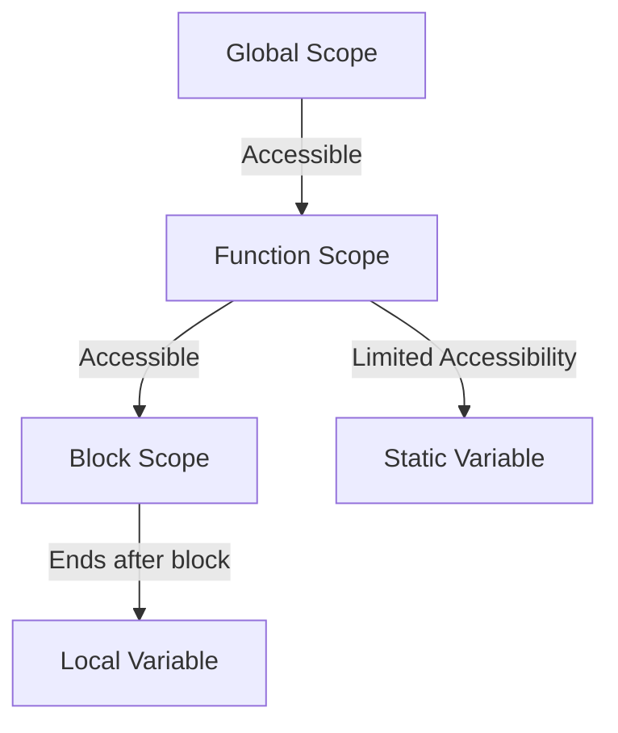

Variables are fundamental components in programming. They act as containers for storing data values that can be manipulated throughout your code. Understanding how to declare, initialize, and use variables effectively is crucial for writing efficient and maintainable programs.

## What is a Variable?

A variable is a symbolic name associated with a value and whose associated value can change. Think of a variable as a labeled box that can hold data. The label (variable name) helps you retrieve and manipulate the data.

<Ads />

## Variables by Language

<Tabs>
  <TabItem value="javascript" label="JavaScript" default>

### JavaScript Variables Overview

In JavaScript, variables can be declared using `var`, `let`, or `const`:

- `var`: Function-scoped and prone to hoisting issues. Avoid using in modern code.
- `let`: Block-scoped and ideal for variables that can be reassigned.
- `const`: Block-scoped and immutable. Perfect for values that shouldn't change.

```js title="Declaring variables in JavaScript"
let name = "Alice"; // Block-scoped variable
const age = 25; // Constant variable, cannot be reassigned
var isStudent = true; // Function-scoped (use is discouraged)
```

:::note Modern JavaScript
Use `let` and `const` for modern JavaScript as they offer better scoping and avoid potential pitfalls.
:::

### Variable Hoisting in JavaScript

JavaScript variables declared using `var` are hoisted to the top of their scope, but not initialized:

```js title="Variable hoisting"
console.log(x); // Undefined, not an error but undefined due to hoisting
var x = 10;
```

  </TabItem>

  <TabItem value="java" label="Java">

### Java Variables Overview

Java is a statically-typed language, meaning you need to declare the type of the variable before using it:

- **Primitive types**: `int`, `double`, `boolean`, `char`, etc.
- **Reference types**: Objects and arrays.

```java title="Declaring variables in Java"
String name = "Alice";
int age = 25;
boolean isStudent = true;
```

### Variable Scope in Java

Java has three main types of variable scopes:
1. **Local variables**: Declared within a method and accessible only within that method.
2. **Instance variables**: Declared within a class but outside any method. They are specific to an instance of a class.
3. **Class (static) variables**: Declared with the `static` keyword and shared among all instances of a class.

  </TabItem>

  <TabItem value="python" label="Python">

### Python Variables Overview

Python is a dynamically-typed language, which means the type is inferred when the variable is assigned:

```python title="Declaring variables in Python"
name = "Alice"
age = 25
is_student = True
```

### Variable Naming Conventions

In Python, variable names should follow these guidelines:
- Use lowercase words separated by underscores for readability: `is_student`.
- Avoid using Python keywords like `class`, `for`, or `if` as variable names.

### Variable Scope in Python

Python has four main types of scopes:
1. **Local scope**: Variables declared inside a function.
2. **Global scope**: Variables declared at the top level of a script or module.
3. **Enclosed scope**: Variables in a nested function.
4. **Built-in scope**: Reserved names in the Python language.

  </TabItem>

  <TabItem value="cpp" label="C++">

### C++ Variables Overview

C++ requires you to declare the type explicitly, similar to Java:

```cpp title="Declaring variables in C++"
std::string name = "Alice";
int age = 25;
bool isStudent = true;
```

### Variable Lifetime and Scope in C++

- **Local variables**: Declared within a function and destroyed after the function ends.
- **Global variables**: Declared outside of all functions and accessible from any part of the program.
- **Static variables**: Retain their value between function calls.

```cpp title="Static variable"
#include <iostream>
using namespace std;

void example() {
    static int count = 0; // Retains value between calls
    count++;
    cout << "Count: " << count << endl;
}

int main() {
    example();
    example();
    return 0;
}
```

  </TabItem>
</Tabs>

<AdsComponent />

## Visualizing Variable Scope

To understand the lifetime and scope of variables across different parts of your program, we can use a Mermaid diagram:



- **Global Scope**: Variables accessible throughout the program.
- **Function Scope**: Variables that live within the function.
- **Block Scope**: Variables that exist within a block of code (e.g., inside loops or conditionals).
- **Static Variable**: Maintains its value between function calls.

---

## Best Practices for Variable Use

- **Choose meaningful names**: Variables should reflect their purpose.
- **Follow language-specific naming conventions**.
- **Use the correct scope**: Keep variables as limited in scope as possible for better code management.
- **Avoid global variables when possible**: They can lead to code that's hard to maintain and debug.

By understanding how to declare, initialize, and use variables effectively, you can write cleaner, more maintainable code in any programming language.

---

<h2 className="text-center">Feedback and Support</h2>

<GiscusComponent />