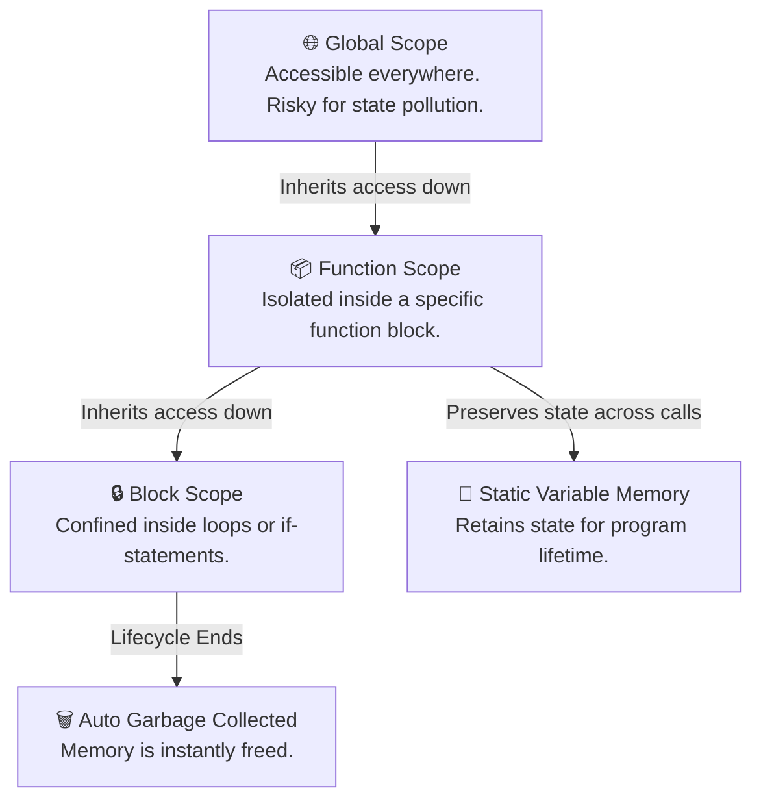

If code is the engine that drives an application, variables are the fuel tanks holding the data that keeps it moving. Whether you are building an interactive interface or optimizing a low-level search algorithm, you cannot write meaningful software without understanding where data lives and how long it stays there.

Let’s unpack how variables actually work, look at how different languages handle them under the hood, and establish a rock-solid mental model for managing data in your code.

## The Mental Model: What *is* a Variable?

The classic textbook tells you that a variable is a "box with a label." That’s a decent start, but let's look at it like software engineers:

A **variable** is a friendly, human-readable name pointing to a specific address in your computer’s temporary memory (RAM). Instead of forcing you to remember a horrific hex string like `0x7fff5fbff61a` just to retrieve a user's score, your language lets you type `userScore`. 

When working with variables, your code goes through two crucial steps:
1. **Declaration**: Telling the computer, *"Hey, save some memory space for me and call it X."*
2. **Initialization**: Putting an actual data value inside that reserved space for the first time.

<AdsComponent />

<br />

## Variables in Action: A Four-Language Showdown

Different programming ecosystems handle memory and data typing in completely unique ways. Select a language tab below to see how they declare variables, manage memory lifecycles, and behave under the hood.

<Tabs>
  <TabItem value="javascript" label="JavaScript" default>

### The JavaScript Lifecycle: Dynamic & Context-Driven

JavaScript is a **dynamically-typed** language, meaning you don't explicitly tell it what type of data a variable holds; it figures it out on the fly. However, *how* you choose to declare that variable changes its entire behavioral DNA. Modern JS gives you three keywords:

* `const`: Your default choice. It stands for constant. It blocks variable reassignment and prevents accidental bugs.
* `let`: Your choice for variables that *must* change over time (like loops or counters).
* `var`: The legacy, pre-2015 keyword. It uses function scoping instead of block scoping and is highly prone to unexpected scoping bugs. **Avoid it in production code.**

```js title="Declaring variables in modern JS"
const userName = "Alice"; // Safe, immutable reference
let userAge = 25;        // Mutable, can be updated later
var oldSchool = true;    // Legacy footprint (discouraged)
```

### Beware of The Pitfall: Hoisting

When JavaScript compiles your file, it moves variable declarations to the top of their scope before executing the code. If you use `var`, it initializes it as `undefined`, which can lead to silent errors instead of crashing when it should:

```js title="The Hoisting Paradox"
console.log(myNumber); // Outputs: undefined (No crash, just a silent bug!)
var myNumber = 42;

// Modern Fix:
console.log(fixedNumber); // ReferenceError! (Fails fast and tells you exactly what's wrong)
let fixedNumber = 100;
```

  </TabItem>

  <TabItem value="python" label="Python">

### The Python Way: Clean, Dynamic, and Inferred

Python strips away the structural noise. There are no declaration keywords like `let` or `int`. Python is **dynamically-typed** and uses assignment to create a variable on the fly. The moment you assign a value using `=`, Python allocates the memory and identifies the data type behind the scenes.

```python title="Sleek variable assignment in Python"
user_name = "Alice"   # Python detects this as a String
user_age = 25         # Python detects this as an Integer
is_active = True      # Python detects this as a Boolean
```

### Python Naming & Scoping Realities

Because Python relies heavily on readability, its community strictly adheres to **PEP 8 guidelines**:
* Use `snake_case` (lowercase words split by underscores) for all variable names: `total_checkout_price`.
* Never use built-in keywords (like `list`, `str`, `dict`, or `if`) as variable names.

Python tracks variables across four distinct scope boundaries, neatly summarized by the **LEGB Rule**:
1. **L**ocal: Inside the current running function.
2. **E**nclosing: Inside an outer function (for nested architectures).
3. **G**lobal: Declared at the very top level of the file/module.
4. **B**uilt-in: Native Python functions and names (like `print()`).

  </TabItem>

  <TabItem value="java" label="Java">

### The Java Standard: Static Typing & Explicit Blueprints

Java is a **statically-typed** language. It demands absolute certainty. You cannot simply create a variable name and figure it out later; you must declare exactly *what kind* of data is going into that memory container before your code even compiles.

Java data types split into two clean categories:
* **Primitives**: Lightweight, raw data stored directly on the fast execution stack (e.g., `int`, `double`, `boolean`, `char`).
* **Reference Types**: Complex pointers stored on the heap memory that look up objects, arrays, and classes (e.g., `String`, `ArrayList`).

```java title="Strict variable declarations in Java"
String developerName = "Alice"; // Reference type pointing to an object
int structuralAge = 25;         // Primitive type stored directly
boolean isEnrolled = true;      // Primitive type boolean
```

### Java's Architectural Scopes
Where you declare a variable inside a Java class dictates its structural permissions:
1. **Local Variables**: Born inside a specific method block and wiped from memory the moment that method completes execution.
2. **Instance Variables**: Declared directly inside a class but outside methods. Every single new object created gets its own unique copy of this data.
3. **Class (Static) Variables**: Marked with the `static` keyword. This data is shared collectively across every instance of that class in the entire runtime environment.

  </TabItem>

  <TabItem value="cpp" label="C++">

### The C++ Paradigm: Raw Performance and Explicit Lifetimes

C++ is a compiled, **statically-typed** system architecture language. Like Java, it requires explicit data type definitions. However, C++ gives you profound, low-level control over exactly how long a variable lives in memory and where it can be seen.

```cpp title="Explicit variable initialization in C++"
#include <string>

std::string engineerName = "Alice"; 
int targetAge = 25;
bool isSystemActive = true;
```

### Memory Lifetimes: The Power of Static Data
In standard C++, a local variable inside a function is instantly destroyed the moment that function hits its closing brace (`}`). However, by using the `static` keyword, you can tell C++ to keep that variable alive in memory for the *entire duration* of the program's lifecycle, preserving its data across multiple function executions:

```cpp title="Preserving state with Static variables"
#include <iostream>
using namespace std;

void trackInvocations() {
    static int executionCount = 0; // Initialized ONLY once
    executionCount++;
    cout << "This function has run " << executionCount << " times." << endl;
}

int main() {
    trackInvocations(); // Outputs: 1
    trackInvocations(); // Outputs: 2
    trackInvocations(); // Outputs: 3
    return 0;
}
```

  </TabItem>
</Tabs>

<AdsComponent />

## Visualizing Variable Scope Boundaries

A variable's **scope** determines exactly where in your code that variable can be accessed, read, or modified. To protect your application's data integrity, follow the principle of least privilege: **keep variables encapsulated in the tightest scope boundary possible.**



## Production Best Practices for Clean Code

Writing production-grade code means using variables defensively to avoid bugs down the line. Here are the golden rules used by enterprise engineering teams:

### 1. Optimize for Readability (No Cryptic Names)
Your code is read by humans far more often than it is processed by compilers. Avoid lazy variable names that force developers to guess your intent.
* **Bad:** `let d = new Date();` or `let fn = "John";`
* **Good**: `let currentCheckoutDate = new Date();` or `let userFirstName = "John";`

### 2. Treat State as Immutable by Default
If a value does not need to change, do not give it the ability to change. Use `const` in JavaScript/TypeScript or `final` in Java. This guarantees that your variable won't be accidentally modified by a completely different module deep in your source file.

### 3. Starve the Global Scope

It is incredibly tempting to declare variables globally so you can access them anywhere. Do not do this. Global variables create tightly coupled code, trigger unpredictable racing conditions, and make writing reliable unit tests almost impossible. Keep your variables encapsulated inside their respective blocks or objects.

## Let's Refine Your Code!

What programming language are you currently using to master Data Structures and Algorithms? Have you run into any weird scoping issues or hoisting errors in your current codebase? Drop your questions or code blocks below, and let’s debug them together!