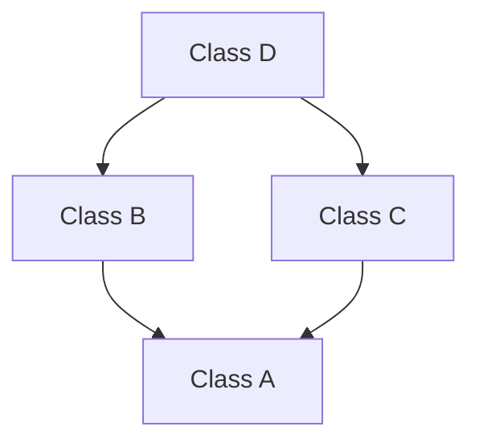

# Inheritance in C++

Inheritance is a fundamental feature of Object-Oriented Programming (OOP) that allows a new class (derived class) to acquire properties and behavior (data members and member functions) of an existing class (base class). It promotes code reuse, logical hierarchy, and polymorphism.

---

## 1. Introduction to Inheritance

**Definition:**  
Inheritance is a mechanism where one class can inherit the properties (data members) and functionalities (member functions) of another class.

**Key Terminology:**
- **Base Class (Parent/Superclass):** The class whose features are inherited.
- **Derived Class (Child/Subclass):** The class that inherits from the base class.

**Syntax:**
```cpp
class BaseClass {
    // base class members
};

class DerivedClass : access-specifier BaseClass {
    // derived class members
};
```

:::note Multiple Base Classes:
If multiple base classes are present, then they are separated using commas.
Order in which the base classes are written matters!

*Example:*
```cpp
class DerivedClass : access-specifier1 BaseClass1, access-specifier2 BaseClass2, access-specifier3 BaseClass3 ...
```
:::

**Access Specifiers in Inheritance:**
The access-specifier determines how the members of the base class are treated in the derived class.

| Base Class Member Access | Public Inheritance	    | Protected Inheritance  | Private Inheritance  |
|--------------------------|------------------------|------------------------|----------------------|
| `public`	               | `public` in derived	| `protected` in derived | `private` in derived |
| `protected`              | `protected` in derived | `protected` in derived | `private` in derived |
| `private`                | Not accessible	        | Not accessible         | Not accessible       |

**Why use inheritance?**
- Reusability: Avoid rewriting common code.
- Extensibility: Add new features to existing classes without modifying them.
- Polymorphism: Use base class pointers/references to operate on derived objects.


## 2. Single Inheritance
A derived class inherits from exactly one base class.

**Example:**

```cpp
#include <iostream>
using namespace std;

// Base class
class Vehicle {
public:
    void start() {
        cout << "Vehicle started." << endl;
    }
};

// Derived class
class Car : public Vehicle {
public:
    void honk() {
        cout << "Car honks." << endl;
    }
};

int main() {
    Car myCar;
    myCar.start();  // Inherited from Vehicle
    myCar.honk();   // Own method
    return 0;
}
```

**Output:**

```text
Vehicle started.
Car honks.
```


## 3. Multiple Inheritance
A derived class inherits from more than one base class simultaneously.

**Example:**

```cpp
#include <iostream>
using namespace std;

class Engine {
public:
    void startEngine() {
        cout << "Engine started." << endl;
    }
};

class Wheels {
public:
    void rotate() {
        cout << "Wheels rotating." << endl;
    }
};

class Car : public Engine, public Wheels {
public:
    void drive() {
        cout << "Car is driving." << endl;
    }
};

int main() {
    Car myCar;
    myCar.startEngine();
    myCar.rotate();
    myCar.drive();
    return 0;
}
```

**Output:**

```text
Engine started.
Wheels rotating.
Car is driving.
```

**Ambiguity**
- Ambiguity can happen when two base classes have member functions with the same name.
- In such a case, if that function is called, it can be confusing as to which of the two function is called.
- Can be resolved using scope resolution (Base::function()).


## 4. Multilevel Inheritance
In multilevel inheritance, a derived class becomes the base class for another class, forming a chain.

**Example:**

```cpp
#include <iostream>
using namespace std;

class Animal {
public:
    void breathe() {
        cout << "Animal breathes." << endl;
    }
};

class Mammal : public Animal {
public:
    void giveBirth() {
        cout << "Mammal gives birth." << endl;
    }
};

class Dog : public Mammal {
public:
    void bark() {
        cout << "Dog barks." << endl;
    }
};

int main() {
    Dog myDog;
    myDog.breathe();    // From Animal
    myDog.giveBirth();  // From Mammal
    myDog.bark();       // Own method
    return 0;
}
```

**Output:**

```text
Animal breathes.
Mammal gives birth.
Dog barks.
```


## 5. Hierarchical Inheritance
Multiple derived classes inherit from a single base class. This represents a parent-child tree structure.

**Example:**

```cpp
#include <iostream>
using namespace std;

class Shape {
public:
    void shapefunc() {
        cout << "This is a shape." << endl;
    }
};

class Circle : public Shape {
public:
    void radius() {
        cout << "Circle has radius." << endl;
    }
};

class Square : public Shape {
public:
    void side() {
        cout << "Square has sides." << endl;
    }
};

int main() {
    Circle c;
    c.shapefunc();
    c.radius();

    Square s;
    s.shapefunc();
    s.side();
    return 0;
}
```

**Output:**

```text
This is a shape.
Circle has radius.
This is a shape.
Square has sides.
```


## 6. Hybrid Inheritance
Hybrid inheritance is a combination of two or more types of inheritance (e.g., hierarchical + multiple, multilevel + multiple). Not every hybrid inheritance creates ambiguity – it only becomes problematic when it forms a diamond.

**Example (Hybrid = Hierarchical + Multiple):**

```cpp
#include <iostream>
using namespace std;

// Base class
class Person {
public:
    void introduce() {
        cout << "I am a person." << endl;
    }
};

// Hierarchical branch 1
class Student : public Person {
public:
    void study() {
        cout << "I am studying." << endl;
    }
};

// Hierarchical branch 2
class Employee : public Person {
public:
    void work() {
        cout << "I am working." << endl;
    }
};

// Multilevel extension: WorkingStudent inherits only from Student
// This combines Multilevel with the Hierarchical design without forming a diamond.
class WorkingStudent : public Student {
public:
    void partTimeJob() {
        cout << "I have a part-time job alongside studies." << endl;
    }
};

int main() {
    WorkingStudent ws;
    ws.introduce();    // From Person
    ws.study();        // From Student
    ws.partTimeJob();  // Own method
    // ws.work();      // Not available – WorkingStudent is not an Employee. No ambiguity.
    
    // Demonstrate independent Employee branch
    Employee emp;
    emp.introduce();
    emp.work();
    
    return 0;
}
```

**Output:**

```text
I am a person.
I am studying.
I have a part-time job alongside studies.
I am a person.
I am working.
```


## 7. Diamond Problem
The Diamond Problem occurs when two classes (say `B` and `C`) inherit from a common base class `A`, and a class `D` inherits from both `B` and `C`. This creates an ambiguous diamond‑shaped hierarchy:



**Example:**

```cpp
#include <iostream>
using namespace std;

// Base class
class A {
public:
    void show() { cout << "Class A" << endl; }
};

// Derived from A (Hierarchical)
class B : public A {};

// Derived from A (Hierarchical)
class C : public A {};

// Derived from both B and C (Multiple)
class D : public B, public C {};

int main() {
    D obj;
    // obj.show();   // ERROR: ambiguous! Which path? B::A::show or C::A::show?
    obj.B::show();    // Calling through B's copy
    obj.C::show();    // Calling through C's copy
    return 0;
}
```

**Problems:**
- Ambiguity: Which base class sub‑object should D use when a member of A is referenced?
- Duplication: D contains two separate copies of A’s members, wasting memory and creating inconsistency.

**Solution: Virtual Inheritance**
Using the virtual keyword while inheriting ensures that only one shared copy of the base class is created, no matter how many paths lead to it.

```cpp
#include <iostream>
using namespace std;

class A {
public:
    void show() {
        cout << "Class A" << endl;
    }
};

// Virtual inheritance
class B : virtual public A {};
class C : virtual public A {};

class D : public B, public C {};

int main() {
    D obj;
    obj.show();     // No ambiguity, single copy of A
    return 0;
}
```

**Output:**

```text
Class A
```

**How it works:**
Virtual inheritance tells the compiler to share the base class sub‑object among all virtually derived classes. The most‑derived class (`D`) is then responsible for constructing the shared base class (`A`) directly.
While virtual inheritance solves the diamond problem, it may introduce minor performance overhead and complexity. It should be used only when a true diamond hierarchy exists and shared state is required.
