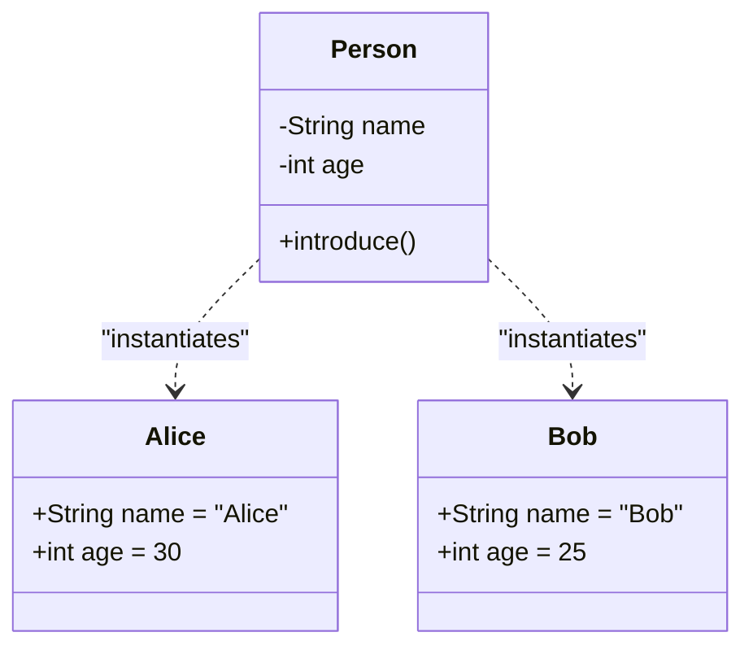

---

id: objects

title: Objects

sidebar_label: Objects

sidebar_position: 7

description: Learn about Objects in Object-Oriented Programming - instances of classes that represent real-world entities.

tags: [oop, objects, classes, programming-concepts, java, python, csharp]

---


# Objects


An **Object** is an instance of a class in Object-Oriented Programming (OOP). It represents a real-world entity with its own state (attributes) and behavior (methods). While a class is a blueprint, an object is the actual realization of that blueprint.


## What is an Object?


Objects are the fundamental building blocks of OOP. They encapsulate data and the operations that can be performed on that data.


### Key Concepts


- **Instance of a Class**: Created from a class template.

- **State**: Represented by attributes (data members).

- **Behavior**: Represented by methods (member functions).

- **Identity**: Each object has a unique identity, even if they have the same state.

- **Message Passing**: Objects communicate by calling methods on each other.


## Object Creation in Java


```java

public class Person {

&#x20;   private String name;

&#x20;   private int age;

&#x20;   

&#x20;   public Person(String name, int age) {

&#x20;       this.name = name;

&#x20;       this.age = age;

&#x20;   }

&#x20;   

&#x20;   public void introduce() {

&#x20;       System.out.println("Hi, I'm " + name + " and I'm " + age + " years old.");

&#x20;   }

&#x20;   

&#x20;   public String getName() {

&#x20;       return name;

&#x20;   }

}


// Creating objects

public class Main {

&#x20;   public static void main(String[] args) {

&#x20;       // Creating multiple objects

&#x20;       Person person1 = new Person("Alice", 30);

&#x20;       Person person2 = new Person("Bob", 25);

&#x20;       

&#x20;       person1.introduce();

&#x20;       person2.introduce();

&#x20;       

&#x20;       System.out.println("Person1 name: " + person1.getName());

&#x20;   }

}

```


## Object Creation in Python


```python

class Person:

&#x20;   def __init__(self, name, age):

&#x20;       self.name = name

&#x20;       self.age = age

&#x20;   

&#x20;   def introduce(self):

&#x20;       print(f"Hi, I'm {self.name} and I'm {self.age} years old.")


# Creating objects

person1 = Person("Alice", 30)

person2 = Person("Bob", 25)


person1.introduce()

person2.introduce()

```


## Object Creation in C#


```csharp

public class Person

{

&#x20;   public string Name { get; set; }

&#x20;   public int Age { get; set; }

&#x20;   

&#x20;   public Person(string name, int age)

&#x20;   {

&#x20;       Name = name;

&#x20;       Age = age;

&#x20;   }

&#x20;   

&#x20;   public void Introduce()

&#x20;   {

&#x20;       Console.WriteLine($"Hi, I'm {Name} and I'm {Age} years old.");

&#x20;   }

}


// Usage

public class Program

{

&#x20;   public static void Main()

&#x20;   {

&#x20;       Person person1 = new Person("Alice", 30);

&#x20;       Person person2 = new Person("Bob", 25);

&#x20;       

&#x20;       person1.Introduce();

&#x20;       person2.Introduce();

&#x20;   }

}

```


## Object vs Class


| Aspect          | Class                          | Object                          |

|-----------------|--------------------------------|---------------------------------|

| Definition      | Blueprint / Template           | Instance of the blueprint       |

| Existence       | Exists in code                 | Exists in memory at runtime     |

| Memory          | No memory allocation           | Occupies memory                 |

| Multiple        | One definition                 | Can create many objects         |


## Mermaid Diagram: Class and Objects





## Benefits of Objects


- **Modularity**: Independent units of code.

- **Reusability**: Create multiple objects from one class.

- **Real-world Modeling**: Represents entities naturally.

- **Encapsulation**: Protects internal state.


## Best Practices


- Create objects only when needed (avoid unnecessary instantiation).

- Use meaningful variable names for objects.

- Follow the Single Responsibility Principle.

- Properly manage object lifecycle (especially in languages with manual memory management).

- Use dependency injection where appropriate.


## Related Concepts


- [Classes](./classes)

- [Abstraction](./abstraction)

- [Encapsulation](./encapsulation)

- [Inheritance](./inheritance)

- [Polymorphism](./polymorphism)


