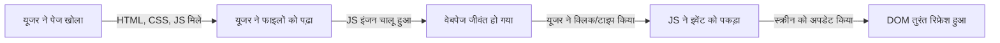

नमस्ते दोस्तों! 👋 **जावास्क्रिप्ट (JavaScript)** की इस शानदार दुनिया में आपका स्वागत है। अगर आपने कभी सोचा है कि साधारण, स्थिर (static) वेबसाइटें अचानक क्लिक होने वाली, हिलने-डुलने वाली और लाइव एप्लिकेशन्स में कैसे बदल जाती हैं, तो उसका जवाब यही है। जावास्क्रिप्ट आधुनिक वेब डेवलपमेंट की जादुई सामग्री है। आइए मिलकर इसके बुनियादी सिद्धांतों (basics) को समझते हैं और देखते हैं कि यह इतनी खास क्यों है!

<AdsComponent />

## 1. आखिरकार जावास्क्रिप्ट है क्या? (What is JavaScript?)

सोचिए अगर HTML किसी वेबपेज का कंकाल (skeleton) है, और CSS उसके कपड़े और स्टाइलिंग है, तो **जावास्क्रिप्ट (JS)** उसका दिमाग और मांसपेशियां (muscles) हैं। यह एक हाई-लेवल, बेहद वर्सटाइल प्रोग्रामिंग भाषा है जिसे वेबसाइटों को जीवंत बनाने के लिए बनाया गया है। स्क्रीन पर सिर्फ टेक्स्ट देखने के बजाय, JS आपके यूजर्स को पेज के साथ वास्तविक समय (real-time) में इंटरैक्ट करने की अनुमति देता है।

### डेवलपर्स इसे क्यों पसंद करते हैं:

- **यह कहीं भी चलती है**: यह सीधे आपके वेब ब्राउज़र के अंदर चलती है—इसके लिए किसी भारी-भरकम सेटअप की ज़रूरत नहीं है।
- **पूरी तरह से इंटरैक्टिव**: यह साधारण बटन क्लिक और फॉर्म चेक से लेकर जटिल एनिमेशन तक सब कुछ संभाल सकती है।
- **क्रॉस-प्लेटफ़ॉर्म चैंपियन**: हर आधुनिक ब्राउज़र (जैसे Chrome, Firefox) बिना किसी अतिरिक्त टूल के जावास्क्रिप्ट को समझता है।
- **हमेशा तैयार**: यह एक 'इवेंट लिसनर' की तरह काम करती है, जो बस इस इंतज़ार में रहती है कि यूजर कब स्क्रॉल करे, होवर करे या कुछ टाइप करे, और तुरंत रिएक्ट करती है।

:::tip 🤯 एक मजेदार तथ्य (Fun Fact)
जावास्क्रिप्ट को 1995 में ब्रेंडन इच (Brendan Eich) द्वारा मात्र **10 दिनों** में तैयार किया गया था। हालांकि इसे बहुत जल्दबाजी में बनाया गया था, फिर भी इसने सारी बाधाओं को पार करते हुए पूरी इंटरनेट की सबसे व्यापक रूप से उपयोग की जाने वाली भाषा का खिताब हासिल किया!
:::

<Ads />

## 2. यह जादू काम कैसे करता है? (How Does it Work?)

जावास्क्रिप्ट सीधे आपके ब्राउज़र के अंदर रहती है। जैसे ही कोई यूजर आपकी वेबसाइट खोलता है, ब्राउज़र का आंतरिक इंजन (JS Engine) आपके कोड को लाइन-बाय-लाइन पढ़ता है और तुरंत इंटरैक्टिव हिस्सों को चालू कर देता है।

### जावास्क्रिप्ट का जीवनचक्र (The JavaScript Lifecycle)



## 3. काम के दौरान जावास्क्रिप्ट: एक छोटी सी झलक

आइए एक छोटा सा उदाहरण देखें। यहाँ बताया गया है कि कैसे जावास्क्रिप्ट की एक छोटी सी लाइन पूरे वेबपेज के व्यवहार को बदल देती है जब यूजर उसके साथ इंटरैक्ट करता है।

```html
<!DOCTYPE html>
<html>
  <head>
    <title>मेरा पहला JS कदम</title>
  </head>
  <body>
    <h1 id="greeting">स्वागत है!</h1>
    <button onclick="changeGreeting()">मुझे क्लिक करें</button>

    <script>
      function changeGreeting() {
        document.getElementById("greeting").innerText = "हैलो, जावास्क्रिप्ट!";
      }
    </script>
  </body>
</html>
```

### इस जादू को करीब से समझें:
1. **HTML संरचना**: हमने स्क्रीन पर एक साधारण हेडिंग (`स्वागत है!`) और एक बटन रखा।
2. **जावास्क्रिप्ट की चिंगारी**: हमने बटन से कहा, *"सुनो, जब कोई तुम्हें क्लिक करे, तो 'greeting' नाम के एलिमेंट को ढूंढना और उसका टेक्स्ट बदलकर 'हैलो, जावास्क्रिप्ट!' कर देना।"*

<AdsComponent />

## 4. आपको जावास्क्रिप्ट कहाँ-कहाँ मिलेगी?

स्पॉइलर अलर्ट: **हर जगह!** यह ब्राउज़र की सीमाओं को तोड़कर पूरी टेक दुनिया पर राज कर रही है। देखिए कहाँ-कहाँ इसका दबदबा है:

### 4.1. फ्रंट-एंड (Front-End - क्लाइंट साइड)
यह आपके यूजर इंटरफेस को स्मूथ और रिस्पॉन्सिव बनाती है। **React**, **Vue**, और **Angular** जैसे बेहद लोकप्रिय टूल्स पूरी तरह से जावास्क्रिप्ट पर बने हैं, जिन्होंने वेब ऐप्स बनाने का तरीका बदल दिया है।

### 4.2. बैक-एंड (Back-End - सर्वर साइड)
**Node.js** की बदौलत जावास्क्रिप्ट अब सिर्फ ब्राउज़र तक सीमित नहीं है। अब आप अपने सर्वर का लॉजिक लिख सकते हैं, डेटाबेस कनेक्ट कर सकते हैं, और सिर्फ इस *एक* भाषा का उपयोग करके पूरा फुल-स्टैक सिस्टम बना सकते हैं।

### 4.3. मोबाइल और डेस्कटॉप ऐप्स (Apps)
ऐप बनाना चाहते हैं? **React Native** (iOS और Android के लिए) और **Electron** (डेस्कटॉप ऐप्स जैसे VS Code और Discord के लिए) जैसे फ्रेमवर्क आपको अपने JS स्किल्स का उपयोग करके अलग-अलग प्लेटफॉर्म के लिए ऐप्स बनाने की सुविधा देते हैं।

### 4.4. ब्राउज़र गेमिंग (Gaming)
**Phaser** और **Three.js** जैसी शक्तिशाली गेम लाइब्रेरियों के साथ, आप बेहतरीन 2D और 3D गेम्स बना सकते हैं जो सीधे ब्राउज़र टैब के अंदर बिना किसी रुकावट के चलते हैं।

## 5. अपने प्रोजेक्ट में जावास्क्रिप्ट को कैसे जोड़ें?

शुरुआत करना बेहद आसान है। आप `<script>` टैग का उपयोग करके जावास्क्रिप्ट को अपने HTML पेजों में शामिल कर सकते हैं।

### 5.1. फटाफट वाला तरीका (Inline JS)
आप अपना कोड सीधे अपनी HTML फ़ाइल के अंदर इस तरह लिख सकते हैं:

```html
<script>
  console.log("बधाई हो! आपका कोड बिना किसी रुकावट के चल रहा है।");
</script>
```

### 5.2. साफ-सुथरा तरीका (External File)
जैसे-जैसे आपका प्रोजेक्ट बढ़ेगा, कोड उलझने लगेगा। इसलिए बेहतर होगा कि आप अपनी जावास्क्रिप्ट को उसकी खुद की एक अलग फ़ाइल (जैसे `main.js`) में रखें और उसे लिंक करें:
```html
<script src="main.js"></script>
```

### 5.3. साफ-सुथरे कोड के लिए प्रो-टिप्स (Best Practices)

- **चीजों को अलग रखें**: HTML को संरचना संभालने दें, CSS को रूप-रंग संभालने दें, और जावास्क्रिप्ट को व्यवहार (behavior) संभालने दें।
- **पेज को लोड होने से न रोकें**: बाहरी स्क्रिप्ट्स को लिंक करते समय हमेशा `defer` एट्रिब्यूट का उपयोग करें। यह सुनिश्चित करता है कि भारी स्क्रिप्ट्स के डाउनलोड होने का इंतज़ार किए बिना आपका वेबपेज और उसका टेक्स्ट तेजी से लोड हो जाए।

```html
<script src="main.js" defer></script>
```

## 6. निष्कर्ष (Wrap Up)

जावास्क्रिप्ट एक महाशक्ति (superpower) है जो यह तय करती है कि डिजिटल दुनिया कैसे काम करेगी। इस पर महारत हासिल करके, आप डायनेमिक वेब ऐप्स, मोबाइल टूल्स, इंटरैक्टिव गेम्स और मजबूत सर्वर इंफ्रास्ट्रक्चर बनाने के दरवाजे खोल देते हैं।

एक गहरी सांस लें—आप यह बिल्कुल कर सकते हैं! हमारे आने वाले गाइड्स में हम वेरिएबल्स, लूप्स और लॉजिक को गहराई से समझेंगे। तब तक, कोडिंग करते रहें!
