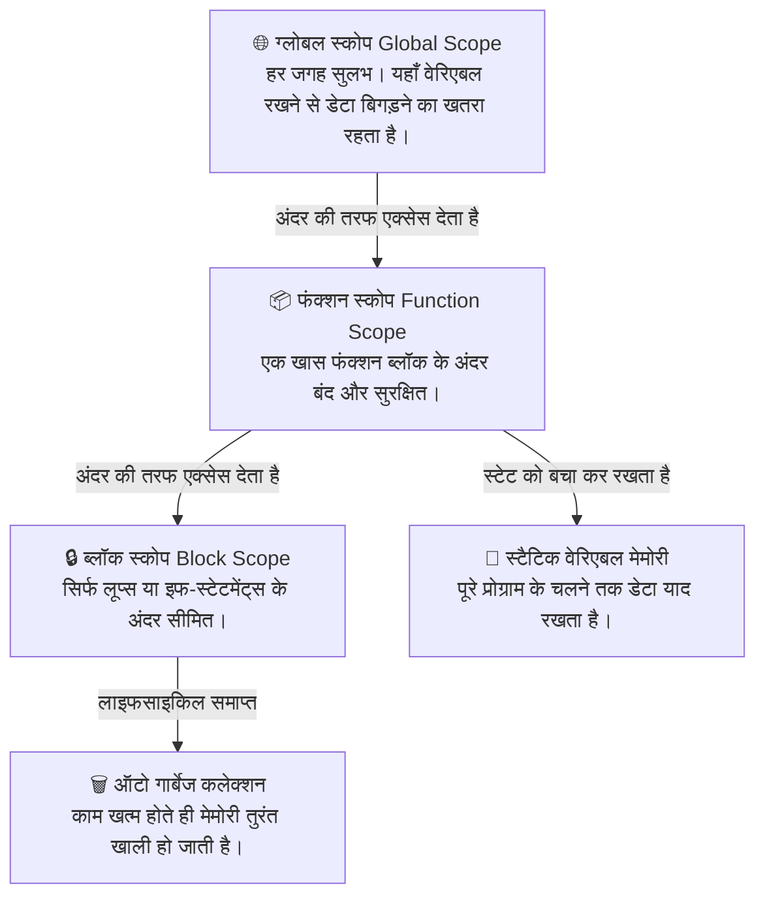

यदि कोड एक ऐसा इंजन है जो आपकी एप्लिकेशन को चलाता है, तो वेरिएबल्स (Variables) उस इंजन के फ्यूल टैंक हैं जो डेटा को सुरक्षित रखते हैं ताकि एप्लिकेशन सुचारू रूप से चलती रहे। चाहे आप एक शानदार यूजर इंटरफेस बना रहे हों या किसी कठिन सर्च एल्गोरिदम को ऑप्टिमाइज़ कर रहे हों—आप यह जाने बिना बेहतरीन सॉफ्टवेयर नहीं लिख सकते कि डेटा कहाँ रहता है और मेमोरी में कब तक टिकता है।

आइए वेरिएबल्स के असली काम को गहराई से समझते हैं, देखते हैं कि अलग-अलग प्रोग्रामिंग भाषाएं पर्दे के पीछे मेमोरी को कैसे संभालती हैं, और कोड में डेटा मैनेजमेंट का एक मजबूत मेंटल मॉडल तैयार करते हैं।

## मेंटल मॉडल: आखिरकार एक वेरिएबल क्या है?

पुरानी किताबें अक्सर कहती हैं कि वेरिएबल "एक डिब्बा है जिस पर लेबल लगा है।" शुरुआत के लिए यह ठीक है, लेकिन आइए इसे एक सॉफ्टवेयर इंजीनियर के नजरिए से देखते हैं:

एक **वेरिेएबल** कंप्यूटर की टेम्परेरी मेमोरी (RAM) में एक खास पते (memory address) को दिया गया एक आसान और इंसानी नाम है। सोचिए, अगर आपको किसी यूजर का स्कोर जानने के लिए हर बार `0x7fff5fbff61a` जैसा खतरनाक हेक्साडेसिमल कोड याद रखना पड़े, तो कितनी आफत होगी! आपकी प्रोग्रामिंग भाषा इसी आफत को दूर करने के लिए आपको `userScore` लिखने की आजादी देती है।

जब आप वेरिएबल्स के साथ काम करते हैं, तो आपका कोड दो मुख्य चरणों (phases) से गुजरता है:
1. **डिक्लेरेशन (Declaration)**: कंप्यूटर से कहना, *"सुनो, मेमोरी में थोड़ी जगह सुरक्षित कर लो और उसे X नाम दे दो।"*
2. **इनिशियलाइजेशन (Initialization)**: उस सुरक्षित की गई जगह में पहली बार कोई असली डेटा वैल्यू डालना।

<AdsComponent />

## वेरिएबल्स का मुकाबला: 4 पॉपुलर भाषाएं आमने-सामने

अलग-अलग प्रोग्रामिंग भाषाएं मेमोरी और डेटा टाइपिंग को बिल्कुल अनोखे तरीके से संभालती हैं। नीचे दिए गए टैब्स में से किसी एक को चुनें और देखें कि वो भाषा वेरिएबल्स को कैसे डिक्लेयर करती है और पर्दे के पीछे क्या खेल खेलती है।

<Tabs>
  <TabItem value="javascript" label="JavaScript" default>

### जावास्क्रिप्ट लाइफसाइकिल: डायनेमिक और कॉन्टेक्स्ट-ड्रिवन

जावास्क्रिप्ट एक **डायनेमिकली-टाइप्ड (dynamically-typed)** भाषा है। इसका मतलब है कि आपको पहले से चिल्लाकर यह बताने की जरूरत नहीं है कि वेरिएबल में किस तरह का डेटा आएगा; यह खुद-ब-खुद समझ जाती है। लेकिन, आप वेरिएबल बनाने के लिए किस कीवर्ड (keyword) का इस्तेमाल करते हैं, इससे उसका पूरा व्यवहार बदल जाता है। मॉडर्न जावास्क्रिप्ट हमें तीन विकल्प देती है:

* `const`: इसे अपना डिफॉल्ट विकल्प मानिए। यह 'कांस्टेंट' के लिए है। एक बार इसमें वैल्यू डाल दी, तो उसे दोबारा बदला नहीं जा सकता—यह कोड को सुरक्षित रखता है।
* `let`: इसका इस्तेमाल तब करें जब आपको पता हो कि वेरिएबल की वैल्यू आगे जाकर बदलेगी (जैसे लूप्स या काउंटर्स में)।
* `var`: यह 2015 से पहले का पुराना कीवर्ड है। यह ब्लॉक स्कोप के बजाय फंक्शन स्कोप का इस्तेमाल करता है, जिससे अजीबोगरीब बग्स आ जाते हैं। **मॉडर्न प्रोडक्शन कोड में इसके इस्तेमाल से पूरी तरह बचें।**

```js title="मॉडर्न जावास्क्रिप्ट में वेरिएबल्स डिक्लेयर करना"
const userName = "Alice"; // सुरक्षित, बदला नहीं जा सकता
let userAge = 25;        // बदला जा सकता है, आगे अपडेट होगा
var oldSchool = true;    // पुराना तरीका (इसका इस्तेमाल न करें)
```

### सावधान रहें: होइस्टिंग (Hoisting) का खतरा

जब जावास्क्रिप्ट आपकी फाइल को कंपाइल करती है, तो वह `var` से बने वेरिएबल्स को उनके स्कोप में सबसे ऊपर ले जाती है। लेकिन ट्विस्ट यह है कि वह उनकी वैल्यू ऊपर नहीं ले जाती, जिससे कोड क्रैश होने के बजाय `undefined` आउटपुट दे देता है, जो कि एक साइलेंट बग है:

```js title="होइस्टिंग का चक्रव्यूह"
console.log(myNumber); // आउटपुट: undefined (कोड क्रैश नहीं हुआ, पर गलत नतीजा आया!)
var myNumber = 42;

// मॉडर्न समाधान (Modern Fix):
console.log(fixedNumber); // ReferenceError! (कोड तुरंत क्रैश होकर गलती बता देगा)
let fixedNumber = 100;
```

  </TabItem>

  <TabItem value="python" label="Python">

### पायथन का अंदाज: साफ-सुथरा, डायनेमिक और सीधा

पायथन कोड के फालतू शोर को पूरी तरह खत्म कर देती है। यहाँ `let` या `int` जैसे किसी डिक्लेरेशन कीवर्ड की जरूरत नहीं होती। पायथन **डायनेमिकली-टाइप्ड** है। जैसे ही आप `=` का उपयोग करके किसी नाम को वैल्यू असाइन करते हैं, पायथन तुरंत मेमोरी एलोकेट कर देती है और खुद ही डेटा का प्रकार (Data Type) पहचान लेती है।

```python title="पायथन में आसान वेरिएबल असाइनमेंट"
user_name = "Alice"   # पायथन ने इसे String (स्ट्रिंग) मान लिया
user_age = 25         # पायथन ने इसे Integer (अंक) मान लिया
is_active = True      # पायथन ने इसे Boolean (सत्य/असत्य) मान लिया
```

### पायथन नेमिंग और स्कोप के नियम

चूंकि पायथन का पूरा जोर कोड की पठनीयता (readability) पर है, इसलिए इसकी कम्युनिटी **PEP 8 गाइडलाइंस** का सख्ती से पालन करती है:
* वेरिएबल्स के लिए हमेशा `snake_case` (छोटे अक्षरों के बीच अंडरस्कोर) का इस्तेमाल करें: `total_checkout_price`।
* कभी भी पायथन के रिजर्व्ड कीवर्ड्स (जैसे `list`, `str`, `dict`, या `if`) का इस्तेमाल वेरिएबल के नाम के रूप में न करें।

पायथन वेरिएबल्स को ट्रैक करने के लिए **LEGB रूल** का पालन करता है:
1. **L**ocal: वर्तमान फंक्शन के अंदर।
2. **E**nclosing: बाहरी फंक्शन के अंदर (नेस्टेड फंक्शन के मामले में)।
3. **G**lobal: फाइल या मॉड्यूल के सबसे ऊपरी स्तर पर।
4. **B**uilt-in: पायथन के अपने इन-बिल्ट नाम (जैसे `print()`)।

  </TabItem>

  <TabItem value="java" label="Java">

### जावा का स्टैंडर्ड: स्टैटिक टाइपिंग और सख्त नियम

जावा एक **स्टैटिकली-टाइप्ड (statically-typed)** भाषा है। यह शत-प्रतिशत स्पष्टता मांगती है। आप बस कोई भी नाम लिखकर बाद में यह नहीं सोच सकते कि इसमें क्या डालना है; कोड कंपाइल होने से पहले आपको यह बताना ही होगा कि उस डिब्बे में किस प्रकार का डेटा जाएगा।

जावा में डेटा टाइप्स दो हिस्सों में बंटे होते हैं:
* **प्रिमिटिव्स (Primitives)**: हल्के और सीधे फास्ट एग्जीक्यूशन स्टैक (Stack) मेमोरी में स्टोर होने वाले डेटा (जैसे `int`, `double`, `boolean`, `char`)।
* **रेफरेंस टाइप्स (Reference Types)**: हीप (Heap) मेमोरी में स्टोर होने वाले कॉम्प्लेक्स पॉइंटर्स जो ऑब्जेक्ट्स या एरेज़ की तरफ इशारा करते हैं (जैसे `String`, `ArrayList`)।

```java title="जावा में सख्त वेरिएबल डिक्लेरेशन"
String developerName = "Alice"; // ऑब्जेक्ट की तरफ इशारा करने वाला रेफरेंस टाइप
int structuralAge = 25;         // सीधे स्टैक में स्टोर होने वाला प्रिमिटिव टाइप
boolean isEnrolled = true;      // प्रिमिटिव बुलियन टाइप
```

### जावा के आर्किटेक्चरल स्कोप
आप जावा क्लास में वेरिएबल कहाँ डिक्लेयर करते हैं, इससे तय होता है कि उसे क्या-क्या परमिशन्स मिलेंगी:
1. **लोकल वेरिएबल्स (Local Variables)**: एक खास मेथड ब्लॉक के अंदर पैदा होते हैं और मेथड खत्म होते ही मेमोरी से गायब हो जाते हैं।
2. **इंसटेंस वेरिएबल्स (Instance Variables)**: क्लास के अंदर लेकिन मेथड्स के बाहर बनते हैं। जब भी क्लास का नया ऑब्जेक्ट बनता है, उसे इस डेटा की अपनी एक अलग कॉपी मिलती है।
3. **क्लास/स्टैटिक वेरिएबल्स (Class Variables)**: इन्हें `static` कीवर्ड के साथ मार्क किया जाता है। यह डेटा पूरे रनटाइम के दौरान उस क्लास के सभी ऑब्जेक्ट्स के बीच कॉमन रहता है।

  </TabItem>

  <TabItem value="cpp" label="C++">

### C++ का प्रतिमान: रॉक-सॉलिड परफॉर्मेंस और मेमोरी पर कंट्रोल

C++ एक कंपाइल्ड और **स्टैटिकली-टाइप्ड** सिस्टम आर्किटेक्चर भाषा है। जावा की तरह इसमें भी डेटा टाइप बताना अनिवार्य है। लेकिन C++ आपको इस बात पर पूरा कंट्रोल देती है कि आपका वेरिएबल मेमोरी में कब तक रहेगा और उसे कोड में कहाँ से देखा जा सकेगा।

```cpp title="C++ में वेरिएबल्स का इनिशियलाइजेशन"
#include <string>

std::string engineerName = "Alice"; 
int targetAge = 25;
bool isSystemActive = true;
```

### स्टेटिक वेरिएबल्स की ताकत (Static Variables)
C++ में एक साधारण लोकल वेरिएबल फंक्शन खत्म होते ही नष्ट हो जाता है। लेकिन अगर आप उसके आगे `static` कीवर्ड लगा देते हैं, तो आप C++ को निर्देश दे रहे हैं कि इस वेरिएबल को प्रोग्राम के खत्म होने तक मेमोरी में जिंदा रखो। इससे वह वेरिएबल फंक्शन के बार-बार चलने पर भी अपना पुराना डेटा याद रखता है:

```cpp title="स्टेटिक वेरिएबल्स के साथ डेटा सुरक्षित रखना"
#include <iostream>
using namespace std;

void trackInvocations() {
    static int executionCount = 0; // यह लाइन सिर्फ पहली बार चलेगी
    executionCount++;
    cout << "यह फंक्शन " << executionCount << " बार चल चुका है।" << endl;
}

int main() {
    trackInvocations(); // आउटपुट: 1
    trackInvocations(); // आउटपुट: 2
    trackInvocations(); // आउटपुट: 3
    return 0;
}
```

  </TabItem>
</Tabs>

<AdsComponent />

## वेरिएबल स्कोप (Scope) की सीमाओं को समझना

एक वेरिएबल का **स्कोप** यह तय करता है कि आप कोड में उसे कहाँ से एक्सेस, रीड या मॉडिफाई कर सकते हैं। अपने एप्लिकेशन के डेटा को सुरक्षित रखने के लिए हमेशा सबसे कड़े स्कोप नियम का पालन करें: **वेरिएबल को जितना हो सके उतने छोटे स्कोप में रखें।**



## क्लीन कोड लिखने की प्रोडक्शन बेस्ट प्रैक्टिसेज

इंडस्ट्री-लेवल का कोड लिखने का मतलब है वेरिएबल्स का इस्तेमाल इस तरह करना कि आगे जाकर कोई बग न आए। यहाँ कुछ गोल्डन रूल्स दिए गए हैं जिन्हें बड़ी टेक कंपनियां फॉलो करती हैं:

### 1. नाम ऐसा जो कहानी बयां करे (Readability First)

आपका कोड कंपाइलर से ज़्यादा इंसानों द्वारा पढ़ा जाता है। इसलिए छोटे या शॉर्टकट नामों से बचें जो दूसरे डेवलपर्स को सोचने पर मजबूर कर दें।

* **गलत तरीका:** let d = new Date(); या let fn = "John";
* **सही तरीका:** let currentCheckoutDate = new Date(); या let userFirstName = "John";

### 2. डेटा को डिफ़ॉल्ट रूप से इम्यूटेबल (Immutable) रखें

अगर किसी वेरिएबल की वैल्यू बदलने की जरूरत नहीं है, तो उसे बदलने की ताकत मत दीजिए। जावास्क्रिप्ट में const और जावा में final का इस्तेमाल करें। यह गारंटी देता है कि कोई दूसरा मॉड्यूल गलती से आपके डेटा को बदल नहीं पाएगा।

### 3. ग्लोबल स्कोप को खाली रखें
शुरुआत में यह बहुत आसान लगता है कि वेरिएबल्स को ग्लोबल बना दिया जाए ताकि उन्हें कहीं से भी इस्तेमाल किया जा सके। ऐसा कभी न करें। ग्लोबल वेरिएबल्स कोड को आपस में बुरी तरह उलझा देते हैं, जिससे टेस्टिंग करना और बड़े प्रोजेक्ट्स को संभालना नामुमकिन हो जाता है।

## आइए आपके कोड को बेहतर बनाएं!

आप डेटा स्ट्रक्चर और एल्गोरिदम (DSA) सीखने के लिए अभी किस प्रोग्रामिंग भाषा का इस्तेमाल कर रहे हैं? क्या आपको कभी अपने कोड में स्कोप या होइस्टिंग से जुड़ा कोई अजीब बग मिला है? अपने सवाल या कोड के टुकड़े नीचे कमेंट्स में शेयर करें, और आइए मिलकर उन्हें डीबग करते हैं!
