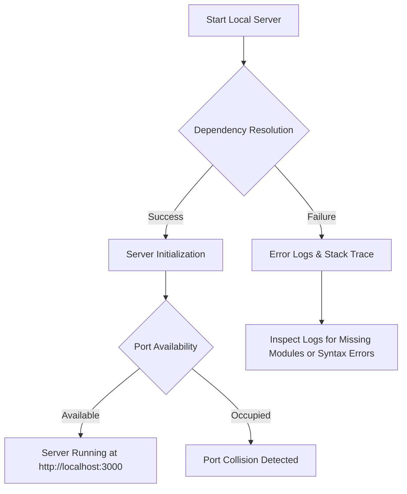

# Troubleshooting Guide

This central matrix provides rapid diagnostic actions and structural configurations for common setup, environment, build, and deployment issues encountered while contributing to the **Algo** platform.

:::tip Core Principle
Before modifying systemic files, always ensure your local environment is cleanly synchronized with the upstream `main` branch.
:::

## Installation & Dependency Issues

### `npm install` Fails / Resolution Blocks

* **Symptoms:** Dependency installation terminates abruptly with package resolution tree locks, peer dependency mismatch alerts, or architecture/environment compatibility faults.

#### 1. Audit Runtime Environment
Ensure you are operating within the official, supported Node.js stable LTS baseline designated for the Algo ecosystem:

```bash
node -v
npm -v
```

#### 2. Execute an Isolated Reset Pipeline

If caching or upstream registry structural mismatches persist, clear the local workspace canvas completely and trigger a clean installation.

:::info Platform-Specific Command Matrix
Select the destructive clean script optimized for your operating system terminal:
:::

**Linux / macOS (Bash/Zsh)**

```bash
rm -rf node_modules package-lock.json && npm install

```

**Windows (PowerShell Core)**

```powershell
Remove-Item -Recurse -Force node_modules; Remove-Item package-lock.json; npm install

```

---

## 🖥️ Local Engine & Development Server

### Core Thread Crashes on Startup (`npm start`)

* **Potential Root Causes:** Unresolved cross-dependencies, legacy Node.js runtimes, active microservices occupying default operational ports, or corrupted configuration maps.



#### Step-by-Step Resolution Matrix

1. **Purge & Rehydrate:** Force an execution of `npm install` to repair missing binary links or broken symbolic modules.
2. **Resolve Port Collisions:** Verify that no other background processes are bound to the default development port (`3000`).
3. **Engine Validation:** Ensure the engine flags configured inside `package.json` align perfectly with your active local CLI toolset.
4. **Clean Boot Sequence:** Execute the initialization runtime cleanly:
    ```bash
    npm start
    ```

### Client Changes Fail to Hot-Reload

If modifications made to documentation files or MDX blocks fail to automatically stream updates directly into the browser viewport:

1. Send a terminate signal to the active server instance using Ctrl + C.
2. Force-clear your active browser cache storage layers.
3. Trigger a **Hard Viewport Refresh** using Cmd + Shift + R (macOS) or Ctrl + F5 (Windows/Linux) immediately after re-launching the compiler:
    ```bash
    npm start
    ```

## Compiler Build & MDX Engines

### Production Build Failures (`npm run build`)

:::warning Critical Diagnostic Routine
Always inspect the raw terminal stack trace logs immediately preceding the failure flag. Docusaurus output pinpoint accuracy routes directly to the isolated line number and problematic component.
:::

#### Immediate Remediation Actions

* Resolve all semantic linting warnings, hanging syntax flags, or TypeScript compiler blocks.
* Validate that all custom module references and structured layout hooks (`import`) map with exact, case-sensitive file path paths.
* Re-run the local deployment simulation sequence:
    ```bash
    npm run build
    ```

### MDX Compilation Errors

* **Common Pitfalls:** Unclosed JSX/TSX semantic tags, unescaped reserved formatting operators (`{`, `<`, etc.), missing or unimported layout nodes, or misaligned frontmatter configuration keys.

```tsx
// ❌ Invalid Syntax Structure
<MyComponent>

//  Valid Component Structure
<MyComponent />
```

## Layout, Assets & Link Integrity

### Broken Internal Navigation Links

#### Validation Routine

1. Verify the targeted asset or internal markdown file actually exists within the workspace directory tree.
2. Force the use of strict **Relative Paths** (e.g., `../domain/target-file.md`) instead of hardcoded, brittle absolute server routes.
3. Boot up the compiler engine (`npm start`) and run a physical execution test across all navigation routes.

### Broken Image & Graphic Assets

If a rendered workspace element displays an empty container boundary or an invalid asset link indicator, verify the following asset tracking requirements:

* **Directory Targeting:** Confirm the path routing accurately anchors into your `/static/` ecosystem mappings.
* **Case-Sensitivity Bounds:** Double-check that asset name variations and extension strings strictly align (e.g., `.png` vs `.PNG`).

```markdown

```

## Deployment Pipelines

### Upstream GitHub Pages Deployment Blocks

Before running automated code pipelines to deploy site modifications to your production environments, always guarantee that the localized distribution bundler evaluates with absolute zero error conditions:

    ```bash
    npm run build
    ```

Once the development bundle completes smoothly without warnings, deploy using your workspace access layer mechanism:

#### Authentication Protocol Matrix

| Access Protocol | Deployment Script |
| --- | --- |
| **SSH Configuration** | `USE_SSH=true npm run deploy` |
| **HTTPS Configuration** | `GIT_USER=<your-github-username> npm run deploy` |

## API & Backend Integration Nodes

### Local Server Workspace Mappings Unreachable

If automated interactive code execution frames or custom interactive charts fail to securely retrieve datasets from the development API microservice, verify your local configuration values.

#### Target Configuration Core (`.env`)

```env
ALGO_API_URL=http://localhost:5000
```

`DOCUSAURUS_API_BASE_URL` remains supported for existing local setups, but new environments should prefer `ALGO_API_URL`.

#### Infrastructure Checklist

* [ ] **Service Activation:** Confirm the targeted local backend engine thread is up and running.
* [ ] **Port Interface Mapping:** Verify the platform listener is tracking operations over port `5000`.
* [ ] **CORS Interceptor Overrides:** Verify that your system firewall rules or developer interceptor rules do not block local loopback Cross-Origin Requests.

### Production Build Fails With Missing API Base URL

Production builds intentionally fail when neither `ALGO_API_URL` nor `DOCUSAURUS_API_BASE_URL` is configured. API-backed pages depend on this value for requests, and an empty fallback would make the browser call relative paths on the static site instead of the API service.

Set the production API endpoint before building or deploying:

```env
ALGO_API_URL=https://api.example.com
```

## Frequently Asked Questions

#### Where should I add new algorithm documentation?

Navigate to the matching computational domain directory nested inside the root `/docs/` space. Ensure all new documentation sets adhere strictly to the format templates defined inside our system [Contribution Guide](https://github.com/ajay-dhangar/algo/CONTRIBUTING.md).

#### How can I preview my workspace edits with hot-reloading?

Boot the local development server utilizing `npm start`, then navigate directly to the browser loopback interface at `http://localhost:3000`.

#### How can I guarantee my code satisfies automated verification steps?

Execute a local compilation sequence using `npm run build`. If the pipeline passes cleanly without trace notifications, your MDX rules, internal relative navigation maps, and configuration hooks are ready for pull requests.

## Still Need Assistance?

If your local issue is outside the scope of this matrix or persists despite executing resolution passes:

1. Review the comprehensive developer configuration specs inside [CONTRIBUTING.md](https://github.com/ajay-dhangar/algo/CONTRIBUTING.md).
2. Query active threads inside our live [GitHub Discussions](https://github.com/ajay-dhangar/algo/discussions) and issue registries.
3. Open a detailed support **Issue File** tracking the following context elements:
* 📝 Clear steps required to replicate the compiler block.
* 🎯 Expected structural layout behavior versus the actual layout response.
* 📸 Complete raw CLI logs or screenshot evidence.

### **Happy Coding!**

Thank you for your valuable contributions toward elevating the **Algo** core engine framework!
