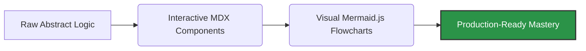

*"The best way to master a complex concept is to deconstruct it, visualize it, and teach it to the world."*

The modern developer ecosystem faces a massive roadblock: **Data Structures and Algorithms (DSA) are heavily gatekept.** They are either locked behind corporate paywalls or buried under dry, abstract textbooks that lack real-world context. 

**Algo** is an open-source development sandbox engineered to smash that barrier. It replaces rigid text with an interactive documentation engine, turning abstract logic into a living, breathing learning playground.

## Technical Architecture & Ecosystem

Anyone can copy-paste a basic code snippet. Algo moves beyond static code dumps by leveraging a production-grade stack to make documentation dynamic and testable.

### Our Core Creator Principles

1. **Interactive Over Static:**

    By anchoring the platform on **Docusaurus (React + MDX)**, we embed live UI elements right inside the documentation. Contributors can build components that let users manipulate data structures in real-time.

2. **Visual-First Communication:**

    We drop overwhelming paragraphs in favor of **Mermaid.js** diagrams to track complex execution logic flows step-by-step.

3. **Mathematical Precision:**

    We integrate **KaTeX** to render clean mathematical notation, making complex asymptotic runtime bounds like $O(N \log N)$ visually polished and accessible.

## GSSoC '26 Contribution Blueprint

As a **Project Admin** for **GirlScript Summer of Code (GSSoC) 2026**, the goal is to build an inclusive engineering incubator. We deliberately structure tasks so developers at every layer of the stack can ship production code:

| Contributor Tier | Core Responsibilities | Key Takeaway |
| --- | --- | --- |
| **Beginner** | Resolving documentation layout issues, improving Markdown text, updating inline code comments. | Clear understanding of Git workflows and your first open-source PR merged. |
| **Intermediate** | Implementing optimized algorithm variations across multiple target languages. | Deep mastery over space/time algorithmic complexities. |
| **Advanced** | Architecting reusable React design tokens, configuring GitHub Actions, tuning CI/CD automation pipelines. | Real-world production engineering and system design leadership. |

## The Development Horizon

We treat documentation with enterprise-grade standards. Direct pushes are restricted, and automated checks must pass before changes are merged. Our development roadmap includes:

* **Interactive Code Simulators:** Drag-and-drop array and tree visualizers built natively in React.
* **Automated Code Playbooks:** Strict linting and formatting validation pipelines for multi-language solutions.
* **Real-time Community Nodes:** Seamless integration of localized discussion channels to bridge the gap between mentors and contributors.

Thank you for exploring the codebase, reviewing our standards, and building the ultimate open-source algorithm repository. **Let's review some PRs!**

---

### Core Project Nodes

* **GitHub Profile:** [@ajay-dhangar](https://github.com/ajay-dhangar)
* **Live Repository:** [github.com/ajay-dhangar/algo](https://github.com/ajay-dhangar/algo)
* **Documentation Site:** [ajay-dhangar.github.io/algo](https://ajay-dhangar.github.io/algo/)