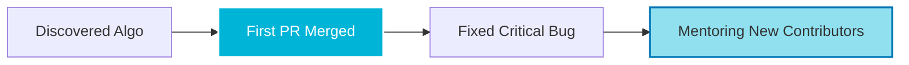
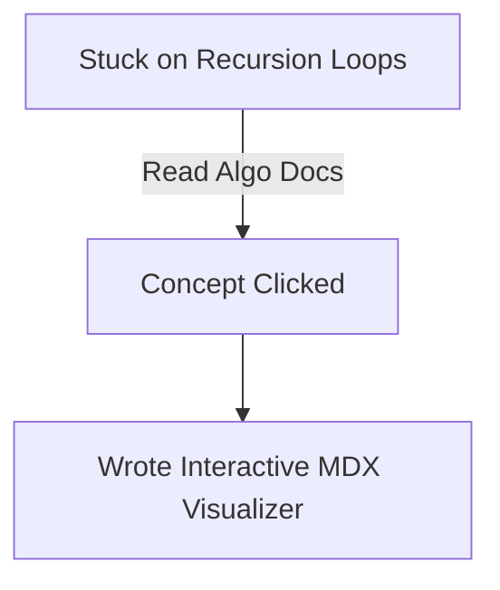

import Tabs from '@theme/Tabs';
import TabItem from '@theme/TabItem';

At **Algo**, we believe every pull request has a human story behind it. Whether you are fixing your very first typo during GSSoC '26, building an intricate interactive React visualization, or optimizing our CI/CD pipelines, your journey can inspire thousands of developers who visit this platform daily.

This page acts as both a **step-by-step guide** on how to submit your developer spotlight and a **live blueprint** showcasing the advanced layout features you can use to make your story look beautiful.

<!-- truncate -->

## Quick Start Guide

### Step 1: Create Your File

Navigate to your local clone of the repository and create a new MDX file inside the stories directory:

```bash
# Naming convention: your-github-username.mdx
docs/stories/your-github-username.mdx

```

### Step 2: Add Your Profile Image

Upload a profile picture or a custom banner image to the `static/img/stories/` folder, or use your direct GitHub avatar URL (`https://github.com/your-username.png`).

### Step 3: Fill Out the Template & Open a PR

Copy the boilerplate template below, inject your unique human experience, and submit a PR with the tag `docs: added contributor story [your-username]`.

## The Blueprint Boilerplate (Copy & Paste)

Copy the code block below to start writing your story. We have fixed the broken component formats so you can deploy an enterprise-grade design layout effortlessly.

````mdx
---
title: "My Open Source Journey: [Your Name]"
authors: [your-name]
sidebar_label: "[Your Name]"
tags: [contributor-spotlight, gssoc26, open-source]
description: "How [Your Name] contributed to Algo and overcame the fear of the first pull request."
---

import Tabs from '@theme/Tabs';
import TabItem from '@theme/TabItem';

# My Open Source Journey: [Your Name]

<!-- Quick Summary Profile Card -->
<div style={{ 
  padding: '1.5rem', 
  background: 'linear-gradient(135deg, rgba(0, 180, 216, 0.08) 0%, rgba(0, 119, 182, 0.05) 100%)', 
  borderRadius: '12px', 
  border: '1px solid rgba(0, 180, 216, 0.2)', 
  marginBottom: '2rem',
  display: 'flex',
  gap: '1.5rem',
  alignItems: 'center',
  flexWrap: 'wrap'
}}>
  
  <div>
    <h3 style={{ margin: '0 0 0.5rem 0', color: '#00b4d8' }}>🚀 Developer Profile</h3>
    <p style={{ margin: 0, fontSize: '0.95rem' }}>
      <strong>Role:</strong> Frontend Contributor / Technical Writer <br />
      <strong>GitHub:</strong> <a href="https://github.com/your-github-username" target="_blank">@your-github-username</a> <br />
      <strong>Impact:</strong> Optimized 3 React visualizers & Documented Graph Traversals
    </p>
  </div>
</div>

## The Spark: Finding Algo

*Replace this text with your real story. How did you discover Algo? What caught your attention? Speak genuinely about your initial thoughts, fears, or goals when entering the ecosystem.*

:::tip My Advice to Beginners
Don't wait until you feel like an "expert" to contribute. Grab a `good first issue` and start right now!
:::

## The Breakthrough (My Contributions)

Below is how I broken down my technical achievements during my time contributing to the repository:

<Tabs>
  <TabItem default label="Code Contributions" value="code">
    ### Features Built
    * **Feature A:** Implemented an interactive sidebar component utilizing Tailwind CSS.
    * **Feature B:** Fixed a state mutation bug in the Stack Visualizer component.

    ```tsx
    // Example of code you modified or were proud of writing!
    const handleStackPush = (element) => {
      setStack((prev) => [...prev, element]);
    };
    ```
  </TabItem>
  
  <TabItem label="Technical Writing & Visuals" value="docs">
    ### Documentation & Layouts
    * **Graph Algorithms:** Authored the comprehensive documentation for Breadth-First Search (BFS).
    * **Diagrams:** Integrated custom **Mermaid.js** flowcharts to illustrate time complexities visually for newcomers.
  </TabItem>
</Tabs>

## My Milestone Timeline



## Reflections & Thank Yous

*Share your thoughts on the Algo community environment. Did you interact with the founder, Ajay Dhangar, or the project maintainers? What did you learn about collaboration?*

:::info Community Note
"Open source isn't just about shipping code features; it's about belonging to a community that elevates your growth."
:::

````

## UI & Format Toolkit for a Better Look

To make your story look highly polished, interactive, and engaging, maximize these native Docusaurus styling tools:

### 1. Highlight Callouts (Admonitions)

Break up walls of text using clean markdown callout boxes to highlight critical turning points or struggles.

:::note Context Info
Use this for background information or details regarding your university or engineering background.
:::

:::danger The Challenge I Faced
Use this to talk about a major roadblock, a terrifying merge conflict, or a failing CI/CD pipeline bug you had to crack!
:::

### 2. Live Flowcharts (Mermaid.js)

Show off your learning curves or architecture fixes interactively with direct script parsing:

````markdown


````

### 3. Modern Glassmorphism Dashboard Cards

Instead of generic headers, apply inline custom layout styles to build an striking introduction element:

```html
<div style={{ 
  padding: '1.25rem', 
  background: 'rgba(255, 255, 255, 0.03)', 
  backdropFilter: 'blur(10px)',
  borderRadius: '8px', 
  borderLeft: '5px solid #0077b6',
  boxShadow: '0 4px 12px rgba(0,0,0,0.1)'
}}>
  <strong>💡 Pro-Tip:</strong> Using inline React styling syntax inside MDX files unlocks seamless design control without editing your theme CSS.
</div>

```

### Need Help Reviewing Your Story Layout?

If you're unsure if your layout renders correctly, drop a message into the **CodeHarborHub Discord** channel or ping our founder, **[@ajay-dhangar](https://github.com/ajay-dhangar)**, directly on your pull request thread. We are always ready to help you optimize your layout!